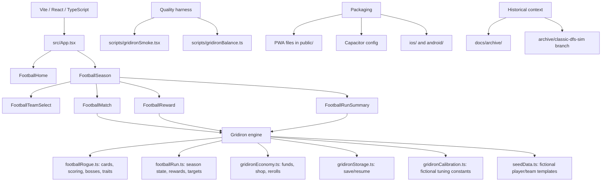

# Gridiron Project Map

Gridiron is now the active app. The old Classic Slate Boss DFS simulator is
preserved through Git history, not compiled into the current product.

## Active Source

- `src/components/FootballHome.tsx` - title screen, help entry, resume/new season.
- `src/components/FootballSeason.tsx` - top-level season state machine.
- `src/components/FootballMatch.tsx` - game UI, hand selection, scoring preview, ledger.
- `src/components/FootballReward.tsx` - War Room shop and reward decisions.
- `src/components/FootballRunSummary.tsx` - end-of-run debrief.
- `src/components/footballStyles.ts` - shared visual tokens and button/card helpers.
- `src/lib/footballRogue.ts` - core card/scoring model.
- `src/lib/footballRun.ts` - run progression and reward catalog.
- `src/lib/gridironEconomy.ts` - Front Office Funds economy.
- `src/lib/gridironStorage.ts` - local save/resume persistence.
- `src/lib/rng.ts` - deterministic random helpers.
- `src/lib/seedData.ts` - fictional football data used by the Gridiron card model.

## Maintenance Notes

- Run `npm run lint`, `npm run build`, and `npm run smoke:gridiron` after code changes.
- Run `npm run balance:gridiron -- 3000` after scoring, reward, target, or economy changes.
- Keep real teams, players, betting, sportsbook, deposits, withdrawals, and prize language out of shipped app copy.
- Keep archived DFS material in `docs/archive/` unless intentionally restoring it from the archive branch.
