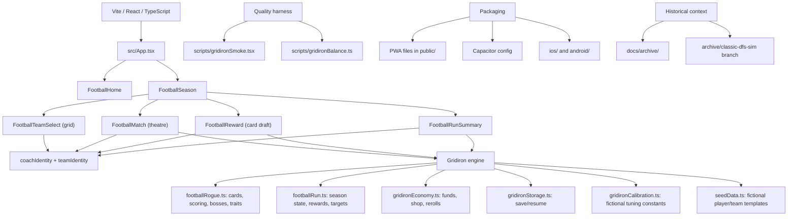

# Gridiron — single-file review bundle

_Generated 2026-06-22T01:29Z by scripts/build-review-bundle.sh. This ONE file is self-contained: the review brief is first, then every referenced source file inline under `===== FILE: <path> =====` markers. You do not need the repo to review._

---

# PART 1 — REVIEW BRIEF (read this first; it is your prompt)

# Gridiron — second-opinion review brief (round 2)

> Paste this whole file as your prompt, then attach the files listed in §Files.
> It is written so a model with no prior context can give useful, non-redundant feedback.

## Role
You are a senior product designer and game-design critic with shipped credits in mobile-first card roguelikes (Balatro, Slay the Spire, Marvel Snap, Mini Metro). You are not a cheerleader. Give honest, opinionated, ranked-by-impact critique, and be willing to say "cut this."

## The product
**Gridiron** is a single-player, mobile-first **football card roguelike** in a Vite + React + TypeScript app (productized alpha). Build a deck, call plays, beat rising point targets across a 5-game season; spend Funds in a War Room between games. Read `docs/GRIDIRON_HANDOFF.md` end-to-end first — it is the canonical packet (pitch, core loop, three-channel scoring, screens, engine modules, balance harness, open questions). `docs/PROJECT_MAP.md` is the file map. State assumptions inline; do not stall on clarifying questions.

Public repo (read-only): `https://github.com/dmbrown81/slate-boss`

## Hard constraints (do not violate, do not propose violating)
- **Fictional football only.** No real teams/players/IP, no real money, betting, DFS/contest framing, deposits, withdrawals, or prizes.
- **The engine is the asset and is off-limits.** Do **not** propose rewrites or balance changes to `src/lib/footballRogue.ts`, `src/lib/footballRun.ts`, or the scoring math. UI, UX, presentation, animation, onboarding, audio, metagame, and framing are all fair game.
- Keep React + Vite + TypeScript. No framework swaps, no state-machine library, no 3D, no native rewrite, no multiplayer.
- Mobile-first, polished on desktop too.
- Any change must keep `npm run lint`, `npm run build`, and `npm run smoke:gridiron` green, and `npm run balance:gridiron -- 3000` passing if it touches scoring presentation.

## Already shipped — do NOT re-recommend these (a prior round already built them)
- **Play-resolution theatre:** drive-score count-up, gold full-bleed banner for splash concepts, escalating FIRST DOWN→DRIVE!→TOUCHDOWN! stamps, red TURNOVER ON DOWNS mourning. All tap-skippable and disabled under `prefers-reduced-motion`.
- **Coach + team-palette identity:** fictional coach (name + quote), two-colour palette, and a geometric coach portrait per team, surfaced in the match scoreboard stripe, War Room header, Run Summary opener, and Team Select cards.
- **War Room as a card draft:** 3-up reward grid, decision-lane tier badges (Engine/Counter/Consistency/Value/Risk, with a glow on the best fits), two-tap buy via a detail sheet, dedicated bank/skip tile.
- **Team Select grid ritual:** 2-up 3:4 team cards with palette, portrait, play-style tag, difficulty; fifth team centred.
- **Retention (local):** Daily Scrimmage deterministic seed, run history (last 10), best-run recap, season-cumulative score.
- **Help:** quick-start block + full-reference toggle. **Motion safety:** global `prefers-reduced-motion` handling.
If you think any of the above is done *badly*, critique the execution — but don't pitch it as net-new.

## Where I most want your eyes (ranked — these are the real gaps)
1. **Cold-start Game-1 difficulty.** The balance harness only measures *optimized* play across full seasons; it is blind to a brand-new player with a starter deck and no upgrades in Game 1, where a high opening target + a budget that affords ~3 plays demands near-optimal stacking immediately. Is Game 1 survivable for someone who hasn't learned stacking? Where does a cold player bounce, and what would you change (UI/onboarding only — not engine numbers)?
2. **Number legibility / scoring scale.** Targets in the high hundreds, ×1.40 multipliers, three channels updating at once. Does the *scale itself* read at a glance, or is it still "tax-software math"? Concrete presentation fixes only.
3. **Mobile ergonomics & accessibility.** Match-screen scroll length, thumb reach (hand vs. Run button), touch-target sizes, and **color-only encoding** (the three scoring channels and the War Room lanes are distinguished purely by color — colorblind risk). Contrast and screen-reader support are unaudited.
4. **Retention depth.** Daily seed has no locked challenge / leaderboard / "already played today"; history is local last-10. Enough to reopen tomorrow, or retention theater? Cheapest highest-impact addition?
5. **Sensory feedback.** The theatre is visual-only — no sound, no haptics. Does silence undercut it on mobile, and what's the minimal tasteful addition?
6. **Theatre dosage & team-identity feel.** Are banners/stamps the right intensity/frequency for the 200th run? Do the five teams *feel* distinct in play (not just on the select screen), especially Volts and Ghosts?

## Output
Open with one sentence naming the single biggest problem with Gridiron *as it stands now* (post-sprint). Then:
1. Honest one-paragraph read — strongest thing, weakest thing, the one thing keeping strangers from loving it.
2. Section per focus area above, with specific, ranked, concrete fixes (not "make it clearer" — say exactly what to change).
3. An **agent-ready ticket list** (8–12), ranked by impact-per-hour, each self-contained: name the files it touches and the acceptance criteria, and respect the constraints (engine off-limits, gates stay green). First ticket = the one to ship today.
4. A short "things I would refuse to build" list if relevant.

Be specific, quote real identifiers from the docs/code, rank everything, no marketing language, no emojis.

## Files to attach
**Orientation:** `README.md`, `docs/GRIDIRON_HANDOFF.md`, `docs/PROJECT_MAP.md`
**Engine (context only — do not propose changing):** `src/lib/footballRogue.ts`, `src/lib/footballRun.ts`, `src/lib/gridironEconomy.ts`, `src/lib/gridironCalibration.ts`
**Screens (what you're reviewing):** `src/components/FootballHome.tsx`, `FootballTeamSelect.tsx`, `FootballMatch.tsx`, `FootballReward.tsx`, `FootballRunSummary.tsx`, `FootballHelpModal.tsx`, `FootballSeason.tsx`, `coachIdentity.tsx`, `teamIdentity.ts`, `footballStyles.ts`
**Motion/theme:** `src/index.css`
**Verification (how it's proven):** `scripts/gridironBalance.ts`, `scripts/gridironSmoke.tsx`, `src/lib/gridironStorage.ts`
Skip `seedData.ts` (large card data) and the `android/`, `ios/`, PWA packaging files unless you want to critique app-store/native presentation.

---

# PART 2 — SOURCE (every file referenced above, inline)

> The brief's "Files to attach" list is satisfied below — each file appears between `===== FILE: <path> =====` and `===== END FILE =====` markers, in priority order (UX-critical first, engine last).

===== FILE: docs/GRIDIRON_HANDOFF.md =====
# Gridiron — Reviewer / Audit Handoff

> A self-contained packet for an outside designer, engineer, or AI model to review the game, audit the code, and give feedback. You can hand someone *just this file* and they'll understand where the project is and what to critique.

_Last updated: 2026-06-22 · Branch: `gridiron-ux-sprint` (PR #5 → `main`) · Status: productized alpha with playable 5-game **season**, team-as-deck selection, save/resume, seeded run scaffolding, War Room economy, Player Traits, mobile/defense lane depth, boss preview, NFL/DFS-derived calibration notes, Coach Debrief, balance diagnostics, plus a UX sprint: play-resolution **theatre**, a **coach + team-palette identity** layer, a **War Room card draft**, a **Team Select grid**, and a local **retention layer** (run history + Daily Scrimmage seed)._

---

## 1. What this is

**Gridiron** is a single-player, football-native **card roguelike** — Balatro-style engine-building, but the scoring language is football instead of poker. It lives inside the **Slate Boss** repository and is now the active app product. The original Classic Slate Boss DFS simulator has been removed from the active source tree and remains recoverable from the archive branch/tag.

- **No real IP.** Fictional teams and players only. No NFL marks, no real names, no real money, no prizes. The architecture is intentionally "license-agnostic" (names are display-only data) so a licensed dataset could drop in later without a rewrite — but that is a far-future dream, not a near-term plan.
- **Design ethos:** clean, text-and-math-forward, mobile-first. The fun is *outsmarting a transparent system*, not graphics. Motion is now used deliberately for *celebration and weight* (a play-resolution theatre layer — see §3/§4h), but every animation is skippable on tap and fully disabled under `prefers-reduced-motion`. No bitmap art, no generative art; decoration is color + geometry + motion only.

**The pitch:** Build the deck. Call the play. Beat the defense.

---

## 2. How to run it

```bash
npm install
npm run dev -- --host 127.0.0.1     # http://127.0.0.1:5173/slate-boss/
npm run lint                         # eslint, must pass
npm run build                        # tsc + vite, must pass
npm run smoke:gridiron               # server-renders every screen; must pass
npm run balance:gridiron -- 3000     # Monte-Carlo balance harness (skill-gap report)
```

The app boots into the Gridiron title screen → **Kickoff** to play. **How to Play** opens the in-game help. The visible and compiled product path is Gridiron-only.

---

## 3. The core loop (what a player actually does)

A **season = 5 games**. Win all five (the last is the **Championship**) to win the run; lose any game and the run ends. After each win you visit the **War Room** and spend **Funds** on priced rewards to strengthen your team for the next, harder game — this is the "one more run" engine-building loop. Your deck, coordinators, playbook installs, Funds, and Player Traits **persist across games** within a run.

Each **game = 3 drives**. Each drive has a **points target that rises** drive to drive and game to game. Clear all three to win the game. The flow per drive:

1. Draw an 8-card hand from your deck. Each card is a **football action** (Deep Ball, Power Run, Deep Catch, Sack, Interception, Field Goal…), and its value is weighted by the source player's archetype.
2. The hand is grouped by role (**QB Pass / Catch / Run / Defense / Kick**) so the player can read the football grammar quickly.
3. Tap **up to 4 cards** to assemble a play. A live **preview** shows the play's name and full score *before* you commit — this is the hero UI.
4. **Run the play** → the drive score **counts up** to its new total; the cards are spent, then a single canonical **Scoring Sequence** recaps Base → Execution → Big Play → Final in the preview slot. Splash concepts (Double-Stack Bomb, Shootout, Pick Six, QB Keeper) fire a gold full-bleed **banner**; clearing a drive stamps **FIRST DOWN → DRIVE! → TOUCHDOWN!** by drive index. Or **Audible** (3/drive) to throw selected cards back and redraw, spending no budget.
5. Hit the target → bank the drive, advance (fresh hand/budget). Run out of **Play Budget** below the target → a **TURNOVER ON DOWNS** stamp over a dimmed field, then the run ends.

The first game includes a contextual **Coach's First Drive** panel that teaches the key grammar: QB Pass + same-team Catch = Stack TD. On Game 1 / Drive 1 the scoreboard also collapses secondary build/defense/coordinator detail so there's a single teaching voice; the detail returns after the first taught play.

**Scoring is deterministic.** Variance lives entirely in the **draw**, never in a hidden roll — so the ledger is always teachable and every win/loss is on the player.

---

## 4. The three systems that make it an engine, not a calculator

### 4a. Three-channel scoring (fixes the "one big play wins" problem)
```
drivePoints = Base × (1 + Execution) × BigPlay
```
- **Base** (green) — raw yards from the cards. The fuel.
- **Execution** (blue) — flat additive bonus from clean concepts (Stack TD +0.6, Ground & Pound +0.4…). Reliable.
- **Big Play** (gold) — multiplier from elite synergies (Double Stack ×1.5, Shootout ×1.4, Pick Six ×1.6…). Explosive.

A build needs all three; pumping one channel stalls. Keeping them separate and visible is what stops a single Double-Stack Bomb from trivializing a target.

### 4b. Play Budget (the DFS salary cap, folded into the play resource)
Every card has a **cap cost** (1–4, by the source player's salary tier; kick/defense overridden). Each drive grants a budget (24 / 26 / 28); you call as many plays as you can afford. Cheap value cards buy *more* plays; expensive studs hit harder but drain the cap. This is the DFS soul, re-expressed — and it is **one** resource, not a fourth one bolted on top of a play counter (a deliberate design call; see §8).

### 4c. Scaling coordinators (the compounding engine)
Coordinators are persistent buffs that **grow as you play** — the difference between a calculator and an engine. You start with 2 and can hire up to 5 via rewards. Examples:
- **Air Raid Coordinator** — +0.25 Execution on stack plays for every stack you've *already* completed this match (within-game ramp).
- **Bell Cow** — +13 Base per run card, and +6 *permanent* Base each Ground & Pound this match (within-game ramp).
- **Franchise QB** — +0.20 Big Play on every play for each *earlier game* in which you landed a Bomb (**season-long ramp**).
- **Read-Option Guru / The Improviser / Broken Play Artist** — the Volts mobile-QB lane: within-game QB-run ramp, season-long keeper scaling, and busted-play rescue.
- **Pressure Chain / Takeaway Machine** — the Ghosts defensive lane: within-game defensive pressure ramp and season-long takeaway scaling.
- Plus West Coast Guru, Ball-Hawk DC, Salary Wizard in the reward pool.

You can watch their values tick up on the scoreboard.

### 4d. War Room, Funds & the Game Plan (run progression + commitment)
After each win, you enter the **War Room** with **Funds**. Wins pay a purse, banked Funds earn light interest, rerolls cost Funds, and skipping the shop banks a small bonus. You can buy up to two rewards per visit. The keystone is the **Game Plan**: level up a play concept (Stack TD, Ground & Pound, Pick Six…). Each level adds flat scoring *and*, once it's your core play (Lv 2+), a **growing Big Play (X-mult)**. Other buys include coordinators, player cards, trims, upgrades, and Training rewards that add Player Traits.

### 4e. Player Traits (card modifiers)
Some Training rewards permanently tag one card with a football-native trait:
Reliable, Explosive, Discounted, Clutch, Protected, or Hot Route. Traits show as card badges and emit scoring ledger lines when triggered. They make individual cards feel developed without adding a new screen.

### 4f. Geometric targets — the early-flat → late-multiplicative pivot
Targets escalate **~24% per game (geometric)** plus a Championship bump. Flat Base/Execution plateaus against that curve (adding +40 base to a 3000-point target is noise), so a committed **multiplicative engine** (leveled Game Plan × scaling coordinators × Player Traits) becomes *required* to win the late season. This is the power curve the design was missing: early games reward flat value; late games demand the compounding engine.

**Anti-spam:** repeating the same concept in a drive applies ×0.85 Big Play ("Defense Adjusted") to push varied play-calling.

**Weather:** each match rolls a weighted condition (Clear 45 / Dome 25 / Wind 12 / Snow 8 / Primetime 10) from the NFL/DFS calibration pass. Conditions shift the math — e.g. Snow punishes passing and rewards the ground game — but normal games are now much more common than bad-weather chaos.

### 4g. Boss defenses (adaptation pressure)
From Game 2 onward, each match shows an opposing defensive scheme on the scoreboard. These are the Boss Blind analogs: they counter a style without deleting it, forcing a supporting plan.

- **No-Fly Zone** — deep stacks lose Big Play; short passing stays efficient.
- **Stacked Box** — run concepts lose Base; stacks get a play-action window.
- **Turnover Drill** — defensive splash plays lose Big Play; clean offense gains Execution.
- **Adaptive DC** — repeated concepts are punished harder.

### 4h. Theatre & team identity (presentation layer — no engine impact)
The match now *reacts* to a play instead of silently ticking: a requestAnimationFrame **count-up** on the drive score, a gold concept **banner** for splash plays, escalating drive-clear **stamps**, and a red **turnover** stamp on a stall. Each team also has a **face**: a fictional coach (name + signature quote), a two-colour palette, and a geometric single-colour **coach portrait** (`coachIdentity.tsx` / `teamIdentity.ts` — presentation-only; `TEAM_PROFILES` in the engine stays colour/coach-free). The portrait + palette surface as a scoreboard stripe, the War Room header (with boss-aware advice), the Run Summary opener, and the Team Select cards. All motion is tap-skippable and honors `prefers-reduced-motion`.

### 4i. Retention layer (local, no accounts)
A **Daily Scrimmage** entry on Home seeds a deterministic run from the UTC date. Completed runs are written to a local **run history** (`gridiron_history_v1`, last 10), and the **best run** surfaces on Home and the Run Summary. Run score is the **season cumulative** (sum of every match's points). No leaderboard, no accounts, no server — see §8 for whether this is enough.

---

## 5. Balance snapshot

Measured with the **permanent** harness — `npm run balance:gridiron` (`scripts/gridironBalance.ts`), ~2000–3000 seasons per policy. It plays full seasons under four reward policies and prints two gaps:

| Reward policy | Champion | Per-game clear (G1→G5) |
|---|---|---|
| **Synergy** — commit to one Game Plan + feed it | **53.0%** | 98 · 88 · 80 · 74 · 53 |
| Naive — grab coordinators, don't commit | 30.9% | 97 · 89 · 78 · 66 · 31 |
| Random — any reward | 10.7% | 97 · 79 · 53 · 35 · 11 |
| None — skip all rewards | 0.0% | 98 · 72 · 23 · 1 · 0 |

- **Build gap (best − none): 53.0 pts ✅** — building is decisive.
- **Reward gap (synergy − random): 42.3 pts ✅** — picking well clearly beats random.
- **Commitment gap (synergy − naive): 22.1 pts** — *committing* to one Game Plan and stacking it beats grabbing pieces without a plan. This is the strategic spine.
- **Per-team viability:** Ironhawks 53.0%, Blazers 53.3%, Stormers 52.7%, Volts 51.5%, Ghosts 55.8%; spread 4.3 pts ✅, competitive teams 5/5 ✅, dead-draw losses 6.5% ✅.
- **Per-lane commitment:** pass 48.3%, ground 47.7%, defense 58.8%, mobile 51.3%; spread 11.1 pts 🟡, all four lanes viable.
- **Economy:** smart-spend gap 42.3 pts ✅; greedy vs patient gap 2.7 pts ✅, so spend-now vs bank is a real decision.

History: the build started with smart ≈ random (~1-pt gap — meta-layer was noise). It was fixed in stages: lean-aware keystone rewards + a starter-deck ratio fix (catch-flood → reliable stacks), then the **game-theory pass** that added leveled **Game Plan** commitment and a **geometric** target curve. The latest pass added boss defenses, first-drive onboarding, build identity surfacing, reward impact projections, grouped hands, and staged scoring feedback. Tunables: `DRIVE_TARGET`/`DRIVE_BUDGET`, `GAME_PLAN_STEP`/`GAME_PLAN_COMMIT_XMULT`, `FB_BOSS_SCHEMES`, `cardsForPlayer`/`buildStarterDeck` (`footballRogue.ts`); `gameTargets` geometric scale + reward catalog/build helpers (`footballRun.ts`). **Keep the harness committed and re-run it on every balance change.**

---

## 6. Code map (what to audit)

**Engine / run logic (pure, no React, no `Math.random` in scoring):**
- `src/lib/footballRogue.ts` — card model, Player Traits, team deck factories (from `seedData.ts` fictional players), three-channel `scoreFootballPlay`, structured ledger metadata, coordinators, mobile/defense lane hooks, weighted environments, boss defenses, free-agent cards, tunables.
- `src/lib/footballRun.ts` — season run state (`FbRunState`), seeded run helpers, `gameTargets` escalation, reward catalog + `generateRewards`, lane-aware reward shelves, War Room reward hydration, build identity helpers, reward impact projections, Coach Debrief.
- `src/lib/gridironCalibration.ts` — read-only calibration constants derived from the local `nfl_dfs` research folder; use them to tune fictional archetypes and match conditions, not to ship NFL content.
- `src/lib/gridironEconomy.ts` — Front Office Funds, win purse, interest, reroll/skip economy, War Room purchase cap.
- `src/lib/gridironStorage.ts` — versioned Gridiron save/resume under `gridiron_run_v1`, plus run history (`gridiron_history_v1`) and best-run selection.

**UI (React, inline styles + shared tokens):**
- `src/components/footballStyles.ts` — design tokens (the single source of visual truth).
- `src/components/teamIdentity.ts` — per-team palette, fictional coach name, quote, play-style tag (presentation data; engine stays colour/coach-free).
- `src/components/coachIdentity.tsx` — geometric single-colour `CoachPortrait` SVG (no real people, no licenses).
- `src/components/FootballHome.tsx` — title screen, resume/new, Daily Scrimmage, best-run recap.
- `src/components/FootballTeamSelect.tsx` — 2-up grid of 3:4 team cards (palette + coach portrait + play-style + difficulty) → detail → Start.
- `src/components/FootballSeason.tsx` — orchestrates the run (match → reward → summary); accumulates season score; threads the optional daily seed.
- `src/components/FootballMatch.tsx` — one game (scoreboard + coach stripe, grouped hand, live preview, canonical scoring sequence, count-up, banners/stamps).
- `src/components/FootballReward.tsx` — the War Room **card draft**: coach advice header, 3-up reward grid with lane-glow tier badges, two-tap buy via a detail sheet, dedicated bank/skip tile, reroll, next scout.
- `src/components/FootballRunSummary.tsx` — coach opener, season score, local-best comparison, share string, debrief.
- `src/components/FootballHelpModal.tsx` — in-game How to Play (quick-start + full reference toggle; reads engine data so it can't drift).
- `src/App.tsx` — minimal routing between the Gridiron title screen and season flow.
- `src/index.css` — global theme + keyframes (incl. banner/stamp/count-up motion and the `prefers-reduced-motion` block).

Classic Slate Boss source has been removed from the active app tree. Historical
DFS and AI review material lives in `docs/archive/`; the playable classic code is
recoverable from the `archive/classic-dfs-sim` branch and `classic-dfs-sim-2026-06-17` tag.

---

## 7. Roadmap

**Done:** core match loop, three-channel scoring, Play Budget, scaling coordinators (incl. season-long Franchise QB), the **5-game season shell**, a **permanent balance harness**, the **skill-decisive rebalance**, the **game-theory pass** (leveled Game Plan + geometric targets), the **clarity/boss pass** (guided first drive, grouped hand, current build identity, reward impact projections, boss defensive schemes), plus **five team-as-deck identities**, seeded run scaffolding, save/resume, next-game boss/weather scout, War Room/Funds economy, Player Traits, weighted environment calibration, mobile/defense lane depth, per-lane commitment diagnostics, Coach Debrief, and a Gridiron smoke test. **UX sprint (PR #5):** play-resolution **theatre** (count-up, concept banners, drive/turnover stamps; reduced-motion safe), a **coach + team-palette identity** layer, the **War Room card draft** with decision-lane tier badges and two-tap buy, the **Team Select grid ritual**, a quick-start Help split, and the **retention layer** (run history + best-run recap + Daily Scrimmage seed + season-cumulative score).

> **Presentation idea on the table (not yet built):** push Gridiron as a landscape/tablet-first app for more screen real estate (coordinators + Game Plans + hand side-by-side). The current layout is mobile-portrait single-column.

**Next, in order** (productized alpha, still design-flexible):
1. **Film Tools** — one-use consumables, one slot, buyable in the War Room.
2. **Boss intro card** — a short full-screen reveal (name, scheme, hint) before each match from Game 2.
3. **Coordinator ordering + containment** — resolve coordinators left-to-right, expose up/down controls, and make bigger concepts trigger contained concept effects where readable.
4. **War Room compare mode** — long-press to pin two rewards side-by-side (the card-draft sheet exists; this is the A-vs-B helper on top).
5. **More deck manipulation rewards** — copy/convert/cost-reduce/respec in small, readable doses.
6. **Sensory feedback** — optional sound + haptics on big plays/clears/stalls (currently the theatre is visual-only).

Deferred: bitmap/generative art, accounts/backend, multiplayer, real-money, large content catalogs.

---

## 8. Open questions / things to challenge

1. **Cold-start Game-1 difficulty (highest-value gap — nothing measures it):** the balance harness only reports *optimized synergy play across full seasons*. It says nothing about a brand-new player, starter deck, no upgrades, Game 1. With a high opening target and a budget that affords ~3 plays, you must hit near-optimal stacks immediately or stall. Is Game 1 survivable for someone who hasn't learned stacking yet — and where exactly does a cold player bounce?
2. **Number legibility / scoring scale:** targets in the high hundreds, multipliers like ×1.40, three channels updating at once. The theatre adds weight, but the raw magnitudes are unchanged. Does the *scale itself* read at a glance, or is it still "tax-software math"?
3. **Retention depth:** Daily Scrimmage is a deterministic seed with no locked challenge, no leaderboard, no "already played today"; run history is local last-10. Is this enough to reopen the app tomorrow, or is it retention theater?
4. **Mobile ergonomics & accessibility:** match-screen scroll length, thumb reach (hand vs. Run button), touch-target sizes, and **color-only encoding** — the three scoring channels *and* the War Room lanes are distinguished purely by color (a colorblind risk). Contrast and screen-reader support are unaudited. We ship `prefers-reduced-motion` and nothing else.
5. **Team identity feel:** five decks are viable in the harness and now have coaches/palettes. Do players *feel* those identities — especially Volts and Ghosts — in play, not just on the select screen?
6. **Three channels on a small screen:** clarifying, or too much math at once for a casual player?
7. **Cognitive load:** is "season → 5 games → 3 drives each" clear, or one nesting level too many?
8. **Onboarding:** first-drive coach + collapsed-clutter focus exist. Does it teach enough without slowing repeat runs? Should the brief's "3 captions / 3 taps" overlay replace the panel entirely on Game 1?
9. **Theatre dosage:** are the banners/stamps the right intensity and frequency, or will they annoy on the 200th run even with tap-to-skip?

---

## 9. Design pillars to grade against

- **Engaging** — many real decisions per match; the live ledger updates as you tap; instant comprehension (QB + his WR = "Stack TD," number jumps).
- **Strategic** — Play Budget trade-offs, three balanced channels, scaling coordinators, varied play-calling vs. anti-spam, weather.
- **Challenging** — rising targets, lose-on-stalled-drive, defense adapts to spam.
- **Rewarding** — coordinators that compound (number-go-up), a transparent ledger that explains *why* you won or lost.
- **Clean first** — text/number-forward, mobile-first, no art dependency.

Feedback most useful on: **is the core loop fun enough to justify building the season shell, and what should change before we do?**

===== END FILE: docs/GRIDIRON_HANDOFF.md =====

===== FILE: docs/PROJECT_MAP.md =====
# Gridiron Project Map

Gridiron is now the active app. The old Classic Slate Boss DFS simulator is
preserved through Git history, not compiled into the current product.



## Active Source

- `src/components/FootballHome.tsx` - title screen, help entry, resume/new season, Daily Scrimmage, best-run recap.
- `src/components/FootballTeamSelect.tsx` - 2-up grid of 3:4 team cards (palette + coach portrait + play-style + difficulty), detail panel, Start.
- `src/components/FootballSeason.tsx` - top-level season state machine; accumulates season score, threads the optional daily seed.
- `src/components/FootballMatch.tsx` - game UI, hand selection, scoring preview/ledger, plus the theatre layer (count-up, concept banners, drive/turnover stamps) and coach stripe.
- `src/components/FootballReward.tsx` - War Room card draft: lane tier badges, two-tap buy via detail sheet, bank/skip tile.
- `src/components/FootballRunSummary.tsx` - end-of-run debrief, coach opener, season score, local-best compare, share string.
- `src/components/FootballHelpModal.tsx` - in-game How to Play (quick-start + full-reference toggle; reads engine data).
- `src/components/coachIdentity.tsx` - geometric single-colour CoachPortrait SVG (presentation only).
- `src/components/teamIdentity.ts` - per-team palette, coach name, quote, play-style tag (presentation only).
- `src/components/footballStyles.ts` - shared visual tokens and button/card helpers.
- `src/lib/footballRogue.ts` - core card/scoring model.
- `src/lib/footballRun.ts` - run progression and reward catalog.
- `src/lib/gridironEconomy.ts` - Front Office Funds economy.
- `src/lib/gridironStorage.ts` - local save/resume + run history (`gridiron_history_v1`).
- `src/lib/gridironCalibration.ts` - read-only fictional tuning constants.
- `src/lib/rng.ts` - deterministic random helpers.
- `src/lib/seedData.ts` - fictional football data used by the Gridiron card model.

## Maintenance Notes

- Run `npm run lint`, `npm run build`, and `npm run smoke:gridiron` after code changes.
- Run `npm run balance:gridiron -- 3000` after scoring, reward, target, or economy changes.
- Keep real teams, players, betting, sportsbook, deposits, withdrawals, and prize language out of shipped app copy.
- Keep archived DFS material in `docs/archive/` unless intentionally restoring it from the archive branch.

===== END FILE: docs/PROJECT_MAP.md =====

===== FILE: README.md =====
# Gridiron / Slate Boss

Gridiron is a single-player football card roguelike inside the Slate Boss repo.
The current headline mode is Gridiron: build a team deck, call football concepts,
clear three drives per game, and survive a five-game season.

Classic Slate Boss, the original fictional DFS lineup simulator, has been removed
from the active app tree. It remains recoverable from the `archive/classic-dfs-sim`
branch and `classic-dfs-sim-2026-06-17` tag.

## Run Locally

```bash
npm install
npm run dev -- --host 127.0.0.1
```

Open `http://127.0.0.1:5173/slate-boss/`.

## Quality Gates

```bash
npm run lint
npm run build
npm run build:native
npm run smoke:gridiron
npm run balance:gridiron -- 3000
```

The Gridiron balance harness is the source of truth for tuning. It checks whether
smart build choices beat random choices, whether all five team decks are viable,
and whether losses are caused by weak builds instead of dead draws.

## App Packaging

Gridiron is now wired for installable web, iOS, and Android packaging:

```bash
npm run icons
npm run cap:sync
```

The normal `npm run build` keeps the hosted `/slate-boss/` base path. The native
sync path uses `npm run build:native` so Capacitor gets relative asset URLs for
the iOS and Android webviews. See `docs/APP_LAUNCH_CHECKLIST.md` for store
account, testing, and listing guardrails.

## Product State

Gridiron is moving into productized alpha. The foundation now includes:

- five team-as-deck starting identities
- seeded season state for weather, bosses, rewards, and match draws
- a **Front Office Funds economy** (win purse + banked interest) — the between-game transmission
- the **War Room** shop: priced rewards, buy up to two, reroll, and skip-for-funds
- **Player Traits** (card modifiers: Reliable, Explosive, Discounted, Clutch, Protected, Hot Route), bought via Training rewards and wired into the scoring ledger
- an NFL/DFS research calibration layer that keeps real stats out of the shipped game while using them to tune fictional archetypes, weather frequency, traits, and boss logic
- mobile-QB and defensive-pressure identity lanes with their own scaling coordinators, Game Plans, and per-lane balance gauge
- a run-summary **Coach Debrief** that explains the final build and suggests the next strategic focus
- versioned localStorage save/resume under `gridiron_run_v1` (save format v3, migrates v1/v2)
- boss preview during War Room reward selection
- staged scoring ledger with stage/channel/operation metadata
- a lightweight screen render smoke test

Near-term work should stay focused on app hardening and strategic depth, in order:
Film Tools (one-use consumables) + War Room decision clarity; then coordinator
ordering plus concept containment; then Coach Debrief 2.0 / run history and seeded
daily challenges. Avoid backend, accounts, multiplayer, real-money features, or
licensed IP until the alpha loop is steadier; treat native packaging as a shell
around the web app for now.

## Useful Files

- `src/lib/footballRogue.ts` - Gridiron card model, Player Traits, deck factories, scoring, bosses, and tunables.
- `src/lib/footballRun.ts` - season state, seeded run helpers, priced rewards, training, and build identity.
- `src/lib/gridironCalibration.ts` - read-only NFL/DFS-derived calibration constants for fictional tuning.
- `src/lib/gridironEconomy.ts` - Front Office Funds: purse, interest, reroll/skip economy.
- `src/lib/gridironStorage.ts` - Gridiron save/resume persistence (v3 with v1/v2 migration).
- `src/components/FootballSeason.tsx` - season orchestration.
- `scripts/gridironBalance.ts` - Monte Carlo balance harness.
- `scripts/gridironSmoke.tsx` - lightweight render smoke test.
- `docs/PROJECT_MAP.md` - current layer diagram and folder map.
- `docs/NFL_DFS_GRIDIRON_CALIBRATION.md` - what was found in `/Users/dominicbrown/Desktop/nfl_dfs` and how it should inform Gridiron without shipping real NFL content.
- `docs/archive/` - historical DFS and AI review briefs preserved outside the active app path.

===== END FILE: README.md =====

===== FILE: src/components/footballStyles.ts =====
// Gridiron — shared visual design tokens.
// One source of truth so every football screen feels like the same product.

import type { CSSProperties } from 'react';
import type { FbSide } from '../lib/footballRogue';

export const FB = {
  // surfaces
  bg: '#090c11',
  panel: '#121a24',
  panelSoft: '#0e151d',
  inset: '#0a0f16',
  // lines
  border: '#1f2a37',
  borderSoft: '#19222e',
  // text
  text: '#e8edf4',
  textDim: '#8595aa',
  textFaint: '#56657a',
  // brand
  gold: '#f0b429',
  goldSoft: '#3a2f12',
  green: '#34c771',
  greenSoft: '#0e2a1b',
  blue: '#3b82f6',
  red: '#e26d83',
};

// side accents for cards / play channels
export const SIDE: Record<FbSide, { border: string; chip: string; text: string; grad: string }> = {
  pass: { border: '#3b82f6', chip: '#0c1a2e', text: '#79b0ff', grad: 'linear-gradient(160deg,#13203a,#0c1320)' },
  catch: { border: '#34c771', chip: '#0c2419', text: '#5fe0a0', grad: 'linear-gradient(160deg,#0f2a1d,#0b1612)' },
  run: { border: '#f5a623', chip: '#271a06', text: '#ffc457', grad: 'linear-gradient(160deg,#2a1d08,#171005)' },
  kick: { border: '#9aa6b5', chip: '#171c22', text: '#cdd6e1', grad: 'linear-gradient(160deg,#1b222b,#10151b)' },
  defense: { border: '#e26d83', chip: '#2a1118', text: '#ff97aa', grad: 'linear-gradient(160deg,#2a131a,#170d10)' },
};

export const card = (radius = 14): CSSProperties => ({
  background: FB.panel,
  border: `1px solid ${FB.border}`,
  borderRadius: radius,
});

export const btnPrimary: CSSProperties = {
  padding: '14px 0',
  border: 'none',
  borderRadius: 12,
  fontSize: 15,
  fontWeight: 800,
  letterSpacing: 0.3,
  cursor: 'pointer',
  background: 'linear-gradient(180deg,#f7c544,#e6a519)',
  color: '#1a1206',
  boxShadow: '0 6px 18px -8px rgba(240,180,41,0.6)',
};

export const btnGhost: CSSProperties = {
  background: '#141b24',
  border: `1px solid ${FB.border}`,
  color: FB.textDim,
  borderRadius: 10,
  padding: '8px 12px',
  fontSize: 12,
  fontWeight: 700,
  cursor: 'pointer',
};

export const sectionLabel: CSSProperties = {
  fontSize: 10,
  letterSpacing: 1.4,
  color: FB.textFaint,
  fontWeight: 800,
  textTransform: 'uppercase',
};

===== END FILE: src/components/footballStyles.ts =====

===== FILE: src/components/teamIdentity.ts =====
// Gridiron — team identity data (presentation only).
// The engine (footballRogue.ts / TEAM_PROFILES) has no colour or coach data on
// purpose: it stays license-agnostic and math-first. This is the visual face
// layer — fictional coaches and team palettes. Safe to change without touching
// scoring or the balance harness. Rendered by <CoachPortrait> in coachIdentity.tsx.

import type { TeamArchetype } from '../lib/footballRogue';

export interface TeamIdentity {
  primary: string;   // team accent — stripes, rings, headers
  secondary: string; // lighter wash for fills/gradients
  coachName: string;
  quote: string;     // one line that fits the identity, surfaced at key moments
  playStyle: string; // two-or-three-word style tag for the team-select grid
}

export const TEAM_IDENTITY: Record<TeamArchetype, TeamIdentity> = {
  balanced: {
    primary: '#5b8fd1', secondary: '#c9d6e8',
    coachName: 'Coach Hollis Reed',
    quote: 'We take what the defense gives us.',
    playStyle: 'Flexible all-rounder',
  },
  air_raid: {
    primary: '#f5733a', secondary: '#ffc457',
    coachName: 'Coach Marv Castillo',
    quote: 'Let it fly — we win the game in the air.',
    playStyle: 'Aerial big-play',
  },
  ground_game: {
    primary: '#2bb6a3', secondary: '#9fe8dd',
    coachName: 'Coach Dell Yeager',
    quote: 'Pound the rock. Wear them down.',
    playStyle: 'Grind it out',
  },
  mobile_qb: {
    primary: '#9b6cf0', secondary: '#d7c2ff',
    coachName: 'Coach Rome Vasquez',
    quote: 'Keep the pocket moving and improvise.',
    playStyle: 'QB-run chaos',
  },
  defensive_pressure: {
    primary: '#8c97ad', secondary: '#d6deea',
    coachName: 'Coach Sable Knox',
    quote: 'Defense scores too. Make them pay.',
    playStyle: 'Takeaway defense',
  },
};

===== END FILE: src/components/teamIdentity.ts =====

===== FILE: src/components/coachIdentity.tsx =====
// Gridiron — coach portrait (presentation only).
// A geometric single-colour silhouette (no real people, no licenses), coloured
// from the team palette in teamIdentity.ts. Safe to change without touching
// scoring or the balance harness.

import type { TeamArchetype } from '../lib/footballRogue';
import { TEAM_IDENTITY } from './teamIdentity';

// Per-team emblem motif drawn beside the headset — keeps the five coaches
// visually distinct while staying abstract geometry.
function Emblem({ team, color }: { team: TeamArchetype; color: string }) {
  switch (team) {
    case 'air_raid': // upward dart — the deep ball
      return <path d="M44 20 L52 12 L50 22 Z" fill={color} />;
    case 'ground_game': // grounded bar
      return <rect x={42} y={17} width={11} height={4} rx={1} fill={color} />;
    case 'mobile_qb': // lightning notch
      return <path d="M48 11 L43 19 L47 19 L44 25 L52 16 L48 16 Z" fill={color} />;
    case 'defensive_pressure': // shield wedge
      return <path d="M47 12 L53 15 L50 23 L44 19 Z" fill={color} />;
    default: // balanced — steady diamond
      return <path d="M48 13 L52 18 L48 23 L44 18 Z" fill={color} />;
  }
}

// Geometric coach silhouette: rounded badge, shoulders + head, a headset, and
// a team emblem. Single fill colour from the team palette.
export function CoachPortrait({ team, size = 48 }: { team: TeamArchetype; size?: number }) {
  const id = TEAM_IDENTITY[team];
  const gradId = `coach-bg-${team}`;
  return (
    <svg width={size} height={size} viewBox="0 0 64 64" role="img" aria-label={id.coachName} style={{ display: 'block', flexShrink: 0 }}>
      <defs>
        <linearGradient id={gradId} x1="0" y1="0" x2="0" y2="1">
          <stop offset="0%" stopColor={id.secondary} stopOpacity={0.18} />
          <stop offset="100%" stopColor="#0a0f16" stopOpacity={0.9} />
        </linearGradient>
      </defs>
      <rect x={1.5} y={1.5} width={61} height={61} rx={14} fill={`url(#${gradId})`} stroke={id.primary} strokeWidth={2} />
      {/* shoulders */}
      <path d="M14 60 C14 46 24 42 32 42 C40 42 50 46 50 60 Z" fill={id.primary} />
      {/* head */}
      <circle cx={32} cy={27} r={11} fill={id.primary} />
      {/* headset band + mic */}
      <path d="M21 25 A11 11 0 0 1 43 25" fill="none" stroke="#0a0f16" strokeWidth={2.6} strokeLinecap="round" />
      <circle cx={21} cy={27} r={3} fill="#0a0f16" />
      <circle cx={43} cy={27} r={3} fill="#0a0f16" />
      <path d="M21 30 C21 36 26 35 28 33" fill="none" stroke="#0a0f16" strokeWidth={2.2} strokeLinecap="round" />
      <Emblem team={team} color={id.secondary} />
    </svg>
  );
}

===== END FILE: src/components/coachIdentity.tsx =====

===== FILE: src/components/FootballHome.tsx =====
import { useState } from 'react';
import { FB, btnPrimary, card } from './footballStyles';
import FootballHelpModal from './FootballHelpModal';
import { bestGridironHistoryRun, clearGridironRun, loadGridironHistory, loadGridironRun } from '../lib/gridironStorage';
import { TEAM_PROFILES } from '../lib/footballRogue';
import { SEASON_GAMES } from '../lib/footballRun';
import { stringSeed } from '../lib/rng';

interface Props {
  onPlay: (seed?: number) => void;
}

export default function FootballHome({ onPlay }: Props) {
  const [showHelp, setShowHelp] = useState(false);
  const [activeRun, setActiveRun] = useState(() => loadGridironRun());
  const [history] = useState(() => loadGridironHistory());
  const activeTeam = activeRun ? TEAM_PROFILES[activeRun.run.team] : null;
  const bestRun = bestGridironHistoryRun(history);
  const bestTeam = bestRun ? TEAM_PROFILES[bestRun.team] : null;
  const daily = dailyChallengeSeed();

  function startFresh() {
    clearGridironRun();
    setActiveRun(null);
    onPlay();
  }

  function startDaily() {
    clearGridironRun();
    setActiveRun(null);
    onPlay(daily.seed);
  }

  return (
    <div style={{ minHeight: '100svh', display: 'flex', flexDirection: 'column', padding: '0 16px 24px' }}>
      {/* Hero */}
      <div
        className="fb-yard"
        style={{
          marginTop: 8,
          borderRadius: 18,
          padding: '40px 20px 34px',
          textAlign: 'center',
          background: 'radial-gradient(120% 90% at 50% 0%, #16324a 0%, rgba(22,50,74,0) 60%), linear-gradient(180deg,#0e1923,#0a0f16)',
          border: `1px solid ${FB.border}`,
          position: 'relative',
          overflow: 'hidden',
        }}
      >
        <div style={{ fontSize: 11, letterSpacing: 3, color: FB.gold, fontWeight: 800 }}>SLATE BOSS PRESENTS</div>
        <div className="fb-pop" style={{ fontSize: 54, fontWeight: 900, color: FB.text, lineHeight: 0.95, marginTop: 8, letterSpacing: -1.5, textShadow: '0 2px 24px rgba(240,180,41,0.18)' }}>
          GRIDIRON
        </div>
        <div style={{ fontSize: 13, color: FB.textDim, marginTop: 10, fontWeight: 600 }}>A football card roguelike</div>
        <div style={{ fontSize: 12.5, color: FB.gold, marginTop: 18, fontWeight: 700, letterSpacing: 0.3 }}>
          Build the deck. Call the play. Beat the defense.
        </div>
      </div>

      {/* What it is */}
      <div style={{ ...card(), padding: '14px 14px', marginTop: 14 }}>
        <div style={{ fontSize: 13, color: FB.textDim, lineHeight: 1.55 }}>
          Your cards are football plays. Each drive, assemble the best play you can afford — stack your QB with
          his receivers, pound the rock, or take it away on defense — and watch it score
          {' '}<span style={{ color: FB.green, fontWeight: 700 }}>Base</span> ×
          {' '}<span style={{ color: FB.blue, fontWeight: 700 }}>Execution</span> ×
          {' '}<span style={{ color: FB.gold, fontWeight: 700 }}>Big Play</span>. Clear three rising targets to win.
        </div>
      </div>

      {/* Feature chips */}
      <div style={{ display: 'grid', gridTemplateColumns: '1fr 1fr', gap: 8, marginTop: 12 }}>
        <Feature icon="🧠" label="Strategic" sub="A salary cap on every play" />
        <Feature icon="⚡" label="Fast" sub="A full match in minutes" />
        <Feature icon="🎲" label="Roguelike" sub="Skill beats luck" />
        <Feature icon="📈" label="Engine builder" sub="Coordinators that scale" />
      </div>

      {bestRun && bestTeam && (
        <div style={{ ...card(12), padding: '12px 14px', marginTop: 12, background: 'linear-gradient(160deg,#111a24,#0c1118)' }}>
          <div style={{ fontSize: 10, color: FB.gold, letterSpacing: 1.2, fontWeight: 900 }}>BEST LOCAL RUN</div>
          <div style={{ display: 'flex', justifyContent: 'space-between', gap: 10, alignItems: 'baseline', marginTop: 4 }}>
            <div style={{ fontSize: 14, color: FB.text, fontWeight: 900 }}>{bestTeam.displayName}</div>
            <div className="fb-num" style={{ fontSize: 12, color: bestRun.won ? FB.gold : FB.textDim, fontWeight: 900 }}>
              {bestRun.won ? 'Champions' : `${bestRun.gamesWon}/${SEASON_GAMES}`}
            </div>
          </div>
          <div style={{ fontSize: 11, color: FB.textDim, marginTop: 4 }}>
            {bestRun.identityTitle} · Score {bestRun.score}
          </div>
        </div>
      )}

      <div style={{ flex: 1 }} />

      {/* Actions */}
      <div style={{ display: 'flex', flexDirection: 'column', gap: 10, marginTop: 20 }}>
        {activeRun && activeTeam && (
          <div style={{ ...card(12), padding: '12px 14px', borderColor: '#5a4112', background: 'linear-gradient(160deg,#17170d,#0e151d)' }}>
            <div style={{ fontSize: 10, color: FB.gold, letterSpacing: 1.3, fontWeight: 900 }}>ACTIVE SEASON</div>
            <div style={{ display: 'flex', justifyContent: 'space-between', gap: 10, alignItems: 'baseline', marginTop: 4 }}>
              <div style={{ fontSize: 15, color: FB.text, fontWeight: 900 }}>{activeTeam.displayName}</div>
              <div className="fb-num" style={{ fontSize: 12, color: FB.textDim, fontWeight: 800 }}>Game {activeRun.run.gameNumber}/{SEASON_GAMES}</div>
            </div>
            <div style={{ fontSize: 11, color: FB.textFaint, marginTop: 4 }}>
              {activeRun.phase === 'reward' ? 'Front Office reward waiting.' : 'Current game ready to continue.'}
            </div>
          </div>
        )}

        <button onClick={() => onPlay()} style={{ ...btnPrimary, width: '100%', fontSize: 17, padding: '16px 0' }}>
          {activeRun ? `🏈 Resume Season (Game ${activeRun.run.gameNumber}/${SEASON_GAMES})` : '🏈 Kickoff'}
        </button>
        <button
          onClick={startDaily}
          style={{ width: '100%', padding: '13px 0', background: '#101926', border: `1px solid ${FB.blue}`, color: '#9cc6ff', borderRadius: 12, fontSize: 14, fontWeight: 800, cursor: 'pointer' }}
        >
          Daily Scrimmage · {daily.label}
        </button>
        {activeRun && (
          <button
            onClick={startFresh}
            style={{ width: '100%', padding: '13px 0', background: '#21131a', border: `1px solid #4a2530`, color: FB.red, borderRadius: 12, fontSize: 14, fontWeight: 800, cursor: 'pointer' }}
          >
            Abandon & New Season
          </button>
        )}
        <button
          onClick={() => setShowHelp(true)}
          style={{ width: '100%', padding: '13px 0', background: '#141b24', border: `1px solid ${FB.border}`, color: FB.text, borderRadius: 12, fontSize: 14, fontWeight: 700, cursor: 'pointer' }}
        >
          How to Play
        </button>
      </div>

      <div style={{ fontSize: 10, color: '#2c3645', textAlign: 'center', lineHeight: 1.5, marginTop: 12 }}>
        Fictional football strategy game. No real teams or players. No real money. No prizes.
      </div>

      {showHelp && <FootballHelpModal onClose={() => setShowHelp(false)} />}
    </div>
  );
}

function dailyChallengeSeed() {
  const label = new Date().toISOString().slice(0, 10);
  return { label, seed: stringSeed(`gridiron-daily:${label}`) };
}

function Feature({ icon, label, sub }: { icon: string; label: string; sub: string }) {
  return (
    <div style={{ ...card(12), padding: '11px 12px', display: 'flex', gap: 10, alignItems: 'center' }}>
      <span style={{ fontSize: 19 }}>{icon}</span>
      <div>
        <div style={{ fontSize: 13, fontWeight: 800, color: FB.text }}>{label}</div>
        <div style={{ fontSize: 10.5, color: FB.textFaint }}>{sub}</div>
      </div>
    </div>
  );
}

===== END FILE: src/components/FootballHome.tsx =====

===== FILE: src/components/FootballTeamSelect.tsx =====
import { useState } from 'react';
import {
  TEAM_ARCHETYPES, TEAM_PROFILES, FB_COORDINATORS, FB_CONCEPT_LABEL,
  type TeamArchetype,
} from '../lib/footballRogue';
import { FB, btnPrimary, card, sectionLabel } from './footballStyles';
import { CoachPortrait } from './coachIdentity';
import { TEAM_IDENTITY } from './teamIdentity';

const DIFF_COLOR: Record<'Easy' | 'Medium' | 'Hard', string> = {
  Easy: FB.green,
  Medium: FB.gold,
  Hard: FB.red,
};

export default function FootballTeamSelect({ onStart, onHome }: { onStart: (team: TeamArchetype) => void; onHome: () => void }) {
  const [picked, setPicked] = useState<TeamArchetype>('balanced');
  const p = TEAM_PROFILES[picked];

  return (
    <div style={{ minHeight: '100svh', display: 'flex', flexDirection: 'column', padding: '14px 16px 24px' }}>
      <div style={{ display: 'flex', alignItems: 'center', justifyContent: 'space-between' }}>
        <button onClick={onHome} style={{ background: 'none', border: 'none', color: FB.textFaint, fontSize: 12, cursor: 'pointer' }}>← Back</button>
        <div style={sectionLabel}>Choose your franchise</div>
        <div style={{ width: 44 }} />
      </div>

      <div style={{ fontSize: 22, fontWeight: 900, color: FB.text, marginTop: 8, letterSpacing: -0.4 }}>
        Pick a team to build around
      </div>
      <div style={{ fontSize: 12.5, color: FB.textDim, marginTop: 4, lineHeight: 1.5 }}>
        Each team is a different starting deck, coordinator pair, and cost identity — not a skin. Your team decides which plays come cheap and which scoring engine you want to chase.
      </div>

      {/* Team chooser — grid ritual */}
      <div style={{ display: 'flex', flexWrap: 'wrap', gap: 10, justifyContent: 'center', marginTop: 14 }}>
        {TEAM_ARCHETYPES.map((id) => (
          <TeamGridCard key={id} id={id} active={id === picked} onPick={() => setPicked(id)} />
        ))}
      </div>

      {/* Detail of picked team */}
      <div style={{ ...card(), padding: '14px 14px', marginTop: 14 }}>
        <div style={{ display: 'flex', alignItems: 'baseline', justifyContent: 'space-between' }}>
          <span style={{ fontSize: 18, fontWeight: 900, color: FB.text }}>{p.displayName}</span>
          <span style={{ fontSize: 11, color: FB.textFaint, fontWeight: 700 }}>{p.shortName}</span>
        </div>
        <div style={{ fontSize: 12.5, color: FB.gold, marginTop: 6, fontWeight: 600, fontStyle: 'italic' }}>{p.tagline}</div>

        <div style={{ display: 'grid', gridTemplateColumns: '1fr 1fr', gap: 10, marginTop: 12 }}>
          <Bullets label="Strengths" color={FB.green} items={p.strengths} />
          <Bullets label="Watch out for" color={FB.red} items={p.weaknesses} />
        </div>

        <Row label="Cost perk" value={p.perkLabel} valueColor={FB.gold} />
        <Row label="Best concepts" value={p.bestConcepts.map((c) => FB_CONCEPT_LABEL[c] ?? c).join(' · ')} />
        <Row label="Coordinators" value={p.startingCoordinators.map((k) => FB_COORDINATORS[k].name).join(' · ')} />
      </div>

      <div style={{ flex: 1, minHeight: 14 }} />

      <button onClick={() => onStart(picked)} style={{ ...btnPrimary, width: '100%', fontSize: 16, padding: '15px 0', marginTop: 14 }}>
        🏈 Start the season with {p.displayName}
      </button>
    </div>
  );
}

// 3:4 team card: coach portrait over a team-colour band, name + difficulty,
// and a one-line play-style tag. Tap selects; the Start button is the commit.
function TeamGridCard({ id, active, onPick }: { id: TeamArchetype; active: boolean; onPick: () => void }) {
  const t = TEAM_PROFILES[id];
  const ident = TEAM_IDENTITY[id];
  return (
    <button
      onClick={onPick}
      style={{
        ...card(14), width: 'calc(50% - 5px)', maxWidth: 200, cursor: 'pointer', textAlign: 'center',
        padding: 0, overflow: 'hidden', position: 'relative',
        border: `1.5px solid ${active ? ident.primary : FB.border}`,
        boxShadow: active ? `0 0 0 1px ${ident.primary}, 0 8px 22px -12px ${ident.primary}` : 'none',
      }}
    >
      <div style={{ background: `linear-gradient(160deg, ${ident.primary}33, #0a0f16)`, padding: '14px 0 10px', display: 'flex', justifyContent: 'center' }}>
        <CoachPortrait team={id} size={56} />
      </div>
      <div style={{ padding: '9px 10px 12px' }}>
        <div style={{ fontSize: 14, fontWeight: 900, color: FB.text }}>{t.displayName}</div>
        <div style={{ fontSize: 10.5, color: ident.primary, fontWeight: 800, marginTop: 2 }}>{ident.playStyle}</div>
        <div style={{ display: 'flex', justifyContent: 'center', gap: 6, marginTop: 8, flexWrap: 'wrap' }}>
          <span style={{ fontSize: 9, fontWeight: 800, letterSpacing: 0.4, color: DIFF_COLOR[t.difficulty], border: `1px solid ${DIFF_COLOR[t.difficulty]}`, borderRadius: 6, padding: '2px 7px' }}>
            {t.difficulty}
          </span>
          {t.firstRunRecommended && (
            <span style={{ fontSize: 9, fontWeight: 800, letterSpacing: 0.4, color: FB.green, background: FB.greenSoft, border: `1px solid ${FB.green}`, borderRadius: 6, padding: '2px 7px' }}>
              START HERE
            </span>
          )}
        </div>
      </div>
    </button>
  );
}

function Bullets({ label, color, items }: { label: string; color: string; items: string[] }) {
  return (
    <div>
      <div style={{ ...sectionLabel, color }}>{label}</div>
      <ul style={{ margin: '6px 0 0', paddingLeft: 16 }}>
        {items.map((it) => (
          <li key={it} style={{ fontSize: 11.5, color: FB.textDim, lineHeight: 1.5 }}>{it}</li>
        ))}
      </ul>
    </div>
  );
}

function Row({ label, value, valueColor }: { label: string; value: string; valueColor?: string }) {
  return (
    <div style={{ marginTop: 11, borderTop: `1px solid ${FB.borderSoft}`, paddingTop: 9 }}>
      <div style={sectionLabel}>{label}</div>
      <div style={{ fontSize: 12, color: valueColor ?? FB.text, marginTop: 3, lineHeight: 1.45, fontWeight: valueColor ? 600 : 400 }}>{value}</div>
    </div>
  );
}

===== END FILE: src/components/FootballTeamSelect.tsx =====

===== FILE: src/components/FootballSeason.tsx =====
import { useEffect, useMemo, useState } from 'react';
import { randomBossScheme, randomEnvironment, type FbBossSchemeKey, type FbEnvironmentKey, type TeamArchetype } from '../lib/footballRogue';
import {
  createRun, gameTargets, generateRewards, isChampionship, rewardFromId, runRng, SEASON_GAMES,
  type FbRunState, type Reward,
} from '../lib/footballRun';
import { MAX_WAR_ROOM_PURCHASES, rerollCost, shopCredit, SKIP_REWARD, type ShopCreditInfo } from '../lib/gridironEconomy';
import { clearGridironRun, loadGridironRun, saveGridironRun } from '../lib/gridironStorage';
import FootballMatch from './FootballMatch';
import FootballReward from './FootballReward';
import FootballRunSummary from './FootballRunSummary';
import FootballTeamSelect from './FootballTeamSelect';

type Phase = 'select' | 'match' | 'reward' | 'summary';

function gameSetup(run: FbRunState): { env: FbEnvironmentKey; scheme: FbBossSchemeKey } {
  return {
    env: randomEnvironment(runRng(run, 'environment')),
    scheme: randomBossScheme(run.gameNumber, isChampionship(run.gameNumber), runRng(run, 'boss')),
  };
}

function rewardsFor(run: FbRunState, rerolls = 0): Reward[] {
  return generateRewards(run, runRng(run, `rewards:${rerolls}`));
}

function hydrateRewards(run: FbRunState, rewardIds: string[] | undefined, rerolls: number): Reward[] {
  if (!rewardIds) return rewardsFor(run, rerolls);
  return rewardIds
    .map((id) => rewardFromId(id, run))
    .filter((reward): reward is Reward => Boolean(reward));
}

export default function FootballSeason({ onHome, initialSeed }: { onHome: () => void; initialSeed?: number }) {
  const [initial] = useState(() => {
    const saved = loadGridironRun();
    const run = saved?.run ?? createRun();
    const setup = gameSetup(run);
    const rerolls = saved?.warRoom?.rerolls ?? 0;
    return {
      phase: (saved?.phase ?? 'select') as Phase,
      run,
      env: setup.env,
      scheme: setup.scheme,
      rewards: saved?.phase === 'reward' ? hydrateRewards(run, saved.warRoom?.rewardIds, rerolls) : [],
      rerolls,
      purchases: saved?.warRoom?.purchases ?? 0,
      creditInfo: saved?.warRoom?.creditInfo ?? null,
    };
  });
  const [run, setRun] = useState<FbRunState>(initial.run);
  const [phase, setPhase] = useState<Phase>(initial.phase);
  const [env, setEnv] = useState<FbEnvironmentKey>(initial.env);
  const [scheme, setScheme] = useState<FbBossSchemeKey>(initial.scheme);
  const [rewards, setRewards] = useState<Reward[]>(initial.rewards);
  const [rerolls, setRerolls] = useState(initial.rerolls);
  const [purchases, setPurchases] = useState(initial.purchases);
  const [creditInfo, setCreditInfo] = useState<ShopCreditInfo | null>(initial.creditInfo);
  const [matchInstance, setMatchInstance] = useState(0);
  const [gamesWon, setGamesWon] = useState(0);
  const [lostDrive, setLostDrive] = useState(0);
  const [runScore, setRunScore] = useState(0);
  const [pendingSeed, setPendingSeed] = useState<number | undefined>(() => initialSeed);

  const targets = useMemo(() => gameTargets(env, run.gameNumber), [env, run.gameNumber]);
  const rewardScout = useMemo(() => gameSetup({ ...run, gameNumber: run.gameNumber + 1 }), [run]);

  useEffect(() => {
    if (phase === 'match') saveGridironRun(phase, run);
    if (phase === 'reward') {
      saveGridironRun(phase, run, {
        rewardIds: rewards.map((reward) => reward.id),
        rerolls,
        purchases,
        creditInfo,
      });
    }
    if (phase === 'summary') clearGridironRun();
  }, [phase, run, rewards, rerolls, purchases, creditInfo]);

  function startSeason(team: TeamArchetype) {
    const nextRun = createRun(team, pendingSeed);
    const setup = gameSetup(nextRun);
    setRun(nextRun);
    setEnv(setup.env);
    setScheme(setup.scheme);
    setRewards([]);
    setRerolls(0);
    setPurchases(0);
    setCreditInfo(null);
    setGamesWon(0);
    setLostDrive(0);
    setRunScore(0);
    setPendingSeed(undefined);
    setMatchInstance((n) => n + 1);
    setPhase('match');
  }

  function handleWon(summary: { bombLanded: boolean; keeperLanded: boolean; takeawayGame: boolean; score: number }) {
    const withBomb: FbRunState = {
      ...run,
      bombGames: run.bombGames + (summary.bombLanded ? 1 : 0),
      keeperGames: run.keeperGames + (summary.keeperLanded ? 1 : 0),
      takeawayGames: run.takeawayGames + (summary.takeawayGame ? 1 : 0),
    };
    setRunScore((prev) => prev + summary.score);
    if (isChampionship(run.gameNumber)) {
      setRun({ ...withBomb, status: 'won' });
      setGamesWon(SEASON_GAMES);
      setPhase('summary');
    } else {
      // Credit the War Room: win purse + interest on the balance you banked.
      const credit = shopCredit(withBomb.funds, run.gameNumber);
      const credited: FbRunState = { ...withBomb, funds: withBomb.funds + credit.total };
      setRun(credited);
      setCreditInfo({ ...credit, gameCleared: run.gameNumber });
      setRerolls(0);
      setPurchases(0);
      setRewards(rewardsFor(credited, 0));
      setPhase('reward');
    }
  }

  // War Room: buy one reward, optionally a second; each leaves the shelf.
  function handleBuy(reward: Reward) {
    if (purchases >= MAX_WAR_ROOM_PURCHASES) return;
    if (run.funds < reward.cost) return;
    const applied = reward.apply({ ...run, funds: run.funds - reward.cost });
    setRun(applied);
    setPurchases((n) => n + 1);
    setRewards((shelf) => shelf.filter((r) => r.id !== reward.id));
  }

  function handleReroll() {
    const cost = rerollCost(rerolls);
    if (run.funds < cost) return;
    const next: FbRunState = { ...run, funds: run.funds - cost };
    const n = rerolls + 1;
    setRun(next);
    setRerolls(n);
    setRewards(rewardsFor(next, n));
  }

  function handleProceed() {
    // Taking nothing all shop banks a small "skip" purse.
    const credited = purchases === 0 ? { ...run, funds: run.funds + SKIP_REWARD } : run;
    const nextRun = { ...credited, gameNumber: credited.gameNumber + 1 };
    const setup = gameSetup(nextRun);
    setRun(nextRun);
    setEnv(setup.env);
    setScheme(setup.scheme);
    setMatchInstance((n) => n + 1);
    setPhase('match');
  }

  function handleLost(info: { drive: number; score: number }) {
    setGamesWon(run.gameNumber - 1);
    setLostDrive(info.drive);
    setRunScore((prev) => prev + info.score);
    setRun({ ...run, status: 'lost' });
    setPhase('summary');
  }

  function newSeason() {
    clearGridironRun();
    setPendingSeed(undefined);
    setPhase('select');
  }

  if (phase === 'select') {
    return <FootballTeamSelect onStart={startSeason} onHome={onHome} />;
  }
  if (phase === 'summary') {
    return <FootballRunSummary won={run.status === 'won'} gamesWon={gamesWon} run={run} lostDrive={lostDrive} score={runScore} onNewSeason={newSeason} onHome={onHome} />;
  }
  if (phase === 'reward') {
    return (
      <FootballReward
        run={run}
        rewards={rewards}
        creditInfo={creditInfo}
        rerollCost={rerollCost(rerolls)}
        purchases={purchases}
        nextBossScheme={rewardScout.scheme}
        nextEnvironment={rewardScout.env}
        onBuy={handleBuy}
        onReroll={handleReroll}
        onProceed={handleProceed}
      />
    );
  }
  return (
    <FootballMatch
      key={matchInstance}
      team={run.team}
      deck={run.deck}
      coordinators={run.coordinators}
      playbook={run.playbook}
      bombGames={run.bombGames}
      keeperGames={run.keeperGames}
      takeawayGames={run.takeawayGames}
      targets={targets}
      environment={env}
      bossScheme={scheme}
      gameNumber={run.gameNumber}
      totalGames={SEASON_GAMES}
      championship={isChampionship(run.gameNumber)}
      seed={run.seed}
      onWon={handleWon}
      onLost={handleLost}
      onHome={onHome}
    />
  );
}

===== END FILE: src/components/FootballSeason.tsx =====

===== FILE: src/components/FootballMatch.tsx =====
import { useEffect, useMemo, useRef, useState, type ReactNode } from 'react';
import {
  buildStarterDeck, scoreFootballPlay, shuffle, cardCost,
  HAND_SIZE, DRIVES_PER_MATCH, AUDIBLES_PER_DRIVE, MAX_PLAY_CARDS, DRIVE_BUDGET,
  FB_BOSS_SCHEMES, FB_COORDINATORS, FB_ENVIRONMENTS, FB_CONCEPT_LABEL, FB_CARD_MODIFIERS, TEAM_PROFILES,
  type FbBossSchemeKey, type FbCard, type FbCoordinatorKey, type FbEnvironmentKey, type FbPlaybook, type FbPlayResult, type FbConceptKey, type TeamArchetype,
} from '../lib/footballRogue';
import { mulberry32, stringSeed, type RNG } from '../lib/rng';
import { buildIdentity } from '../lib/footballRun';
import { FB, SIDE, btnPrimary, btnGhost } from './footballStyles';
import { CoachPortrait } from './coachIdentity';
import { TEAM_IDENTITY } from './teamIdentity';
import FootballHelpModal from './FootballHelpModal';

export interface MatchProps {
  team: TeamArchetype;
  deck: FbCard[];
  coordinators: FbCoordinatorKey[];
  playbook: FbPlaybook;
  bombGames: number;
  keeperGames: number;
  takeawayGames: number;
  targets: number[];
  environment: FbEnvironmentKey;
  bossScheme: FbBossSchemeKey;
  gameNumber: number;
  totalGames: number;
  championship: boolean;
  seed: number;
  onWon: (summary: { bombLanded: boolean; keeperLanded: boolean; takeawayGame: boolean; score: number }) => void;
  onLost: (info: { drive: number; score: number }) => void;
  onHome: () => void;
}

interface MatchState {
  deck: FbCard[];
  hand: FbCard[];
  discard: FbCard[];
  driveIndex: number;
  driveScore: number;
  totalScore: number;
  budgetLeft: number;
  audiblesLeft: number;
  stacksThisMatch: number;
  groundBonusThisMatch: number;
  qbRunsThisMatch: number;
  defPlaysThisMatch: number;
  bombLanded: boolean;
  keeperLanded: boolean;
  conceptCountsThisDrive: Partial<Record<FbConceptKey, number>>;
  status: 'playing' | 'won' | 'lost';
  lastPlay: FbPlayResult | null;
  popKey: number;
}

function freshDrive(deck: FbCard[], discard: FbCard[], rng: RNG) {
  const pool = shuffle([...deck, ...discard], rng);
  return { deck: pool.slice(HAND_SIZE), hand: pool.slice(0, HAND_SIZE), discard: [] as FbCard[] };
}

function drawUp(deck: FbCard[], hand: FbCard[], discard: FbCard[], rng: RNG) {
  let d = [...deck]; let dp = [...discard]; const h = [...hand];
  while (h.length < HAND_SIZE) {
    if (d.length === 0) { if (dp.length === 0) break; d = shuffle(dp, rng); dp = []; }
    h.push(d.shift()!);
  }
  return { deck: d, hand: h, discard: dp };
}

// Concepts splashy enough to earn a full-bleed banner. Everything else stays
// quiet — the brief's rule is "boring concepts get a chip, splashy ones a banner."
const SPLASH_CONCEPTS = new Set<FbConceptKey>(['double_stack_bomb', 'shootout_stack', 'pick_six', 'qb_keeper']);
const DRIVE_STAMP = ['FIRST DOWN', 'DRIVE!', 'TOUCHDOWN!'] as const;

interface PlayStampState {
  id: number;
  kind: 'drive' | 'concept' | 'turnover';
  text: string;
  tone: 'gold' | 'red';
}

// Count a number up to its target with an ease-out curve. Only animates on an
// increase (a scored play); resets like a new drive snap instantly. Honors
// reduced motion by snapping.
function useCountUp(value: number, reduced: boolean) {
  const [display, setDisplay] = useState(value);
  const prev = useRef(value);

  useEffect(() => {
    const from = prev.current;
    prev.current = value;
    if (reduced || value <= from) {
      setDisplay(value);
      return undefined;
    }
    let raf = 0;
    const start = performance.now();
    const dur = 480;
    const tick = (now: number) => {
      const t = Math.min(1, (now - start) / dur);
      const eased = 1 - Math.pow(1 - t, 3);
      setDisplay(Math.round(from + (value - from) * eased));
      if (t < 1) raf = requestAnimationFrame(tick);
    };
    raf = requestAnimationFrame(tick);
    return () => cancelAnimationFrame(raf);
  }, [value, reduced]);

  return display;
}

function usePrefersReducedMotion() {
  const [reduced, setReduced] = useState(false);

  useEffect(() => {
    if (typeof window === 'undefined' || !window.matchMedia) return undefined;
    const query = window.matchMedia('(prefers-reduced-motion: reduce)');
    const update = () => setReduced(query.matches);
    update();
    query.addEventListener('change', update);
    return () => query.removeEventListener('change', update);
  }, []);

  return reduced;
}

export default function FootballMatch(props: MatchProps) {
  const { team, deck: runDeck, coordinators, playbook, bombGames, keeperGames, takeawayGames, targets, environment, bossScheme, gameNumber, totalGames, championship, seed } = props;
  const teamId = TEAM_IDENTITY[team];
  const [matchRng] = useState<RNG>(() => mulberry32(stringSeed(`gridiron-match:${seed}:g${gameNumber}:${environment}:${bossScheme}`)));

  const [match, setMatch] = useState<MatchState>(() => {
    const full = shuffle(runDeck.length ? runDeck : buildStarterDeck().cards, matchRng);
    return {
      deck: full.slice(HAND_SIZE), hand: full.slice(0, HAND_SIZE), discard: [],
      driveIndex: 0, driveScore: 0, totalScore: 0,
      budgetLeft: DRIVE_BUDGET[0], audiblesLeft: AUDIBLES_PER_DRIVE,
      stacksThisMatch: 0, groundBonusThisMatch: 0, qbRunsThisMatch: 0, defPlaysThisMatch: 0,
      bombLanded: false, keeperLanded: false,
      conceptCountsThisDrive: {}, status: 'playing', lastPlay: null, popKey: 0,
    };
  });
  const [selected, setSelected] = useState<string[]>([]);
  const [showHelp, setShowHelp] = useState(false);
  const [scoreBeat, setScoreBeat] = useState(0);
  const [stamp, setStamp] = useState<PlayStampState | null>(null);
  const reducedMotion = usePrefersReducedMotion();
  const displayDriveScore = useCountUp(match.driveScore, reducedMotion);

  const selectedCards = useMemo(
    () => selected.map((id) => match.hand.find((c) => c.id === id)).filter(Boolean) as FbCard[],
    [selected, match.hand],
  );
  const scoreCtx = useMemo(() => ({
    coordinators, environment, bossScheme, playbook, bombGames, keeperGames, takeawayGames,
    stacksThisMatch: match.stacksThisMatch,
    groundBonusThisMatch: match.groundBonusThisMatch,
    qbRunsThisMatch: match.qbRunsThisMatch,
    defPlaysThisMatch: match.defPlaysThisMatch,
    conceptCountsThisDrive: match.conceptCountsThisDrive,
    driveIndex: match.driveIndex,
    championship,
  }), [coordinators, environment, bossScheme, playbook, bombGames, keeperGames, takeawayGames, match.stacksThisMatch, match.groundBonusThisMatch, match.qbRunsThisMatch, match.defPlaysThisMatch, match.conceptCountsThisDrive, match.driveIndex, championship]);
  const preview = useMemo(() => scoreFootballPlay(selectedCards, scoreCtx), [selectedCards, scoreCtx]);

  const env = FB_ENVIRONMENTS[environment];
  const boss = FB_BOSS_SCHEMES[bossScheme];
  const identity = useMemo(() => buildIdentity({ deck: runDeck, playbook }), [runDeck, playbook]);
  const target = targets[match.driveIndex];
  const remaining = Math.max(0, target - match.driveScore);
  const pct = Math.min(100, (match.driveScore / target) * 100);
  const selectedCost = selectedCards.reduce((s, c) => s + cardCost(c), 0);
  const overBudget = selectedCost > match.budgetLeft;
  const cheapest = match.hand.length ? Math.min(...match.hand.map((c) => cardCost(c))) : 0;
  const canAffordAnything = match.budgetLeft >= cheapest;
  const handHasPass = match.hand.some((c) => c.side === 'pass');
  const handHasRun = match.hand.some((c) => c.action === 'power_run' || c.action === 'breakaway_run');
  const handGroups = useMemo(() => groupHand(match.hand), [match.hand]);
  const coach = useMemo(() => firstDriveCoach(gameNumber, match, selectedCards, preview), [gameNumber, match, selectedCards, preview]);
  const coachHighlights = useMemo(() => new Set(coach?.highlightIds ?? []), [coach]);
  const firstDriveFocus = gameNumber === 1 && match.driveIndex === 0 && match.status === 'playing' && !match.lastPlay;
  const playbookEntries = useMemo(
    () => (Object.entries(playbook) as [FbConceptKey, number][]).filter(([, level]) => level > 0),
    [playbook],
  );
  const visibleScoreBeat = reducedMotion && match.lastPlay ? 3 : scoreBeat;

  useEffect(() => {
    if (!match.lastPlay) return undefined;
    if (reducedMotion) return undefined;
    const timers = [260, 560, 900].map((ms, i) => window.setTimeout(() => setScoreBeat(i + 1), ms));
    return () => timers.forEach((timer) => window.clearTimeout(timer));
  }, [match.lastPlay, match.popKey, reducedMotion]);

  // A stalled drive earns a beat of mourning before the result panel.
  useEffect(() => {
    if (match.status !== 'lost') return undefined;
    const timer = window.setTimeout(
      () => setStamp({ id: match.popKey, kind: 'turnover', text: 'TURNOVER ON DOWNS', tone: 'red' }),
      reducedMotion ? 0 : 120,
    );
    return () => window.clearTimeout(timer);
  }, [match.status, match.popKey, reducedMotion]);

  // Stamps and banners are a flash, not a panel — auto-dismiss them.
  useEffect(() => {
    if (!stamp) return undefined;
    const base = stamp.kind === 'turnover' ? 1400 : 1050;
    const ms = reducedMotion ? Math.min(base, 850) : base;
    const timer = window.setTimeout(() => setStamp((s) => (s?.id === stamp.id && s.kind === stamp.kind ? null : s)), ms);
    return () => window.clearTimeout(timer);
  }, [stamp, reducedMotion]);

  function toggle(id: string) {
    if (match.status !== 'playing') return;
    setSelected((prev) => prev.includes(id) ? prev.filter((x) => x !== id) : prev.length >= MAX_PLAY_CARDS ? prev : [...prev, id]);
  }

  function runPlay() {
    if (match.status !== 'playing' || selectedCards.length === 0 || overBudget) return;
    const result = scoreFootballPlay(selectedCards, scoreCtx);
    setScoreBeat(0);

    // Theatre: a cleared drive escalates FIRST DOWN → DRIVE! → TOUCHDOWN!;
    // otherwise a splash concept gets its own banner. Quiet plays stay quiet.
    if (result.valid) {
      if (match.driveScore + result.total >= target) {
        setStamp({ id: Date.now(), kind: 'drive', text: DRIVE_STAMP[Math.min(match.driveIndex, DRIVE_STAMP.length - 1)], tone: 'gold' });
      } else if (SPLASH_CONCEPTS.has(result.concept)) {
        setStamp({ id: Date.now(), kind: 'concept', text: FB_CONCEPT_LABEL[result.concept] ?? result.playName, tone: 'gold' });
      }
    }

    setMatch((m) => {
      const playedIds = new Set(selected);
      const handAfter = m.hand.filter((c) => !playedIds.has(c.id));
      const discardAfter = [...m.discard, ...m.hand.filter((c) => playedIds.has(c.id))];
      const newScore = m.driveScore + result.total;
      const newBudget = m.budgetLeft - result.cost;
      const isStackCon = result.concept === 'stack_td' || result.concept === 'double_stack_bomb' || result.concept === 'shootout_stack';
      const isDefSplash = result.concept === 'pick_six' || result.concept === 'takeaway' || result.concept === 'sack';
      const playedQbRun = result.valid && selectedCards.some((c) => c.action === 'scramble' || c.action === 'qb_sneak');
      const stacks = m.stacksThisMatch + (isStackCon ? 1 : 0);
      const ground = m.groundBonusThisMatch + (result.concept === 'ground_pound' ? 6 : 0);
      const qbRuns = m.qbRunsThisMatch + (playedQbRun ? 1 : 0);
      const defPlays = m.defPlaysThisMatch + (isDefSplash ? 1 : 0);
      const bomb = m.bombLanded || result.concept === 'double_stack_bomb';
      const keeper = m.keeperLanded || result.concept === 'qb_keeper';
      const counts = { ...m.conceptCountsThisDrive, [result.concept]: (m.conceptCountsThisDrive[result.concept] ?? 0) + 1 };
      const base = { ...m, stacksThisMatch: stacks, groundBonusThisMatch: ground, qbRunsThisMatch: qbRuns, defPlaysThisMatch: defPlays, bombLanded: bomb, keeperLanded: keeper, lastPlay: result, popKey: m.popKey + 1 };

      if (newScore >= target) {
        const nextIndex = m.driveIndex + 1;
        if (nextIndex >= DRIVES_PER_MATCH) {
          return { ...base, driveScore: newScore, totalScore: m.totalScore + newScore, budgetLeft: newBudget, conceptCountsThisDrive: counts, status: 'won' };
        }
        const fd = freshDrive(m.deck, discardAfter, matchRng);
        return { ...base, ...fd, driveIndex: nextIndex, driveScore: 0, totalScore: m.totalScore + newScore, budgetLeft: DRIVE_BUDGET[nextIndex], audiblesLeft: AUDIBLES_PER_DRIVE, conceptCountsThisDrive: {}, status: 'playing' };
      }

      const drawn = drawUp(m.deck, handAfter, discardAfter, matchRng);
      const broke = newBudget < (drawn.hand.length ? Math.min(...drawn.hand.map((c) => c.cost)) : Infinity);
      return { ...base, ...drawn, driveScore: newScore, totalScore: m.totalScore + result.total, budgetLeft: newBudget, conceptCountsThisDrive: counts, status: broke ? 'lost' : 'playing' };
    });
    setSelected([]);
  }

  function audible() {
    if (match.status !== 'playing' || selectedCards.length === 0 || match.audiblesLeft <= 0) return;
    setMatch((m) => {
      const ids = new Set(selected);
      const handAfter = m.hand.filter((c) => !ids.has(c.id));
      const discardAfter = [...m.discard, ...m.hand.filter((c) => ids.has(c.id))];
      const drawn = drawUp(m.deck, handAfter, discardAfter, matchRng);
      return { ...m, ...drawn, audiblesLeft: m.audiblesLeft - 1 };
    });
    setSelected([]);
  }

  return (
    <div style={{ minHeight: '100svh', padding: '14px 14px 26px', display: 'flex', flexDirection: 'column', gap: 11, position: 'relative' }}>
      <div style={{ display: 'flex', justifyContent: 'space-between', alignItems: 'center' }}>
        <button onClick={props.onHome} style={btnGhost}>←</button>
        <div style={{ fontSize: 11, color: FB.gold, letterSpacing: 1.5, fontWeight: 900 }}>
          {championship ? '🏆 CHAMPIONSHIP' : `GAME ${gameNumber} / ${totalGames}`}
        </div>
        <button onClick={() => setShowHelp(true)} style={btnGhost}>?</button>
      </div>

      <div className="fb-yard" style={{ background: championship ? 'linear-gradient(180deg,#2a2410,#0b1119)' : 'linear-gradient(180deg,#11202c,#0b1119)', border: `1px solid ${championship ? '#5a4a16' : FB.border}`, borderLeft: `4px solid ${teamId.primary}`, borderRadius: 16, padding: firstDriveFocus ? 11 : 15 }}>
        {!firstDriveFocus && (
          <div style={{ display: 'flex', alignItems: 'center', gap: 8, marginBottom: 10 }}>
            <CoachPortrait team={team} size={30} />
            <div style={{ minWidth: 0 }}>
              <div style={{ fontSize: 12, fontWeight: 900, color: FB.text, lineHeight: 1.1, whiteSpace: 'nowrap', overflow: 'hidden', textOverflow: 'ellipsis' }}>{teamId.coachName}</div>
              <div style={{ fontSize: 10, color: teamId.primary, fontWeight: 800, letterSpacing: 0.3 }}>{TEAM_PROFILES[team].displayName}</div>
            </div>
          </div>
        )}
        <div style={{ display: 'flex', justifyContent: 'space-between', alignItems: 'center', marginBottom: 10 }}>
          <div style={{ display: 'flex', gap: 6, alignItems: 'center' }}>
            {targets.map((_, i) => (
              <div key={i} style={{ width: 26, height: 5, borderRadius: 3, background: i < match.driveIndex ? FB.green : i === match.driveIndex ? FB.gold : '#22303f' }} />
            ))}
          </div>
          <div style={{ fontSize: 11, color: FB.textDim, fontWeight: 800, letterSpacing: 0.5 }}>
            DRIVE {Math.min(match.driveIndex + 1, DRIVES_PER_MATCH)}/{DRIVES_PER_MATCH}
          </div>
        </div>
        <div style={{ display: 'flex', justifyContent: 'space-between', alignItems: 'flex-end', marginBottom: 9 }}>
          <div>
            <div style={{ fontSize: 9.5, color: FB.textFaint, letterSpacing: 1.5, fontWeight: 800 }}>DRIVE SCORE</div>
            <div key={match.popKey} className="fb-num fb-pop" style={{ fontSize: 40, fontWeight: 900, color: FB.text, lineHeight: 1 }}>{displayDriveScore}</div>
          </div>
          <div style={{ textAlign: 'right' }}>
            <div style={{ fontSize: 9.5, color: FB.textFaint, letterSpacing: 1.5, fontWeight: 800 }}>TARGET</div>
            <div className="fb-num" style={{ fontSize: 22, fontWeight: 900, color: FB.gold }}>{target}</div>
            <div style={{ fontSize: 10, color: pct >= 100 ? FB.green : FB.textDim, fontWeight: 600 }}>{remaining > 0 ? `${remaining} to go` : '✓ cleared'}</div>
          </div>
        </div>
        <div style={{ height: 9, background: '#0a1016', borderRadius: 6, overflow: 'hidden', border: '1px solid #0c151d' }}>
          <div style={{ width: `${pct}%`, height: '100%', background: pct >= 100 ? `linear-gradient(90deg,#2aa85e,${FB.green})` : `linear-gradient(90deg,#c98f17,${FB.gold})`, transition: 'width .35s ease' }} />
        </div>
        <div style={{ display: 'flex', gap: 7, marginTop: 11 }}>
          <Stat label="Budget" value={`${match.budgetLeft}`} accent={FB.gold} wide={firstDriveFocus} />
          <Stat label="Audibles" value={`${match.audiblesLeft}`} />
          {!firstDriveFocus && <Stat label="Deck" value={`${match.deck.length}`} />}
          {!firstDriveFocus && <Stat label="Weather" value={env.label.split(' ')[0]} />}
        </div>
        {!firstDriveFocus && (
          <>
            <div style={{ display: 'grid', gridTemplateColumns: '1fr 1fr', gap: 7, marginTop: 9 }}>
              <Scout label="Current Build" title={identity.title} detail={identity.tag} color={identity.level >= 2 ? FB.gold : FB.green} />
              <Scout label="Defense" title={boss.shortLabel} detail={boss.hint} color={bossScheme === 'balanced' ? FB.textDim : FB.red} />
            </div>
            <BuildChipRows
              coordinators={coordinators}
              playbookEntries={playbookEntries}
              stacksThisMatch={match.stacksThisMatch}
              groundBonusThisMatch={match.groundBonusThisMatch}
              qbRunsThisMatch={match.qbRunsThisMatch}
              defPlaysThisMatch={match.defPlaysThisMatch}
              bombGames={bombGames}
              keeperGames={keeperGames}
              takeawayGames={takeawayGames}
            />
          </>
        )}
      </div>

      {match.status === 'playing' && (
        <>
          <PlayPreview result={preview} count={selectedCards.length} budgetLeft={match.budgetLeft} overBudget={overBudget} coachActive={Boolean(coach)} lastPlay={match.lastPlay} scoreBeat={visibleScoreBeat} />
          {coach && <CoachCall coach={coach} />}
          <div>
            <div style={{ fontSize: 9.5, color: FB.textFaint, letterSpacing: 1.4, fontWeight: 800, margin: '0 2px 7px' }}>YOUR HAND · TAP UP TO {MAX_PLAY_CARDS}</div>
            <div style={{ display: 'flex', flexDirection: 'column', gap: 9 }}>
              {handGroups.map((group) => (
                <div key={group.key}>
                  <div style={{ display: 'flex', alignItems: 'center', gap: 6, margin: '0 2px 5px' }}>
                    <span style={{ fontSize: 9, color: group.color, fontWeight: 900, letterSpacing: 1.1 }}>{group.label}</span>
                    <span style={{ height: 1, flex: 1, background: FB.borderSoft }} />
                    <span style={{ fontSize: 9, color: FB.textFaint, fontWeight: 800 }}>{group.cards.length}</span>
                  </div>
                  <div style={{ display: 'grid', gridTemplateColumns: 'repeat(4, 1fr)', gap: 7 }}>
                    {group.cards.map((c) => (
                      <CardView key={c.id} card={c} active={selected.includes(c.id)} highlighted={coachHighlights.has(c.id)} affordable={cardCost(c) <= match.budgetLeft} onClick={() => toggle(c.id)} />
                    ))}
                  </div>
                </div>
              ))}
            </div>
          </div>
          <div style={{ display: 'flex', gap: 8 }}>
            <button onClick={audible} disabled={selectedCards.length === 0 || match.audiblesLeft <= 0}
              className={coach?.action === 'audible' ? 'fb-glow' : undefined}
              style={{ ...btnGhost, flex: 1, padding: '14px 0', fontSize: 14, borderRadius: 12, opacity: selectedCards.length === 0 || match.audiblesLeft <= 0 ? 0.45 : 1 }}>
              Audible · {match.audiblesLeft}
            </button>
            <button onClick={runPlay} disabled={selectedCards.length === 0 || overBudget}
              className={coach?.action === 'run' ? 'fb-glow' : undefined}
              style={{ ...btnPrimary, flex: 2, ...(selectedCards.length === 0 || overBudget ? { background: '#1a2330', color: FB.textFaint, boxShadow: 'none' } : {}) }}>
              {overBudget ? `Over budget by ${selectedCost - match.budgetLeft}` : selectedCards.length ? `Run ${preview.playName} · +${preview.total}` : 'Select cards'}
            </button>
          </div>
          {!coach && !canAffordAnything && <div style={{ fontSize: 11, color: FB.red, textAlign: 'center' }}>Out of budget — audible for cheaper cards or the drive stalls.</div>}
          {!coach && canAffordAnything && !handHasPass && !handHasRun && match.audiblesLeft > 0 && (
            <div style={{ fontSize: 11, color: FB.gold, textAlign: 'center' }}>💡 No QB pass or run in hand — select a few catches and Audible to dig for one.</div>
          )}
        </>
      )}

      {match.status === 'won' && (
        <ResultPanel won title={championship ? 'Champions!' : `Game ${gameNumber} Won`}
          detail={championship ? 'You cleared the championship.' : 'All three drives cleared.'}
          cta={championship ? 'See Results →' : 'Choose Reward →'}
          onCta={() => props.onWon({ bombLanded: match.bombLanded, keeperLanded: match.keeperLanded, takeawayGame: match.defPlaysThisMatch >= 2, score: match.totalScore })} />
      )}
      {match.status === 'lost' && (
        <ResultPanel won={false} title="Drive Stalled"
          detail={`Ran out of budget on Drive ${match.driveIndex + 1} before the target. The season ends here.`}
          cta="See Results →" onCta={() => props.onLost({ drive: match.driveIndex + 1, score: match.totalScore })} />
      )}

      {stamp && <PlayStamp stamp={stamp} reduced={reducedMotion} onSkip={() => setStamp(null)} />}

      {showHelp && <FootballHelpModal onClose={() => setShowHelp(false)} />}
    </div>
  );
}

function PlayStamp({ stamp, reduced, onSkip }: { stamp: PlayStampState; reduced: boolean; onSkip: () => void }) {
  const tone = stamp.tone === 'red' ? FB.red : FB.gold;
  const isTurnover = stamp.kind === 'turnover';
  const animClass = reduced ? undefined : isTurnover ? 'fb-stamp-slam' : 'fb-banner-slide';
  return (
    <div
      onClick={onSkip}
      style={{
        position: 'fixed', inset: 0, zIndex: 60, display: 'flex', alignItems: 'center', justifyContent: 'center',
        padding: '0 16px', background: isTurnover ? 'rgba(8,5,7,0.5)' : 'transparent', cursor: 'pointer',
      }}
    >
      <div
        className={animClass}
        style={{
          fontSize: isTurnover ? 30 : 34, fontWeight: 900, letterSpacing: 1, textAlign: 'center', lineHeight: 1.05,
          color: isTurnover ? '#fff' : '#0b0b0b',
          textTransform: 'uppercase', maxWidth: 460,
          padding: isTurnover ? '14px 22px' : '12px 26px',
          borderRadius: 12,
          transform: isTurnover ? 'rotate(-7deg)' : 'skewX(-7deg)',
          background: isTurnover ? 'transparent' : `linear-gradient(90deg, ${tone}, #ffd76a)`,
          border: isTurnover ? `3px solid ${FB.red}` : 'none',
          boxShadow: isTurnover ? 'none' : '0 8px 30px -6px rgba(240,180,41,0.7)',
          WebkitTextStroke: isTurnover ? '0' : undefined,
        }}
      >
        {stamp.text}
      </div>
    </div>
  );
}

function BuildChipRows({
  coordinators,
  playbookEntries,
  stacksThisMatch,
  groundBonusThisMatch,
  qbRunsThisMatch,
  defPlaysThisMatch,
  bombGames,
  keeperGames,
  takeawayGames,
}: {
  coordinators: FbCoordinatorKey[];
  playbookEntries: [FbConceptKey, number][];
  stacksThisMatch: number;
  groundBonusThisMatch: number;
  qbRunsThisMatch: number;
  defPlaysThisMatch: number;
  bombGames: number;
  keeperGames: number;
  takeawayGames: number;
}) {
  return (
    <div style={{ display: 'flex', flexDirection: 'column', gap: 7, marginTop: 9 }}>
      <ChipRow label="Coordinators">
        {coordinators.map((k) => {
          const ramp = coordinatorRamp(k, {
            stacksThisMatch,
            groundBonusThisMatch,
            qbRunsThisMatch,
            defPlaysThisMatch,
            bombGames,
            keeperGames,
            takeawayGames,
          });
          return (
            <span key={k} style={{ fontSize: 10, fontWeight: 800, color: '#b7a7ff', background: '#140f24', border: '1px solid #2a2440', borderRadius: 7, padding: '4px 8px' }}>
              {FB_COORDINATORS[k].name}{ramp && <span style={{ color: FB.gold }}> · {ramp}</span>}
            </span>
          );
        })}
      </ChipRow>
      {playbookEntries.length > 0 && (
        <ChipRow label="Game Plan">
          {playbookEntries.map(([c, l]) => (
            <span key={c} style={{ fontSize: 10, fontWeight: 800, color: '#5fe0a0', background: '#0c2419', border: '1px solid #1f6b44', borderRadius: 7, padding: '4px 8px' }}>
              {FB_CONCEPT_LABEL[c] ?? c} <span style={{ color: FB.gold }}>Lv{l}</span>
            </span>
          ))}
        </ChipRow>
      )}
    </div>
  );
}

function ChipRow({ label, children }: { label: string; children: ReactNode }) {
  return (
    <div>
      <div style={{ fontSize: 8.5, color: FB.textFaint, letterSpacing: 1, fontWeight: 900, marginBottom: 4 }}>{label.toUpperCase()}</div>
      <div style={{ display: 'flex', gap: 6, flexWrap: 'wrap' }}>{children}</div>
    </div>
  );
}

function coordinatorRamp(k: FbCoordinatorKey, state: {
  stacksThisMatch: number;
  groundBonusThisMatch: number;
  qbRunsThisMatch: number;
  defPlaysThisMatch: number;
  bombGames: number;
  keeperGames: number;
  takeawayGames: number;
}) {
  if (k === 'air_raid' && state.stacksThisMatch > 0) return `+${(0.25 * state.stacksThisMatch).toFixed(2)} EXE`;
  if (k === 'bell_cow' && state.groundBonusThisMatch > 0) return `+${state.groundBonusThisMatch} BASE`;
  if (k === 'franchise_qb' && state.bombGames > 0) return `x${(1 + 0.2 * state.bombGames).toFixed(2)} BP`;
  if (k === 'read_option' && state.qbRunsThisMatch > 0) return `+${(0.2 * state.qbRunsThisMatch).toFixed(2)} EXE`;
  if (k === 'pressure_chain' && state.defPlaysThisMatch > 0) return `+${(0.14 * state.defPlaysThisMatch).toFixed(2)} EXE`;
  if (k === 'improviser' && state.keeperGames > 0) return `x${(1 + 0.18 * state.keeperGames).toFixed(2)} BP`;
  if (k === 'takeaway_machine' && state.takeawayGames > 0) return `x${(1 + 0.05 * state.takeawayGames).toFixed(2)} BP`;
  return '';
}

function Stat({ label, value, accent, wide }: { label: string; value: string; accent?: string; wide?: boolean }) {
  return (
    <div style={{ flex: wide ? 1.4 : 1, background: '#0a1016', border: '1px solid #14202b', borderRadius: 9, padding: '7px 0', textAlign: 'center' }}>
      <div className="fb-num" style={{ fontSize: 15, fontWeight: 900, color: accent ?? FB.text }}>{value}</div>
      <div style={{ fontSize: 8.5, color: FB.textFaint, letterSpacing: 0.6, fontWeight: 700 }}>{label.toUpperCase()}</div>
    </div>
  );
}

function Scout({ label, title, detail, color }: { label: string; title: string; detail: string; color: string }) {
  return (
    <div style={{ background: '#0a1016', border: `1px solid ${FB.borderSoft}`, borderRadius: 9, padding: '8px 9px' }}>
      <div style={{ fontSize: 8.5, color: FB.textFaint, letterSpacing: 0.8, fontWeight: 800 }}>{label.toUpperCase()}</div>
      <div style={{ fontSize: 12, color, fontWeight: 900, lineHeight: 1.2, marginTop: 2 }}>{title}</div>
      <div style={{ fontSize: 9.5, color: FB.textDim, lineHeight: 1.25, marginTop: 2 }}>{detail}</div>
    </div>
  );
}

function CardView({ card, active, highlighted, affordable, onClick }: { card: FbCard; active: boolean; highlighted: boolean; affordable: boolean; onClick: () => void }) {
  const c = SIDE[card.side];
  const eff = cardCost(card);
  const discounted = eff < card.cost;
  const trait = card.modifier ? FB_CARD_MODIFIERS[card.modifier] : null;
  return (
    <button onClick={onClick} className={highlighted && !active ? 'fb-glow' : undefined} style={{
      background: active ? c.grad : FB.panelSoft,
      border: `1.5px solid ${active || highlighted ? c.border : trait ? `${trait.color}55` : FB.borderSoft}`,
      borderRadius: 11, padding: '8px 6px 7px', cursor: 'pointer', textAlign: 'left',
      transform: active ? 'translateY(-5px)' : 'none', transition: 'transform .14s ease, border-color .14s',
      minHeight: 84, display: 'flex', flexDirection: 'column', justifyContent: 'space-between',
      opacity: affordable || active ? 1 : 0.42,
      boxShadow: highlighted && !active ? `0 0 0 2px ${c.border}44, 0 0 18px ${c.border}25` : undefined,
    }}>
      <div>
        <div style={{ display: 'flex', justifyContent: 'space-between', alignItems: 'center' }}>
          <span style={{ fontSize: 8, fontWeight: 900, color: c.text, background: c.chip, border: `1px solid ${c.border}55`, borderRadius: 4, padding: '1px 4px' }}>{card.position}</span>
          <span className="fb-num" style={{ fontSize: 9, fontWeight: 900, color: discounted ? FB.green : FB.gold, background: discounted ? FB.greenSoft : FB.goldSoft, border: `1px solid ${discounted ? '#1f6b44' : '#5a4112'}`, borderRadius: 4, padding: '1px 5px' }}>${eff}</span>
        </div>
        <div style={{ fontSize: 10.5, fontWeight: 800, color: c.text, marginTop: 5, lineHeight: 1.05 }}>{card.label}</div>
        <div className="fb-num" style={{ fontSize: 16, fontWeight: 900, color: FB.text, marginTop: 1 }}>{card.value}</div>
      </div>
      {trait ? (
        <div style={{ fontSize: 8, fontWeight: 900, color: trait.color, background: `${trait.color}1a`, border: `1px solid ${trait.color}55`, borderRadius: 4, padding: '1px 4px', textAlign: 'center', letterSpacing: 0.4 }}>{trait.label.toUpperCase()}</div>
      ) : (
        <div style={{ fontSize: 8, color: FB.textFaint, lineHeight: 1.1, whiteSpace: 'nowrap', overflow: 'hidden', textOverflow: 'ellipsis' }}>{card.playerName} · {card.team}</div>
      )}
    </button>
  );
}

interface Coach {
  title: string;
  detail: string;
  action: 'select' | 'audible' | 'run';
  highlightIds: string[];
}

function CoachCall({ coach }: { coach: Coach }) {
  const accent = coach.action === 'run' ? FB.green : coach.action === 'audible' ? FB.gold : FB.blue;
  return (
    <div style={{ background: '#101926', border: `1px solid ${accent}66`, borderLeft: `3px solid ${accent}`, borderRadius: 12, padding: '10px 12px' }}>
      <div style={{ fontSize: 10, color: accent, letterSpacing: 1.2, fontWeight: 900 }}>COACH'S FIRST DRIVE</div>
      <div style={{ fontSize: 13.5, color: FB.text, fontWeight: 900, marginTop: 2 }}>{coach.title}</div>
      <div style={{ fontSize: 11.5, color: FB.textDim, lineHeight: 1.35, marginTop: 2 }}>{coach.detail}</div>
    </div>
  );
}

function PlayPreview({
  result,
  count,
  budgetLeft,
  overBudget,
  coachActive,
  lastPlay,
  scoreBeat,
}: {
  result: FbPlayResult;
  count: number;
  budgetLeft: number;
  overBudget: boolean;
  coachActive: boolean;
  lastPlay: FbPlayResult | null;
  scoreBeat: number;
}) {
  const live = count > 0;
  const good = result.valid && !overBudget;
  const subtext = live ? result.flavor : coachActive ? '' : 'Tap cards to call a play.';
  if (!live && lastPlay) return <ScoreBeats result={lastPlay} stage={scoreBeat} />;
  return (
    <div style={{ background: live ? (good ? FB.greenSoft : '#23121a') : FB.panelSoft, border: `1px solid ${live ? (good ? '#1f6b44' : '#6b3344') : FB.borderSoft}`, borderRadius: 13, padding: 12, transition: 'background .15s' }}>
      <div style={{ display: 'flex', justifyContent: 'space-between', alignItems: 'center', marginBottom: live ? 9 : 0 }}>
        <div>
          <div style={{ fontSize: 9.5, color: FB.textFaint, letterSpacing: 1.2, fontWeight: 900, marginBottom: 3 }}>PLAY PREVIEW</div>
          <div style={{ fontSize: 16, fontWeight: 900, color: FB.text }}>{live ? result.playName : 'Pick your call'}</div>
          {subtext && <div style={{ fontSize: 11, color: FB.textDim }}>{subtext}</div>}
        </div>
        {live && <div className="fb-num" style={{ fontSize: 28, fontWeight: 900, color: good ? FB.green : FB.red, lineHeight: 1 }}>{result.total}</div>}
      </div>
      {live && (
        <>
          <div style={{ display: 'flex', gap: 6, marginBottom: result.ledger.length > 2 ? 8 : 0 }}>
            <Channel label="Base" value={`${result.base}`} color={FB.green} />
            <Channel label="Execution" value={`+${result.execution.toFixed(2)}`} color={FB.blue} />
            <Channel label="Big Play" value={`×${result.bigPlay}`} color={FB.gold} />
            <Channel label="Budget" value={`${result.cost}/${budgetLeft}`} color={overBudget ? FB.red : FB.textDim} />
          </div>
          {result.ledger.length > 2 && (
            <div style={{ display: 'flex', flexWrap: 'wrap', gap: 5 }}>
              {result.ledger.filter((e) => ['execution', 'big_play', 'coordinator', 'environment', 'boss', 'spam'].includes(e.kind)).map((e) => (
                <span key={e.id} style={{ fontSize: 10, fontWeight: 700, color: e.kind === 'coordinator' ? '#b7a7ff' : e.kind === 'spam' || e.kind === 'boss' ? FB.red : e.kind === 'environment' ? '#9cc6ff' : e.kind === 'big_play' ? FB.gold : FB.blue, background: FB.inset, border: `1px solid ${FB.borderSoft}`, borderRadius: 6, padding: '3px 7px' }}>{e.label}</span>
              ))}
            </div>
          )}
        </>
      )}
    </div>
  );
}

function ScoreBeats({ result, stage }: { result: FbPlayResult; stage: number }) {
  const beats = [
    { label: 'Base', value: `${result.base}`, color: FB.green },
    { label: 'Execution', value: `+${result.execution.toFixed(2)}`, color: FB.blue },
    { label: 'Big Play', value: `×${result.bigPlay}`, color: FB.gold },
    { label: 'Final', value: `+${result.total}`, color: FB.text },
  ];
  return (
    <div style={{ background: FB.panelSoft, border: `1px solid ${FB.borderSoft}`, borderRadius: 12, padding: 10 }}>
      <div style={{ display: 'flex', justifyContent: 'space-between', alignItems: 'center', marginBottom: 8 }}>
        <div style={{ fontSize: 10, color: FB.textFaint, letterSpacing: 1.2, fontWeight: 900 }}>SCORING SEQUENCE</div>
        <div style={{ fontSize: 11, color: FB.textDim, fontWeight: 800 }}>{result.playName}</div>
      </div>
      <div style={{ display: 'grid', gridTemplateColumns: 'repeat(4, 1fr)', gap: 6 }}>
        {beats.map((beat, i) => {
          const active = stage >= i;
          const impact = active && i === 3 && result.bigPlay > 1;
          return (
            <div key={beat.label} className={active ? 'fb-pop' : undefined} style={{ background: active ? (impact ? '#2a230c' : '#111d28') : FB.inset, border: `1px solid ${active ? (impact ? FB.gold : beat.color) : FB.borderSoft}`, borderRadius: 8, padding: '7px 4px', textAlign: 'center', opacity: active ? 1 : 0.45, boxShadow: impact ? '0 0 18px -8px rgba(240,180,41,0.9)' : undefined }}>
              <div className="fb-num" style={{ fontSize: i === 3 ? (impact ? 20 : 17) : 14, color: impact ? FB.gold : beat.color, fontWeight: 900, lineHeight: 1.05 }}>{beat.value}</div>
              <div style={{ fontSize: 8.5, color: FB.textFaint, fontWeight: 800, marginTop: 2 }}>{beat.label.toUpperCase()}</div>
            </div>
          );
        })}
      </div>
    </div>
  );
}

function Channel({ label, value, color }: { label: string; value: string; color: string }) {
  return (
    <div style={{ flex: 1, background: FB.inset, border: `1px solid ${FB.borderSoft}`, borderRadius: 8, padding: '6px 0', textAlign: 'center' }}>
      <div className="fb-num" style={{ fontSize: 13, fontWeight: 900, color }}>{value}</div>
      <div style={{ fontSize: 8, color: FB.textFaint, letterSpacing: 0.4, fontWeight: 700 }}>{label.toUpperCase()}</div>
    </div>
  );
}

function groupHand(hand: FbCard[]) {
  const groups: { key: FbCard['side']; label: string; color: string; cards: FbCard[] }[] = [
    { key: 'pass', label: 'QB Pass', color: SIDE.pass.text, cards: [] },
    { key: 'catch', label: 'Catch', color: SIDE.catch.text, cards: [] },
    { key: 'run', label: 'Run', color: SIDE.run.text, cards: [] },
    { key: 'defense', label: 'Defense', color: SIDE.defense.text, cards: [] },
    { key: 'kick', label: 'Kick', color: SIDE.kick.text, cards: [] },
  ];
  for (const card of hand) groups.find((g) => g.key === card.side)?.cards.push(card);
  return groups
    .map((group) => ({
      ...group,
      cards: group.cards.sort((a, b) => a.team.localeCompare(b.team) || a.position.localeCompare(b.position) || b.value - a.value),
    }))
    .filter((group) => group.cards.length > 0);
}

function firstDriveCoach(gameNumber: number, match: MatchState, selectedCards: FbCard[], preview: FbPlayResult): Coach | null {
  if (gameNumber !== 1 || match.driveIndex !== 0 || match.lastPlay || match.status !== 'playing') return null;

  const pass = bestCoachCard(match.hand, (c) => c.side === 'pass');
  const sameTeamCatch = pass ? bestCoachCard(match.hand, (c) => c.side === 'catch' && c.team === pass.team) : undefined;
  const selectedPass = selectedCards.find((c) => c.side === 'pass');
  const selectedCatch = selectedCards.find((c) => c.side === 'catch');
  const selectedSameTeamCatch = selectedPass ? selectedCards.find((c) => c.side === 'catch' && c.team === selectedPass.team) : undefined;

  if (preview.valid && (preview.concept === 'stack_td' || preview.concept === 'double_stack_bomb' || preview.concept === 'shootout_stack')) {
    return {
      title: 'That is a real football concept',
      detail: `${preview.playName} turns the cards into Base × Execution × Big Play. Run it and watch the scoring sequence.`,
      action: 'run',
      highlightIds: selectedCards.map((c) => c.id),
    };
  }

  if (!pass || !sameTeamCatch) {
    const throwaways = (match.hand.filter((c) => c.side === 'catch').length ? match.hand.filter((c) => c.side === 'catch') : match.hand.filter((c) => c.side !== 'pass')).slice(0, 3);
    return {
      title: 'Dig for a QB pass',
      detail: 'Catches need a QB pass to become a stack. Select a few loose cards and hit Audible to redraw.',
      action: 'audible',
      highlightIds: throwaways.map((c) => c.id),
    };
  }

  if (selectedPass && !selectedSameTeamCatch) {
    const catches = match.hand.filter((c) => c.side === 'catch' && c.team === selectedPass.team);
    return {
      title: 'Add his receiver',
      detail: 'A QB pass plus a same-team catch becomes Stack TD. This is the basic grammar of the game.',
      action: 'select',
      highlightIds: catches.map((c) => c.id),
    };
  }

  if (selectedCatch && !selectedPass) {
    return {
      title: 'Pair that catch with a QB',
      detail: 'A catch by itself is just yardage. Add the highlighted QB pass to turn it into a scoring concept.',
      action: 'select',
      highlightIds: [pass.id],
    };
  }

  if (selectedCards.length > 0 && !preview.valid) {
    return {
      title: 'Make the cards agree',
      detail: 'Try one QB Pass and one same-team Catch. Mismatched cards become Busted Plays.',
      action: 'select',
      highlightIds: [pass.id, sameTeamCatch.id],
    };
  }

  return {
    title: 'Call your first Stack TD',
    detail: 'Select the highlighted QB pass and matching catch. That combo is your first clean play.',
    action: 'select',
    highlightIds: [pass.id, sameTeamCatch.id],
  };
}

function bestCoachCard(hand: FbCard[], pred: (card: FbCard) => boolean): FbCard | undefined {
  return [...hand].filter(pred).sort((a, b) => b.value - a.value || a.cost - b.cost)[0];
}

function ResultPanel({ won, title, detail, cta, onCta }: { won: boolean; title: string; detail: string; cta: string; onCta: () => void }) {
  return (
    <div className="fb-rise" style={{ background: won ? 'linear-gradient(180deg,#0f2a1b,#0a1610)' : 'linear-gradient(180deg,#2a1018,#160c10)', border: `1px solid ${won ? FB.green : FB.red}`, borderRadius: 16, padding: 22, textAlign: 'center', marginTop: 8 }}>
      <div style={{ fontSize: 46 }}>{won ? '🏈' : '🥶'}</div>
      <div style={{ fontSize: 23, fontWeight: 900, color: FB.text, marginTop: 4 }}>{title}</div>
      <div style={{ fontSize: 13, color: FB.textDim, marginTop: 5 }}>{detail}</div>
      <button onClick={onCta} style={{ ...btnPrimary, width: '100%', marginTop: 18 }}>{cta}</button>
    </div>
  );
}

===== END FILE: src/components/FootballMatch.tsx =====

===== FILE: src/components/FootballReward.tsx =====
import { useState } from 'react';
import { FB, card, sectionLabel, btnPrimary, btnGhost } from './footballStyles';
import {
  FB_BOSS_SCHEMES, FB_COORDINATORS, FB_CONCEPT_LABEL, FB_ENVIRONMENTS, FB_CARD_MODIFIERS,
  type FbBossSchemeKey, type FbEnvironmentKey,
} from '../lib/footballRogue';
import { buildIdentity, deckValueSummary, rewardFitLabel, rewardImpact, SEASON_GAMES, type FbRunState, type Reward } from '../lib/footballRun';
import { MAX_WAR_ROOM_PURCHASES, SKIP_REWARD, type ShopCreditInfo } from '../lib/gridironEconomy';
import { CoachPortrait } from './coachIdentity';
import { TEAM_IDENTITY } from './teamIdentity';

interface Props {
  run: FbRunState;
  rewards: Reward[];
  creditInfo: ShopCreditInfo | null;
  rerollCost: number;
  purchases: number;
  nextBossScheme: FbBossSchemeKey;
  nextEnvironment: FbEnvironmentKey;
  onBuy: (reward: Reward) => void;
  onReroll: () => void;
  onProceed: () => void;
}

const KIND_COLOR: Record<Reward['kind'], string> = {
  card: FB.green, coordinator: '#b7a7ff', playbook: FB.blue, trim: FB.red, upgrade: FB.gold, training: '#5fe0a0',
};

type DecisionLane = 'Engine' | 'Counter' | 'Consistency' | 'Value' | 'Risk';

const LANE_STYLE: Record<DecisionLane, { color: string; bg: string; copy: string }> = {
  Engine: { color: FB.blue, bg: '#0b1b32', copy: 'Builds your scaling plan' },
  Counter: { color: FB.red, bg: '#2a1118', copy: 'Answers the next defense' },
  Consistency: { color: FB.green, bg: FB.greenSoft, copy: 'Improves draw quality' },
  Value: { color: FB.gold, bg: FB.goldSoft, copy: 'Raises your floor now' },
  Risk: { color: '#b7a7ff', bg: '#140f24', copy: 'Adds a side lane' },
};

export default function FootballReward({ run, rewards, creditInfo, rerollCost, purchases, nextBossScheme, nextEnvironment, onBuy, onReroll, onProceed }: Props) {
  const deck = deckValueSummary(run.deck);
  const nextGame = run.gameNumber + 1;
  const identity = buildIdentity(run);
  const nextBoss = FB_BOSS_SCHEMES[nextBossScheme];
  const nextEnv = FB_ENVIRONMENTS[nextEnvironment];
  const canReroll = run.funds >= rerollCost && rewards.length > 0;
  const purchaseLimitReached = purchases >= MAX_WAR_ROOM_PURCHASES;
  const trained = run.deck.filter((c) => c.modifier);
  const coachId = TEAM_IDENTITY[run.team];
  const coachAdvice = nextBossScheme === 'balanced'
    ? `${coachId.quote} ${nextBoss.label} is next — feed your engine.`
    : `${nextBoss.label} is up next. ${nextBoss.hint} Shop the Counter lane.`;
  const [detail, setDetail] = useState<Reward | null>(null);
  const detailAffordable = detail ? run.funds >= detail.cost && !purchaseLimitReached : false;

  function buyFromSheet(reward: Reward) {
    onBuy(reward);
    setDetail(null);
  }

  return (
    <div style={{ minHeight: '100svh', padding: '20px 16px 28px', display: 'flex', flexDirection: 'column' }}>
      <div style={{ display: 'flex', justifyContent: 'space-between', alignItems: 'flex-start' }}>
        <div>
          <div style={{ fontSize: 11, color: FB.green, letterSpacing: 2, fontWeight: 800 }}>GAME CLEARED</div>
          <div style={{ fontSize: 24, fontWeight: 900, color: FB.text, marginTop: 2 }}>War Room</div>
        </div>
        <div style={{ textAlign: 'right' }}>
          <div className="fb-num" style={{ fontSize: 26, fontWeight: 900, color: FB.gold, lineHeight: 1 }}>${run.funds}</div>
          <div style={{ fontSize: 9.5, color: FB.textFaint, fontWeight: 800, letterSpacing: 1 }}>FUNDS</div>
        </div>
      </div>
      <div style={{ fontSize: 12, color: FB.textDim, marginTop: 6 }}>
        Spend before {nextGame >= SEASON_GAMES ? 'the Championship' : `Game ${nextGame}`} — the target rises. Buy up to {MAX_WAR_ROOM_PURCHASES}, reroll, or bank for later.
        {creditInfo && (
          <span style={{ color: FB.green }}>{' '}+${creditInfo.purse} purse{creditInfo.interest > 0 ? ` + $${creditInfo.interest} interest` : ''}.</span>
        )}
      </div>

      <div style={{ ...card(12), padding: '12px 14px', marginTop: 14, display: 'flex', gap: 12, alignItems: 'center', borderLeft: `4px solid ${coachId.primary}` }}>
        <CoachPortrait team={run.team} size={46} />
        <div style={{ minWidth: 0 }}>
          <div style={{ fontSize: 13, fontWeight: 900, color: FB.text }}>{coachId.coachName}</div>
          <div style={{ fontSize: 11.5, color: FB.textDim, lineHeight: 1.4, marginTop: 3 }}>{coachAdvice}</div>
        </div>
      </div>

      <div style={{ ...card(12), padding: '12px 14px', marginTop: 10, borderColor: identity.level >= 2 ? '#5a4112' : FB.border }}>
        <div style={{ ...sectionLabel, marginBottom: 5 }}>Current build</div>
        <div style={{ display: 'flex', justifyContent: 'space-between', gap: 10, alignItems: 'flex-start' }}>
          <div>
            <div style={{ fontSize: 17, color: identity.level >= 2 ? FB.gold : FB.text, fontWeight: 900 }}>{identity.title}</div>
            <div style={{ fontSize: 11.5, color: FB.textDim, lineHeight: 1.35, marginTop: 3 }}>{identity.detail}</div>
          </div>
          <span style={{ flexShrink: 0, fontSize: 10, color: identity.level >= 2 ? FB.gold : FB.green, background: identity.level >= 2 ? FB.goldSoft : FB.greenSoft, border: `1px solid ${identity.level >= 2 ? '#5a4112' : '#1f6b44'}`, borderRadius: 999, padding: '4px 8px', fontWeight: 900 }}>{identity.tag}</span>
        </div>
      </div>

      <div style={{ ...card(12), padding: '12px 14px', marginTop: 10, background: '#10131a', borderColor: nextBossScheme === 'balanced' ? FB.border : '#4a2530' }}>
        <div style={{ ...sectionLabel, marginBottom: 6, color: FB.gold }}>Next scout</div>
        <div style={{ display: 'grid', gridTemplateColumns: '1fr 1fr', gap: 10 }}>
          <div>
            <div style={{ fontSize: 12, color: FB.textFaint, fontWeight: 800 }}>DEFENSE</div>
            <div style={{ fontSize: 15, color: nextBossScheme === 'balanced' ? FB.text : FB.red, fontWeight: 900, marginTop: 2 }}>{nextBoss.label}</div>
            <div style={{ fontSize: 11, color: FB.textDim, lineHeight: 1.35, marginTop: 3 }}>{nextBoss.hint}</div>
          </div>
          <div>
            <div style={{ fontSize: 12, color: FB.textFaint, fontWeight: 800 }}>WEATHER</div>
            <div style={{ fontSize: 15, color: FB.text, fontWeight: 900, marginTop: 2 }}>{nextEnv.label}</div>
            <div style={{ fontSize: 11, color: FB.textDim, lineHeight: 1.35, marginTop: 3 }}>{nextEnv.description}</div>
          </div>
        </div>
      </div>

      <div style={{ display: 'flex', justifyContent: 'space-between', alignItems: 'center', margin: '18px 2px 8px' }}>
        <div style={sectionLabel}>On the board</div>
        <button onClick={onReroll} disabled={!canReroll} style={{ ...btnGhost, opacity: canReroll ? 1 : 0.4, color: canReroll ? FB.gold : FB.textFaint }}>
          ↻ Reroll · ${rerollCost}
        </button>
      </div>
      {purchaseLimitReached && (
        <div style={{ fontSize: 11, color: FB.gold, margin: '-2px 2px 8px' }}>
          War Room limit reached. Head to the next game or keep your remaining Funds.
        </div>
      )}

      {rewards.length === 0 ? (
        <div style={{ ...card(12), padding: '16px 14px', textAlign: 'center', color: FB.textDim, fontSize: 12.5 }}>
          Shelf cleared. Reroll for more, or head to the next game.
        </div>
      ) : (
        <div style={{ display: 'grid', gridTemplateColumns: 'repeat(3, 1fr)', gap: 8 }}>
          {rewards.map((rw) => (
            <RewardCard
              key={rw.id}
              reward={rw}
              run={run}
              nextBossScheme={nextBossScheme}
              affordable={run.funds >= rw.cost && !purchaseLimitReached}
              onPick={() => setDetail(rw)}
            />
          ))}
        </div>
      )}

      {purchases === 0 && (
        <button
          onClick={onProceed}
          style={{ ...card(14), padding: '13px 14px', marginTop: 10, cursor: 'pointer', textAlign: 'left', display: 'flex', justifyContent: 'space-between', alignItems: 'center', borderColor: '#5a4112', background: 'linear-gradient(160deg,#17170d,#0e151d)' }}
        >
          <div>
            <div style={{ fontSize: 10, color: FB.gold, letterSpacing: 1.1, fontWeight: 900 }}>BANK VISIT</div>
            <div style={{ fontSize: 13, color: FB.text, fontWeight: 800, marginTop: 2 }}>Skip buys and save for later</div>
            <div style={{ fontSize: 11.5, color: FB.textDim, marginTop: 2 }}>Adds ${SKIP_REWARD} Funds, then advances to the next game.</div>
          </div>
          <span className="fb-num" style={{ fontSize: 17, fontWeight: 900, color: FB.gold }}>+${SKIP_REWARD}</span>
        </button>
      )}

      {purchases > 0 && (
        <button onClick={onProceed} style={{ ...btnPrimary, width: '100%', marginTop: 18 }}>
          Next Game →
        </button>
      )}

      <div style={{ flex: 1 }} />

      {/* Team status */}
      <div style={{ ...card(12), padding: '12px 14px', marginTop: 20 }}>
        <div style={{ ...sectionLabel, marginBottom: 8 }}>Your team</div>
        <div style={{ display: 'flex', gap: 8, marginBottom: 10 }}>
          <Mini label="Deck" value={`${deck.size}`} />
          <Mini label="Avg yards" value={`${deck.avgValue}`} />
          <Mini label="Avg cost" value={`$${deck.avgCost}`} />
        </div>
        <div style={{ display: 'flex', gap: 6, flexWrap: 'wrap' }}>
          {run.coordinators.map((k) => (
            <span key={k} style={{ fontSize: 10, fontWeight: 800, color: '#b7a7ff', background: '#140f24', border: '1px solid #2a2440', borderRadius: 7, padding: '4px 8px' }}>{FB_COORDINATORS[k].name}</span>
          ))}
          {(Object.entries(run.playbook) as [string, number][]).filter(([, l]) => l > 0).map(([c, l]) => (
            <span key={c} style={{ fontSize: 10, fontWeight: 800, color: '#5fe0a0', background: '#0c2419', border: '1px solid #1f6b44', borderRadius: 7, padding: '4px 8px' }}>
              {FB_CONCEPT_LABEL[c as keyof typeof FB_CONCEPT_LABEL] ?? c} <span style={{ color: FB.gold }}>Lv{l}</span>
            </span>
          ))}
        </div>
        {trained.length > 0 && (
          <div style={{ display: 'flex', gap: 6, flexWrap: 'wrap', marginTop: 8 }}>
            {trained.map((c) => {
              const m = FB_CARD_MODIFIERS[c.modifier!];
              return (
                <span key={c.id} style={{ fontSize: 10, fontWeight: 800, color: m.color, background: FB.inset, border: `1px solid ${m.color}44`, borderRadius: 7, padding: '4px 8px' }}>
                  {c.label} · {m.label}
                </span>
              );
            })}
          </div>
        )}
      </div>

      {detail && (
        <RewardSheet
          reward={detail}
          run={run}
          nextBossScheme={nextBossScheme}
          affordable={detailAffordable}
          purchaseLimitReached={purchaseLimitReached}
          onBuy={buyFromSheet}
          onClose={() => setDetail(null)}
        />
      )}
    </div>
  );
}

// A draft card: emoji hero, lane-glow tier badge, name, fat price strip.
// Tapping inspects (opens the sheet); buying is the second, deliberate tap.
function RewardCard({ reward, run, nextBossScheme, affordable, onPick }: {
  reward: Reward; run: FbRunState; nextBossScheme: FbBossSchemeKey; affordable: boolean; onPick: () => void;
}) {
  const lane = rewardDecisionLane(run, reward, nextBossScheme);
  const laneStyle = LANE_STYLE[lane];
  const glow = lane === 'Counter' || rewardFitLabel(run, reward) === 'Feeds current plan';
  return (
    <button
      onClick={onPick}
      style={{
        ...card(12), position: 'relative', padding: '11px 8px 0', cursor: 'pointer', textAlign: 'center',
        display: 'flex', flexDirection: 'column', alignItems: 'center', gap: 6, minHeight: 152, overflow: 'hidden',
        borderTop: `3px solid ${laneStyle.color}`, opacity: affordable ? 1 : 0.6,
      }}
    >
      <span style={{ fontSize: 26, lineHeight: 1 }}>{reward.emoji}</span>
      <span style={{
        fontSize: 8, fontWeight: 900, letterSpacing: 0.5, color: laneStyle.color, background: laneStyle.bg,
        border: `1px solid ${laneStyle.color}66`, borderRadius: 999, padding: '2px 7px',
        boxShadow: glow ? `0 0 10px -2px ${laneStyle.color}` : undefined,
      }}>{lane.toUpperCase()}</span>
      <div style={{ fontSize: 11, fontWeight: 800, color: FB.text, lineHeight: 1.2 }}>{reward.title}</div>
      <div style={{ flex: 1 }} />
      <div className="fb-num" style={{
        width: '100%', margin: '0 -8px', padding: '7px 0', fontSize: 13, fontWeight: 900,
        color: affordable ? '#1a1206' : FB.red, background: affordable ? 'linear-gradient(180deg,#f7c544,#e6a519)' : '#2a141a',
      }}>${reward.cost}</div>
    </button>
  );
}

// Two-tap commit: the inspected card opens here; Buy lives inside the sheet.
function RewardSheet({ reward, run, nextBossScheme, affordable, purchaseLimitReached, onBuy, onClose }: {
  reward: Reward; run: FbRunState; nextBossScheme: FbBossSchemeKey; affordable: boolean; purchaseLimitReached: boolean;
  onBuy: (reward: Reward) => void; onClose: () => void;
}) {
  const lane = rewardDecisionLane(run, reward, nextBossScheme);
  const laneStyle = LANE_STYLE[lane];
  return (
    <div onClick={onClose} style={{ position: 'fixed', inset: 0, zIndex: 70, background: 'rgba(6,9,13,0.66)', display: 'flex', alignItems: 'flex-end', justifyContent: 'center' }}>
      <div onClick={(e) => e.stopPropagation()} className="fb-rise" style={{ width: '100%', maxWidth: 480, background: FB.panel, borderTop: `3px solid ${laneStyle.color}`, borderRadius: '16px 16px 0 0', padding: '16px 16px 22px' }}>
        <div style={{ display: 'flex', gap: 12, alignItems: 'center' }}>
          <span style={{ fontSize: 30 }}>{reward.emoji}</span>
          <div style={{ flex: 1, minWidth: 0 }}>
            <div style={{ fontSize: 17, fontWeight: 900, color: FB.text }}>{reward.title}</div>
            <div style={{ display: 'flex', gap: 6, flexWrap: 'wrap', marginTop: 4 }}>
              <span style={{ fontSize: 9.5, fontWeight: 900, color: laneStyle.color, background: laneStyle.bg, border: `1px solid ${laneStyle.color}66`, borderRadius: 999, padding: '2px 7px' }}>{lane}</span>
              <span style={{ fontSize: 9.5, fontWeight: 900, color: KIND_COLOR[reward.kind], background: FB.inset, border: `1px solid ${FB.borderSoft}`, borderRadius: 999, padding: '2px 7px' }}>{rewardFitLabel(run, reward)}</span>
            </div>
          </div>
          <span className="fb-num" style={{ flexShrink: 0, fontSize: 16, fontWeight: 900, color: FB.gold, background: FB.goldSoft, border: '1px solid #5a4112', borderRadius: 8, padding: '6px 10px' }}>${reward.cost}</span>
        </div>
        <div style={{ fontSize: 11.5, color: laneStyle.color, fontWeight: 800, marginTop: 12 }}>{laneStyle.copy}</div>
        <div style={{ fontSize: 12.5, color: FB.textDim, lineHeight: 1.45, marginTop: 4 }}>{reward.detail}</div>
        <div style={{ fontSize: 12.5, color: FB.gold, lineHeight: 1.4, marginTop: 8, fontWeight: 800 }}>{rewardImpact(run, reward, nextBossScheme)}</div>
        <button
          onClick={() => affordable && onBuy(reward)}
          disabled={!affordable}
          style={{ ...btnPrimary, width: '100%', marginTop: 16, ...(affordable ? {} : { background: '#1a2330', color: FB.textFaint, boxShadow: 'none', cursor: 'not-allowed' }) }}
        >
          {affordable ? `Buy · $${reward.cost}` : purchaseLimitReached ? 'War Room limit reached' : 'Not enough Funds'}
        </button>
        <button onClick={onClose} style={{ ...btnGhost, width: '100%', marginTop: 8, padding: '11px 0' }}>Keep looking</button>
      </div>
    </div>
  );
}

function rewardDecisionLane(run: FbRunState, reward: Reward, bossScheme: FbBossSchemeKey): DecisionLane {
  const fit = rewardFitLabel(run, reward);
  if (bossScheme !== 'balanced' && rewardCountersBoss(reward, bossScheme)) return 'Counter';
  if (fit === 'Starts side plan') return 'Risk';
  if (fit === 'Feeds current plan' || reward.kind === 'coordinator' || reward.kind === 'playbook') return 'Engine';
  if (reward.kind === 'trim' || reward.kind === 'training') return 'Consistency';
  return 'Value';
}

// UI-only heuristic that flags rewards which answer the next boss, so the War
// Room can surface a "Counter" lane. The engine owns scoring; this is just a
// presentation hint, so it fails safe — an unknown id simply falls through to
// another lane rather than crashing. Keep the matchup ids in this one table so
// they are auditable in a single place if reward ids ever drift.
const BOSS_COUNTER_IDS: Partial<Record<FbBossSchemeKey, readonly string[]>> = {
  no_fly_zone: ['pb-stack_td', 'pb-checkdown', 'pb-ground_pound', 'coord-west_coast', 'coord-bell_cow', 'coord-salary_wizard', 'card-bell_rb', 'card-value_slot'],
  stacked_box: ['pb-stack_td', 'pb-double_stack_bomb', 'pb-checkdown', 'coord-air_raid', 'coord-franchise_qb', 'coord-west_coast', 'card-gunslinger', 'card-deep_wr', 'card-value_slot'],
  turnover_drill: ['pb-stack_td', 'pb-ground_pound', 'pb-checkdown', 'coord-air_raid', 'coord-bell_cow', 'coord-west_coast', 'coord-salary_wizard', 'card-gunslinger', 'card-bell_rb', 'card-value_slot'],
};

function rewardCountersBoss(reward: Reward, bossScheme: FbBossSchemeKey): boolean {
  // Adaptive defenses punish a one-note deck, so any breadth (new card/trim/plan) helps.
  if (bossScheme === 'adaptive_dc') {
    return reward.kind === 'card' || reward.kind === 'trim' || reward.kind === 'playbook';
  }
  return BOSS_COUNTER_IDS[bossScheme]?.includes(reward.id) ?? false;
}

function Mini({ label, value }: { label: string; value: string }) {
  return (
    <div style={{ flex: 1, background: FB.inset, border: `1px solid ${FB.borderSoft}`, borderRadius: 8, padding: '6px 0', textAlign: 'center' }}>
      <div className="fb-num" style={{ fontSize: 16, fontWeight: 900, color: FB.text }}>{value}</div>
      <div style={{ fontSize: 9, color: FB.textFaint, fontWeight: 700 }}>{label.toUpperCase()}</div>
    </div>
  );
}

===== END FILE: src/components/FootballReward.tsx =====

===== FILE: src/components/FootballRunSummary.tsx =====
import { useEffect, useState } from 'react';
import { FB, btnPrimary, btnGhost, card } from './footballStyles';
import { FB_CONCEPT_LABEL, FB_COORDINATORS, TEAM_PROFILES } from '../lib/footballRogue';
import { buildCoachDebrief, buildIdentity, deckValueSummary, SEASON_GAMES, type FbRunState } from '../lib/footballRun';
import { bestGridironHistoryRun, loadGridironHistory, saveGridironHistoryEntry } from '../lib/gridironStorage';
import { CoachPortrait } from './coachIdentity';
import { TEAM_IDENTITY } from './teamIdentity';

interface Props {
  won: boolean;
  gamesWon: number;
  run: FbRunState;
  lostDrive: number;
  score: number;
  onNewSeason: () => void;
  onHome: () => void;
}

export default function FootballRunSummary({ won, gamesWon, run, lostDrive, score, onNewSeason, onHome }: Props) {
  const [copied, setCopied] = useState(false);
  const deck = deckValueSummary(run.deck);
  const identity = buildIdentity(run);
  const debrief = buildCoachDebrief(run, won, gamesWon, lostDrive);
  const team = TEAM_PROFILES[run.team];
  const coachId = TEAM_IDENTITY[run.team];
  const coachOpener = won
    ? `We ran the table. ${coachId.quote}`
    : gamesWon > 0
      ? `${gamesWon} in the books before the wall. ${coachId.quote}`
      : `Rough opener. ${coachId.quote} We regroup.`;
  const previousBest = bestGridironHistoryRun(loadGridironHistory());
  const bestLabel = previousBest
    ? `${TEAM_PROFILES[previousBest.team].displayName} · ${previousBest.won ? 'Champions' : `${previousBest.gamesWon}/${SEASON_GAMES}`} · ${previousBest.score}`
    : 'First recorded run';
  const shareText = `GRIDIRON · ${team.displayName} · ${won ? 'Champions' : `Lost G${gamesWon + 1}`} · ${identity.title} · Score ${score} · Seed ${run.seed}`;

  useEffect(() => {
    saveGridironHistoryEntry({
      id: `${run.seed}:${run.team}:${won ? 'won' : 'lost'}:${gamesWon}:${score}`,
      completedAt: new Date().toISOString(),
      seed: run.seed,
      team: run.team,
      won,
      gamesWon,
      score,
      identityTitle: identity.title,
      debrief: debrief.takeaway,
    });
  }, [debrief.takeaway, gamesWon, identity.title, run.seed, run.team, score, won]);

  function copyShare() {
    if (typeof navigator === 'undefined' || !navigator.clipboard) return;
    navigator.clipboard.writeText(shareText).then(() => {
      setCopied(true);
      window.setTimeout(() => setCopied(false), 1300);
    }).catch(() => undefined);
  }

  return (
    <div style={{ minHeight: '100svh', padding: '28px 16px 28px', display: 'flex', flexDirection: 'column' }}>
      <div className="fb-rise" style={{ textAlign: 'center', borderRadius: 18, padding: '30px 18px', background: won ? 'linear-gradient(180deg,#1c2a12,#0a1610)' : 'linear-gradient(180deg,#2a1018,#0b0f16)', border: `1px solid ${won ? FB.gold : FB.red}` }}>
        <div style={{ fontSize: 56 }}>{won ? '🏆' : '🥶'}</div>
        <div style={{ fontSize: 27, fontWeight: 900, color: FB.text, marginTop: 6 }}>{won ? 'Champions!' : 'Season Over'}</div>
        <div style={{ fontSize: 13, color: FB.textDim, marginTop: 6 }}>
          {won
            ? `You ran the table — all ${SEASON_GAMES} games.`
            : `You won ${gamesWon} of ${SEASON_GAMES} games before stalling on Drive ${lostDrive} of Game ${gamesWon + 1}.`}
        </div>
      </div>

      <div style={{ ...card(14), padding: '12px 14px', marginTop: 14, display: 'flex', gap: 12, alignItems: 'center', borderLeft: `4px solid ${coachId.primary}` }}>
        <CoachPortrait team={run.team} size={48} />
        <div style={{ minWidth: 0 }}>
          <div style={{ fontSize: 13, fontWeight: 900, color: FB.text }}>{coachId.coachName}</div>
          <div style={{ fontSize: 12, color: FB.textDim, lineHeight: 1.4, marginTop: 3, fontStyle: 'italic' }}>“{coachOpener}”</div>
        </div>
      </div>

      <div style={{ ...card(14), padding: '14px', marginTop: 12 }}>
        <div style={{ marginBottom: 12, padding: '10px 11px', background: FB.inset, border: `1px solid ${identity.level >= 2 ? '#5a4112' : FB.borderSoft}`, borderRadius: 10 }}>
          <div style={{ fontSize: 10, color: FB.textFaint, letterSpacing: 1.2, fontWeight: 900 }}>FINAL BUILD</div>
          <div style={{ fontSize: 17, color: identity.level >= 2 ? FB.gold : FB.text, fontWeight: 900, marginTop: 2 }}>{identity.title}</div>
          <div style={{ fontSize: 11.5, color: FB.textDim, lineHeight: 1.35, marginTop: 3 }}>{identity.detail}</div>
        </div>
        <div style={{ display: 'flex', gap: 8 }}>
          <Stat label="Games won" value={`${gamesWon}/${SEASON_GAMES}`} accent={won ? FB.gold : FB.text} />
          <Stat label="Score" value={`${score}`} accent={FB.gold} />
          <Stat label="Final deck" value={`${deck.size}`} />
          <Stat label="Coordinators" value={`${run.coordinators.length}`} />
        </div>
        <div style={{ display: 'flex', gap: 6, flexWrap: 'wrap', marginTop: 12 }}>
          {run.coordinators.map((k) => (
            <span key={k} style={{ fontSize: 10, fontWeight: 800, color: '#b7a7ff', background: '#140f24', border: '1px solid #2a2440', borderRadius: 7, padding: '4px 8px' }}>{FB_COORDINATORS[k].name}</span>
          ))}
          {(Object.entries(run.playbook) as [keyof typeof FB_CONCEPT_LABEL, number][]).filter(([, l]) => l > 0).map(([c, l]) => (
            <span key={c} style={{ fontSize: 10, fontWeight: 800, color: '#5fe0a0', background: '#0c2419', border: '1px solid #1f6b44', borderRadius: 7, padding: '4px 8px' }}>
              {FB_CONCEPT_LABEL[c] ?? c} <span style={{ color: FB.gold }}>Lv{l}</span>
            </span>
          ))}
        </div>
        <div style={{ marginTop: 13, background: FB.inset, border: `1px solid ${FB.borderSoft}`, borderRadius: 10, padding: '11px 12px' }}>
          <div style={{ fontSize: 10, color: FB.gold, letterSpacing: 1.1, fontWeight: 900 }}>{debrief.title.toUpperCase()}</div>
          <div style={{ fontSize: 12.5, color: FB.text, lineHeight: 1.4, fontWeight: 700, marginTop: 5 }}>{debrief.takeaway}</div>
          <div style={{ fontSize: 11.5, color: FB.textDim, lineHeight: 1.45, marginTop: 6 }}>{debrief.nextFocus}</div>
          <div style={{ display: 'flex', gap: 6, flexWrap: 'wrap', marginTop: 9 }}>
            {debrief.tags.map((tag) => (
              <span key={`${tag.label}-${tag.value}`} style={{ fontSize: 9.5, color: FB.textDim, background: FB.panelSoft, border: `1px solid ${FB.borderSoft}`, borderRadius: 7, padding: '3px 7px', fontWeight: 800 }}>
                {tag.label}: <span style={{ color: FB.text }}>{tag.value}</span>
              </span>
            ))}
          </div>
        </div>
        <div style={{ marginTop: 12, background: '#101720', border: `1px solid ${previousBest && score >= previousBest.score ? '#5a4112' : FB.borderSoft}`, borderRadius: 10, padding: '10px 11px' }}>
          <div style={{ fontSize: 10, color: FB.textFaint, letterSpacing: 1.1, fontWeight: 900 }}>LOCAL BEST</div>
          <div style={{ fontSize: 12, color: FB.text, lineHeight: 1.35, marginTop: 4, fontWeight: 800 }}>{bestLabel}</div>
          {previousBest && (
            <div style={{ fontSize: 11, color: score > previousBest.score ? FB.green : FB.textDim, marginTop: 4 }}>
              {score > previousBest.score ? `New high score by ${score - previousBest.score}.` : `Needed ${previousBest.score - score + 1} more to beat it.`}
            </div>
          )}
        </div>
        <button
          onClick={copyShare}
          style={{ width: '100%', marginTop: 12, background: FB.inset, border: `1px solid ${FB.borderSoft}`, borderRadius: 10, color: copied ? FB.green : FB.gold, fontSize: 11.5, fontWeight: 800, padding: '9px 10px', cursor: 'pointer', textAlign: 'left' }}
        >
          {copied ? 'Copied run string' : shareText}
        </button>
      </div>

      <div style={{ flex: 1 }} />

      <div style={{ display: 'flex', gap: 8, marginTop: 22 }}>
        <button onClick={onHome} style={{ ...btnGhost, flex: 1, padding: '14px 0', fontSize: 14, borderRadius: 12 }}>Home</button>
        <button onClick={onNewSeason} style={{ ...btnPrimary, flex: 2 }}>New Season</button>
      </div>
    </div>
  );
}

function Stat({ label, value, accent }: { label: string; value: string; accent?: string }) {
  return (
    <div style={{ flex: 1, background: FB.inset, border: `1px solid ${FB.borderSoft}`, borderRadius: 9, padding: '9px 0', textAlign: 'center' }}>
      <div className="fb-num" style={{ fontSize: 18, fontWeight: 900, color: accent ?? FB.text }}>{value}</div>
      <div style={{ fontSize: 8.5, color: FB.textFaint, letterSpacing: 0.5, fontWeight: 700 }}>{label.toUpperCase()}</div>
    </div>
  );
}

===== END FILE: src/components/FootballRunSummary.tsx =====

===== FILE: src/components/FootballHelpModal.tsx =====
import { useState, type CSSProperties, type ReactNode } from 'react';
import { FB, btnPrimary, sectionLabel, SIDE } from './footballStyles';
import {
  FB_BOSS_SCHEMES, FB_COORDINATORS, FB_ENVIRONMENTS, FB_CARD_MODIFIERS, STARTER_COORDINATORS,
  DRIVES_PER_MATCH, AUDIBLES_PER_DRIVE, MAX_PLAY_CARDS, FB_ENVIRONMENT_WEIGHTS,
  type FbBossSchemeKey,
  type FbCardModifier,
  type FbEnvironmentKey,
} from '../lib/footballRogue';
import { STARTING_FUNDS } from '../lib/gridironEconomy';

interface Props { onClose: () => void; }

const CONCEPTS: { name: string; how: string; tier: 'big' | 'mid' | 'safe' }[] = [
  { name: 'Double-Stack Bomb', how: 'QB pass + two same-team catches', tier: 'big' },
  { name: 'Shootout Stack', how: 'A stack + an opponent catch (bring-back)', tier: 'big' },
  { name: 'Pick Six', how: 'A defensive Return TD card', tier: 'big' },
  { name: 'Stack TD', how: 'QB pass + one same-team catch', tier: 'mid' },
  { name: 'Ground & Pound', how: 'Two or more run cards', tier: 'mid' },
  { name: 'Takeaway', how: 'A defensive Interception card', tier: 'mid' },
  { name: 'Checkdown', how: 'QB pass + a checkdown catch', tier: 'safe' },
  { name: 'Field Goal', how: 'A kicker card — reliable points', tier: 'safe' },
];

const TIER_COLOR = { big: FB.gold, mid: FB.green, safe: FB.textDim } as const;

export default function FootballHelpModal({ onClose }: Props) {
  const [showFullRules, setShowFullRules] = useState(false);

  return (
    <div
      onClick={onClose}
      style={{ position: 'fixed', inset: 0, background: 'rgba(4,6,9,0.72)', backdropFilter: 'blur(3px)', zIndex: 50, display: 'flex', alignItems: 'flex-end', justifyContent: 'center' }}
    >
      <div
        onClick={(e) => e.stopPropagation()}
        className="fb-rise"
        style={{ width: '100%', maxWidth: 480, maxHeight: '92vh', overflowY: 'auto', background: FB.bg, borderTop: `1px solid ${FB.border}`, borderRadius: '18px 18px 0 0', padding: '18px 16px 24px' }}
      >
        <div style={{ display: 'flex', justifyContent: 'space-between', alignItems: 'center', marginBottom: 14 }}>
          <div style={{ fontSize: 20, fontWeight: 900, color: FB.text }}>How to Play</div>
          <button onClick={onClose} style={{ background: '#141b24', border: `1px solid ${FB.border}`, color: FB.textDim, borderRadius: 8, width: 30, height: 30, fontSize: 16, cursor: 'pointer' }}>✕</button>
        </div>

        <Block title="Quick start">
          <ul style={ul}>
            <li><Dot c={FB.gold} /><b>Clear the target</b> before your Play Budget runs out.</li>
            <li><Dot c={FB.green} />Tap up to <b>{MAX_PLAY_CARDS}</b> cards. QB Pass + same-team Catch makes Stack TD.</li>
            <li><Dot c={FB.blue} />After wins, spend Funds in the War Room to feed one core Game Plan.</li>
          </ul>
        </Block>

        <button
          onClick={() => setShowFullRules((open) => !open)}
          style={{ width: '100%', padding: '10px 12px', margin: '-4px 0 16px', background: FB.panelSoft, border: `1px solid ${FB.border}`, borderRadius: 10, color: FB.gold, fontSize: 12, fontWeight: 900, cursor: 'pointer' }}
        >
          {showFullRules ? 'Hide full reference' : 'Show full reference'}
        </button>

        {showFullRules && (
          <>
        <Block title="The goal">
          A match is <b>{DRIVES_PER_MATCH} drives</b>. Each drive has a points target that <b>rises</b> drive to
          drive. Clear every drive's target to win. If you run out of <b>Play Budget</b> before reaching a
          target, the drive stalls and the run is over.
        </Block>

        <Block title="Calling a play">
          Tap up to <b>{MAX_PLAY_CARDS}</b> cards from your hand to assemble a football play. The preview shows
          the play's name and score <i>before</i> you commit. Scoring is fully transparent:
          <Formula />
          <ul style={ul}>
            <li><Dot c={FB.green} /><b>Base</b> — raw yards from your cards (the fuel).</li>
            <li><Dot c={FB.blue} /><b>Execution</b> — a flat bonus from clean concepts (reliable).</li>
            <li><Dot c={FB.gold} /><b>Big Play</b> — a multiplier from elite synergies (explosive).</li>
          </ul>
          A great build feeds all three. Pump only one and you stall.
        </Block>

        <Block title="First drive grammar">
          The cleanest first play is usually <b>QB Pass + same-team Catch</b>. That makes a Stack TD. Add a
          second same-team catch and it becomes a Double-Stack Bomb. If your hand is all catches, select a few
          loose cards and use <b>Audible</b> to dig for the QB pass.
        </Block>

        <Block title="Play Budget (the cap)">
          Every card has a <b>cap cost</b> (the <span style={{ color: FB.gold }}>$</span> number). Each drive
          gives you a budget; a play can't cost more than you have left. Cheap value cards let you call more
          plays; expensive studs hit harder but drain the cap. That trade-off is the game.
        </Block>

        <Block title="Audibles">
          {AUDIBLES_PER_DRIVE} per drive. Select the cards you don't want and audible to throw them back and
          redraw — no budget spent. Use them to dig for the pieces of a stack.
        </Block>

        <Block title="Play concepts">
          <div style={{ display: 'flex', flexDirection: 'column', gap: 6 }}>
            {CONCEPTS.map((c) => (
              <div key={c.name} style={{ display: 'flex', alignItems: 'center', gap: 8, background: FB.panelSoft, border: `1px solid ${FB.borderSoft}`, borderRadius: 8, padding: '7px 10px' }}>
                <span style={{ width: 7, height: 7, borderRadius: 2, background: TIER_COLOR[c.tier], flexShrink: 0 }} />
                <span style={{ fontSize: 13, fontWeight: 800, color: FB.text, minWidth: 130 }}>{c.name}</span>
                <span style={{ fontSize: 11.5, color: FB.textDim }}>{c.how}</span>
              </div>
            ))}
          </div>
          <div style={{ fontSize: 11, color: FB.textFaint, marginTop: 8 }}>
            Repeating the same concept in a drive lets the defense adjust (lower Big Play) — mix it up.
          </div>
        </Block>

        <Block title="Card types">
          <div style={{ display: 'flex', flexWrap: 'wrap', gap: 6 }}>
            {(Object.keys(SIDE) as (keyof typeof SIDE)[]).map((side) => (
              <span key={side} style={{ fontSize: 11, fontWeight: 800, color: SIDE[side].text, background: SIDE[side].chip, border: `1px solid ${SIDE[side].border}55`, borderRadius: 6, padding: '4px 9px', textTransform: 'capitalize' }}>{side}</span>
            ))}
          </div>
        </Block>

        <Block title="Your coordinators">
          Coordinators are persistent buffs that <b>scale</b> as you play — the engine that lets you out-score
          rising targets.
          <div style={{ display: 'flex', flexDirection: 'column', gap: 6, marginTop: 8 }}>
            {STARTER_COORDINATORS.map((k) => (
              <div key={k} style={{ background: '#140f24', border: '1px solid #2a2440', borderRadius: 8, padding: '8px 10px' }}>
                <div style={{ fontSize: 13, fontWeight: 800, color: '#b7a7ff' }}>{FB_COORDINATORS[k].name}</div>
                <div style={{ fontSize: 11.5, color: FB.textDim }}>{FB_COORDINATORS[k].description}</div>
              </div>
            ))}
          </div>
        </Block>

        <Block title="Game Plan — commit & scale">
          After each win you can <b>level a Game Plan</b> (a play concept like Stack TD or Ground & Pound).
          Each level scores more every time you call that play — and once it's your core play, it adds a
          <b> growing Big Play multiplier</b>. Targets rise <i>geometrically</i> across the season, so flat
          value alone plateaus: <b>pick a strategy early and stack its Game Plan</b> to build the
          multiplicative engine that beats the late games. Riding one plan beats spreading thin.
        </Block>

        <Block title="The War Room (between games)">
          Win a game and you visit the <b>War Room</b> with <b>Funds</b> (you start with
          <b> ${STARTING_FUNDS}</b>). Each win pays a purse, and banked Funds earn a little
          <b> interest</b> — so every shop is a real choice: <b>buy power now</b>, <b>reroll</b> the board
          for a better fit, or <b>bank</b> toward a keystone coordinator later. Skipping the shop banks a
          small bonus. Funds are separate from in-match Play Budget.
        </Block>

        <Block title="Player Traits">
          Some War Room rewards develop one of your cards, giving it a permanent <b>trait</b> shown as a badge
          on the card face. One trait per card.
          <div style={{ display: 'flex', flexDirection: 'column', gap: 5, marginTop: 8 }}>
            {(Object.keys(FB_CARD_MODIFIERS) as FbCardModifier[]).map((k) => (
              <div key={k} style={{ display: 'flex', gap: 8, alignItems: 'baseline' }}>
                <span style={{ fontSize: 12, fontWeight: 800, color: FB_CARD_MODIFIERS[k].color, minWidth: 78 }}>{FB_CARD_MODIFIERS[k].label}</span>
                <span style={{ fontSize: 11.5, color: FB.textDim }}>{FB_CARD_MODIFIERS[k].description}</span>
              </div>
            ))}
          </div>
        </Block>

        <Block title="Boss defenses">
          Later games add an opposing scheme that counters a style of play. You can see it on the scoreboard
          before calling a play. Bosses do not make a build useless, but they force a supporting plan.
          <div style={{ display: 'flex', flexDirection: 'column', gap: 5, marginTop: 8 }}>
            {(Object.keys(FB_BOSS_SCHEMES) as FbBossSchemeKey[]).map((k) => (
              <div key={k} style={{ display: 'flex', gap: 8, alignItems: 'baseline' }}>
                <span style={{ fontSize: 12, fontWeight: 800, color: k === 'balanced' ? FB.text : FB.red, minWidth: 92 }}>{FB_BOSS_SCHEMES[k].label}</span>
                <span style={{ fontSize: 11.5, color: FB.textDim }}>{FB_BOSS_SCHEMES[k].description}</span>
              </div>
            ))}
          </div>
        </Block>

        <Block title="Weather">
          Each match has a condition that shifts the math. The scouting model makes normal games more common
          than bad-weather games, with Primetime kept as a special chaos slot.
          <div style={{ display: 'flex', flexDirection: 'column', gap: 5, marginTop: 8 }}>
            {(Object.keys(FB_ENVIRONMENTS) as FbEnvironmentKey[]).map((k) => (
              <div key={k} style={{ display: 'flex', gap: 8, alignItems: 'baseline' }}>
                <span style={{ fontSize: 12, fontWeight: 800, color: FB.text, minWidth: 116 }}>{FB_ENVIRONMENTS[k].label}</span>
                <span style={{ fontSize: 11.5, color: FB.textDim }}>{FB_ENVIRONMENTS[k].description} Scout weight: {FB_ENVIRONMENT_WEIGHTS[k]}.</span>
              </div>
            ))}
          </div>
        </Block>
          </>
        )}

        <button onClick={onClose} style={{ ...btnPrimary, width: '100%', marginTop: 18 }}>Got it</button>
      </div>
    </div>
  );
}

function Block({ title, children }: { title: string; children: ReactNode }) {
  return (
    <div style={{ marginBottom: 18 }}>
      <div style={{ ...sectionLabel, marginBottom: 8, color: FB.gold }}>{title}</div>
      <div style={{ fontSize: 13, color: FB.textDim, lineHeight: 1.5 }}>{children}</div>
    </div>
  );
}

function Formula() {
  return (
    <div className="fb-num" style={{ textAlign: 'center', fontSize: 14, fontWeight: 800, color: FB.text, background: FB.inset, border: `1px solid ${FB.border}`, borderRadius: 10, padding: '10px 8px', margin: '10px 0' }}>
      <span style={{ color: FB.green }}>Base</span> × (1 + <span style={{ color: FB.blue }}>Execution</span>) × <span style={{ color: FB.gold }}>Big Play</span>
    </div>
  );
}

const ul: CSSProperties = { listStyle: 'none', display: 'flex', flexDirection: 'column', gap: 6, marginTop: 8 };
function Dot({ c }: { c: string }) {
  return <span style={{ display: 'inline-block', width: 8, height: 8, borderRadius: 2, background: c, marginRight: 8 }} />;
}

===== END FILE: src/components/FootballHelpModal.tsx =====

===== FILE: src/index.css =====
*, *::before, *::after {
  box-sizing: border-box;
  margin: 0;
  padding: 0;
}

:root {
  color-scheme: dark;
  background: #090c11;
  color: #e8edf4;
  font: 16px/1.5 system-ui, -apple-system, 'Segoe UI', sans-serif;
  -webkit-font-smoothing: antialiased;
  text-rendering: optimizeLegibility;
}

html {
  min-height: 100%;
  background: #090c11;
}

body {
  margin: 0;
  min-height: 100%;
  background: #090c11;
  overscroll-behavior-y: none;
  touch-action: manipulation;
  -webkit-text-size-adjust: 100%;
}

#root {
  max-width: 480px;
  margin: 0 auto;
  min-height: 100svh;
  min-height: 100dvh;
  position: relative;
  background:
    radial-gradient(120% 70% at 50% -10%, #13202b 0%, rgba(19,32,43,0) 55%),
    #090c11;
}

button {
  font-family: inherit;
  -webkit-tap-highlight-color: transparent;
}

::-webkit-scrollbar { width: 4px; }
::-webkit-scrollbar-track { background: transparent; }
::-webkit-scrollbar-thumb { background: #232c38; border-radius: 2px; }

/* ── Gridiron utilities ───────────────────────────────────────── */
@keyframes fb-pop {
  0% { transform: scale(0.7); opacity: 0; }
  60% { transform: scale(1.08); opacity: 1; }
  100% { transform: scale(1); opacity: 1; }
}
@keyframes fb-rise {
  0% { transform: translateY(8px); opacity: 0; }
  100% { transform: translateY(0); opacity: 1; }
}
@keyframes fb-glow {
  0%, 100% { box-shadow: 0 0 0 0 rgba(240,180,41,0.0); }
  50% { box-shadow: 0 0 18px 1px rgba(240,180,41,0.25); }
}
@keyframes fb-banner-in {
  0% { transform: translateX(-55%) skewX(-7deg); opacity: 0; }
  18% { transform: translateX(0) skewX(-7deg); opacity: 1; }
  80% { transform: translateX(0) skewX(-7deg); opacity: 1; }
  100% { transform: translateX(55%) skewX(-7deg); opacity: 0; }
}
@keyframes fb-stamp-in {
  0% { transform: scale(2.3) rotate(-7deg); opacity: 0; }
  28% { transform: scale(1) rotate(-7deg); opacity: 1; }
  80% { transform: scale(1) rotate(-7deg); opacity: 1; }
  100% { transform: scale(1) rotate(-7deg); opacity: 0; }
}
.fb-pop { animation: fb-pop .28s cubic-bezier(.2,.9,.3,1.2); }
.fb-rise { animation: fb-rise .22s ease-out; }
.fb-glow { animation: fb-glow .9s ease-out 2; }
.fb-banner-slide { animation: fb-banner-in 1.05s ease-in-out; }
.fb-stamp-slam { animation: fb-stamp-in 1.4s cubic-bezier(.2,.85,.2,1); }

/* faint yard-lines for hero/scoreboard backgrounds */
.fb-yard {
  background-image: repeating-linear-gradient(
    90deg,
    rgba(255,255,255,0.035) 0px,
    rgba(255,255,255,0.035) 1px,
    transparent 1px,
    transparent 40px
  );
}
.fb-num { font-variant-numeric: tabular-nums; letter-spacing: -0.5px; }

@media (prefers-reduced-motion: reduce) {
  *, *::before, *::after {
    animation-duration: 0.001ms !important;
    animation-iteration-count: 1 !important;
    scroll-behavior: auto !important;
    transition-duration: 0.001ms !important;
  }

  .fb-pop,
  .fb-rise,
  .fb-glow,
  .fb-banner-slide,
  .fb-stamp-slam {
    animation: none !important;
  }
}

===== END FILE: src/index.css =====

===== FILE: src/lib/gridironStorage.ts =====
import type { FbRunState } from './footballRun';
import { STARTING_FUNDS, type ShopCreditInfo } from './gridironEconomy';

export const GRIDIRON_RUN_STORAGE_KEY = 'gridiron_run_v1';
export const GRIDIRON_HISTORY_STORAGE_KEY = 'gridiron_history_v1';
// v2 added Front Office Funds + card Player Traits. v3 added the season-long lane
// counters (keeperGames / takeawayGames) for the mobile & defense compounders. We
// still read older saves and migrate them (additive backfill) so an in-progress
// season survives the upgrade.
const STORAGE_VERSION = 3;
const READABLE_VERSIONS = new Set([1, 2, 3]);

export type GridironPersistedPhase = 'match' | 'reward';

export interface GridironWarRoomSave {
  rewardIds: string[];
  rerolls: number;
  purchases: number;
  creditInfo: ShopCreditInfo | null;
}

export interface GridironPersistedRun {
  version: number;
  savedAt: string;
  phase: GridironPersistedPhase;
  run: FbRunState;
  warRoom?: GridironWarRoomSave;
}

export interface GridironRunHistoryEntry {
  id: string;
  completedAt: string;
  seed: number;
  team: FbRunState['team'];
  won: boolean;
  gamesWon: number;
  score: number;
  identityTitle: string;
  debrief: string;
}

function canUseStorage(): boolean {
  return typeof localStorage !== 'undefined';
}

function isPersistedPhase(value: unknown): value is GridironPersistedPhase {
  return value === 'match' || value === 'reward';
}

function isPersistedRun(value: unknown): value is GridironPersistedRun {
  if (!value || typeof value !== 'object') return false;
  const v = value as Partial<GridironPersistedRun>;
  return (
    typeof v.version === 'number' && READABLE_VERSIONS.has(v.version) &&
    isPersistedPhase(v.phase) &&
    !!v.run &&
    v.run.status === 'playing' &&
    typeof v.run.seed === 'number' &&
    typeof v.run.gameNumber === 'number'
  );
}

// Bring an older save up to the current run shape (additive fields only).
function migrate(persisted: GridironPersistedRun): GridironPersistedRun {
  const run = persisted.run;
  if (typeof run.funds !== 'number') run.funds = STARTING_FUNDS;
  if (typeof run.keeperGames !== 'number') run.keeperGames = 0;
  if (typeof run.takeawayGames !== 'number') run.takeawayGames = 0;
  return { ...persisted, version: STORAGE_VERSION, run };
}

export function loadGridironRun(): GridironPersistedRun | null {
  try {
    if (!canUseStorage()) return null;
    const raw = localStorage.getItem(GRIDIRON_RUN_STORAGE_KEY);
    if (!raw) return null;
    const parsed = JSON.parse(raw);
    return isPersistedRun(parsed) ? migrate(parsed) : null;
  } catch {
    return null;
  }
}

export function saveGridironRun(phase: GridironPersistedPhase, run: FbRunState, warRoom?: GridironWarRoomSave): void {
  try {
    if (!canUseStorage() || run.status !== 'playing') return;
    const payload: GridironPersistedRun = {
      version: STORAGE_VERSION,
      savedAt: new Date().toISOString(),
      phase,
      run,
      ...(phase === 'reward' && warRoom ? { warRoom } : {}),
    };
    localStorage.setItem(GRIDIRON_RUN_STORAGE_KEY, JSON.stringify(payload));
  } catch {
    // Storage may be blocked or full. Losing persistence should not break play.
  }
}

export function clearGridironRun(): void {
  try {
    if (!canUseStorage()) return;
    localStorage.removeItem(GRIDIRON_RUN_STORAGE_KEY);
  } catch {
    // noop
  }
}

function isHistoryEntry(value: unknown): value is GridironRunHistoryEntry {
  if (!value || typeof value !== 'object') return false;
  const v = value as Partial<GridironRunHistoryEntry>;
  return (
    typeof v.id === 'string' &&
    typeof v.completedAt === 'string' &&
    typeof v.seed === 'number' &&
    typeof v.team === 'string' &&
    typeof v.won === 'boolean' &&
    typeof v.gamesWon === 'number' &&
    typeof v.score === 'number' &&
    typeof v.identityTitle === 'string' &&
    typeof v.debrief === 'string'
  );
}

export function loadGridironHistory(): GridironRunHistoryEntry[] {
  try {
    if (!canUseStorage()) return [];
    const raw = localStorage.getItem(GRIDIRON_HISTORY_STORAGE_KEY);
    if (!raw) return [];
    const parsed = JSON.parse(raw);
    if (!Array.isArray(parsed)) return [];
    return parsed.filter(isHistoryEntry);
  } catch {
    return [];
  }
}

export function saveGridironHistoryEntry(entry: GridironRunHistoryEntry): void {
  try {
    if (!canUseStorage()) return;
    const current = loadGridironHistory().filter((item) => item.id !== entry.id);
    const next = [entry, ...current]
      .sort((a, b) => Date.parse(b.completedAt) - Date.parse(a.completedAt))
      .slice(0, 10);
    localStorage.setItem(GRIDIRON_HISTORY_STORAGE_KEY, JSON.stringify(next));
  } catch {
    // Storage may be blocked or full. History is motivational, not required.
  }
}

export function bestGridironHistoryRun(history = loadGridironHistory()): GridironRunHistoryEntry | null {
  return [...history].sort((a, b) => {
    if (a.won !== b.won) return a.won ? -1 : 1;
    if (a.gamesWon !== b.gamesWon) return b.gamesWon - a.gamesWon;
    return b.score - a.score;
  })[0] ?? null;
}

===== END FILE: src/lib/gridironStorage.ts =====

===== FILE: src/lib/gridironEconomy.ts =====
// Gridiron — Front Office Funds (the transmission).
//
// Funds are the BETWEEN-GAME currency (distinct from in-match Play Budget). They
// flow through the War Room shop into player development, scheme installs, and
// staff hires. The one rule that gives a roguelike its between-round soul is
// INTEREST: banking funds earns a little more, so every shop is a real decision —
// spend now for power, or hoard for a keystone coordinator later.
//
// Kept deliberately gentle: interest is a nudge, not a dominant hoarding strategy
// (the balance harness guards that hoarding stays viable-but-not-optimal).

export const STARTING_FUNDS = 6;

// Win purse, indexed by the game number you just CLEARED (1..4). The
// championship (game 5) has no shop after it, so its purse is unused.
export const WIN_PURSE: Record<number, number> = { 1: 5, 2: 6, 3: 7, 4: 8 };

export const INTEREST_PER = 5;   // +1 Fund per $5 banked at shop entry…
export const INTEREST_CAP = 3;   // …capped so hoarding never snowballs out of control.

export const SKIP_REWARD = 2;    // bank this many Funds for taking nothing.
export const REROLL_BASE = 2;    // first reroll in a shop…
export const REROLL_STEP = 1;    // …+1 each additional reroll.
export const MAX_WAR_ROOM_PURCHASES = 2; // buy one reward, optionally a second.

// What the War Room shows the player when they walk in after a win.
export interface ShopCreditInfo { purse: number; interest: number; total: number; gameCleared: number }

export function interestOn(funds: number): number {
  return Math.min(INTEREST_CAP, Math.floor(Math.max(0, funds) / INTEREST_PER));
}

// Funds credited on clearing game `gameCleared` (purse + interest on the balance
// you walked in with). Returns the breakdown so the War Room can show the math.
export function shopCredit(funds: number, gameCleared: number): { purse: number; interest: number; total: number } {
  const purse = WIN_PURSE[gameCleared] ?? 0;
  const interest = interestOn(funds);
  return { purse, interest, total: purse + interest };
}

export function rerollCost(rerollsThisShop: number): number {
  return REROLL_BASE + REROLL_STEP * rerollsThisShop;
}

===== END FILE: src/lib/gridironEconomy.ts =====

===== FILE: src/lib/gridironCalibration.ts =====
import type { RNG } from './rng';

export const GRIDIRON_CALIBRATION_SOURCE = {
  label: 'nfl_dfs Phase 2A local research pass',
  seasons: '2023-2025',
  generatedFrom: [
    'player_week_features_asof_reg.parquet',
    'team_week_features_asof_reg.parquet',
    'game_week_features_asof_reg.parquet',
    'defense_vs_position_features_asof_reg.parquet',
    'outcome_labels_reg.parquet',
  ],
  caveats: [
    'Use as historical calibration, not live projection.',
    'Keep Gridiron fictional: no NFL teams, players, marks, salaries, or slate names.',
    'Do not tune from snap_offense_pct until the upstream aggregation is reviewed.',
  ],
} as const;

export const GRIDIRON_ENVIRONMENT_WEIGHTS = {
  clear: 45,
  dome: 25,
  wind: 12,
  snow: 8,
  primetime: 10,
} as const;

export const GRIDIRON_OUTCOME_BANDS = {
  QB: { median: 14.5, strong: 21.4, ceiling: 27.1, smash: 30.9 },
  RB: { median: 5.3, strong: 12.0, ceiling: 19.7, smash: 25.5 },
  WR: { median: 4.8, strong: 10.9, ceiling: 18.9, smash: 24.0 },
  TE: { median: 3.5, strong: 8.2, ceiling: 13.9, smash: 17.8 },
  DST: { median: 5.0, strong: 9.0, ceiling: 13.9, smash: 16.0 },
  K: { median: 8.0, strong: 11.0, ceiling: 15.0, smash: 17.0 },
} as const;

export const GRIDIRON_USAGE_BANDS = {
  qb: {
    attemptsLast3: { median: 30.0, strong: 34.5, ceiling: 38.3 },
    rushYardsLast3: { median: 11.3, strong: 24.3, ceiling: 36.7 },
    pressuredPctLast3: { median: 0.232, high: 0.312, danger: 0.475 },
  },
  rb: {
    carriesLast3: { median: 6.3, strong: 13.0, ceiling: 16.7 },
    targetsLast3: { median: 1.7, strong: 3.0, ceiling: 4.3 },
    redZoneCarriesLast3: { median: 1.0, strong: 2.0, ceiling: 3.3 },
  },
  receiver: {
    targetsLast3: { median: 3.7, strong: 6.3, ceiling: 8.7 },
    targetShareLast3: { median: 0.117, strong: 0.202, ceiling: 0.271 },
    airYardsShareLast3: { median: 0.154, strong: 0.276, ceiling: 0.377 },
    woprLast3: { median: 0.288, strong: 0.493, ceiling: 0.663 },
  },
  tightEnd: {
    targetsLast3: { median: 2.3, strong: 4.7, ceiling: 6.7 },
    redZoneTargetsLast3: { median: 0.3, strong: 0.7, ceiling: 1.3 },
  },
} as const;

export const GRIDIRON_MATCHUP_BANDS = {
  impliedTeamTotal: { low: 17.0, median: 22.0, high: 26.8 },
  gameTotal: { low: 38.5, median: 44.0, high: 49.5 },
  passRateLast3: { low: 0.46, median: 0.552, high: 0.641 },
  defenseAllowedLast3: {
    QB: { tough: 12.0, median: 17.7, soft: 24.2 },
    RB: { tough: 15.0, median: 22.0, soft: 30.6 },
    WR: { tough: 23.0, median: 33.1, soft: 44.8 },
    TE: { tough: 6.8, median: 12.3, soft: 19.1 },
  },
} as const;

export function weightedKey<const T extends string>(weights: Record<T, number>, rng: RNG): T {
  const entries = Object.entries(weights) as [T, number][];
  const total = entries.reduce((sum, [, weight]) => sum + Math.max(0, weight), 0);
  if (total <= 0) return entries[0][0];

  let roll = rng() * total;
  for (const [key, weight] of entries) {
    roll -= Math.max(0, weight);
    if (roll <= 0) return key;
  }
  return entries[entries.length - 1][0];
}

===== END FILE: src/lib/gridironCalibration.ts =====

===== FILE: scripts/gridironSmoke.tsx =====
import React from 'react';
import { renderToString } from 'react-dom/server';
import FootballHome from '../src/components/FootballHome';
import FootballTeamSelect from '../src/components/FootballTeamSelect';
import FootballMatch from '../src/components/FootballMatch';
import FootballReward from '../src/components/FootballReward';
import FootballRunSummary from '../src/components/FootballRunSummary';
import {
  randomBossScheme, randomEnvironment, scoreFootballPlay,
  type FbCard,
} from '../src/lib/footballRogue';
import { createRun, gameTargets, generateRewards, isChampionship, runRng } from '../src/lib/footballRun';

function assert(condition: unknown, message: string): asserts condition {
  if (!condition) throw new Error(message);
}

const noop = () => undefined;
const run = createRun('balanced', 424242);
const env = randomEnvironment(runRng(run, 'smoke-environment'));
const boss = randomBossScheme(run.gameNumber, isChampionship(run.gameNumber), runRng(run, 'smoke-boss'));
const rewards = generateRewards(run, runRng(run, 'smoke-rewards'));

const home = renderToString(<FootballHome onPlay={noop} onClassic={noop} />);
assert(home.includes('GRIDIRON'), 'FootballHome should render the Gridiron brand.');

const teamSelect = renderToString(<FootballTeamSelect onStart={noop} onHome={noop} />);
assert(
  ['Ironhawks', 'Blazers', 'Stormers', 'Volts', 'Ghosts'].every((name) => teamSelect.includes(name)),
  'FootballTeamSelect should render all franchise choices.',
);

const reward = renderToString(
  <FootballReward
    run={run}
    rewards={rewards}
    creditInfo={{ purse: 5, interest: 1, total: 6, gameCleared: 1 }}
    rerollCost={2}
    purchases={0}
    nextBossScheme={boss}
    nextEnvironment={env}
    onBuy={noop}
    onReroll={noop}
    onProceed={noop}
  />,
);
assert(reward.includes('War Room'), 'FootballReward should render the War Room.');
assert(reward.includes('Next scout'), 'FootballReward should render the next-game scout.');
assert(reward.includes('FUNDS'), 'FootballReward should show Front Office Funds.');

const match = renderToString(
  <FootballMatch
    team={run.team}
    deck={run.deck}
    coordinators={run.coordinators}
    playbook={run.playbook}
    bombGames={run.bombGames}
    targets={gameTargets(env, run.gameNumber)}
    environment={env}
    bossScheme={boss}
    gameNumber={run.gameNumber}
    totalGames={5}
    championship={false}
    seed={run.seed}
    onWon={noop}
    onLost={noop}
    onHome={noop}
  />,
);
assert(match.includes('DRIVE SCORE'), 'FootballMatch should render the scoreboard.');

const summary = renderToString(
  <FootballRunSummary
    won={false}
    gamesWon={2}
    run={{ ...run, status: 'lost' }}
    lostDrive={2}
    onNewSeason={noop}
    onHome={noop}
  />,
);
assert(summary.includes('Seed 424242'), 'FootballRunSummary should render the share seed.');

const pass = run.deck.find((c) => c.side === 'pass');
const catchCard = pass ? run.deck.find((c) => c.side === 'catch' && c.team === pass.team) : undefined;
assert(pass && catchCard, 'Starter deck should contain a stackable pass/catch pair.');
const result = scoreFootballPlay([pass, catchCard] as FbCard[], {
  coordinators: run.coordinators,
  environment: env,
  bossScheme: boss,
  stacksThisMatch: 0,
  groundBonusThisMatch: 0,
  conceptCountsThisDrive: {},
  playbook: run.playbook,
  bombGames: run.bombGames,
});
assert(result.valid, 'Stack smoke play should be valid.');
assert(result.ledger.every((entry) => entry.stage && entry.channel && entry.operation), 'Every ledger entry should carry stage/channel/operation metadata.');

console.log('Gridiron smoke passed: home, team select, match, reward, summary, and ledger metadata render cleanly.');

===== END FILE: scripts/gridironSmoke.tsx =====

===== FILE: scripts/gridironBalance.ts =====
// Gridiron balance harness — PERMANENT. Run with `npm run balance:gridiron`.
//
// The headline metric is the SKILL GAP: how much a synergy-aware reward policy
// out-champions a random one. If that gap is small, the roguelike meta-layer is
// noise (building doesn't matter). Keep this committed; run it on every
// balance-affecting change.

import {
  scoreFootballPlay, shuffle, cardCost, randomBossScheme, randomEnvironment,
  DRIVE_BUDGET, DRIVES_PER_MATCH, HAND_SIZE, AUDIBLES_PER_DRIVE,
  TEAM_ARCHETYPES, TEAM_PROFILES,
  type FbBossSchemeKey, type FbCard, type FbConceptKey, type FbEnvironmentKey, type TeamArchetype,
} from '../src/lib/footballRogue';
import {
  createRun, gameTargets, generateRewards, isChampionship, SEASON_GAMES,
  type FbRunState, type Reward,
} from '../src/lib/footballRun';
import { MAX_WAR_ROOM_PURCHASES, shopCredit } from '../src/lib/gridironEconomy';
import { mulberry32, stringSeed, type RNG } from '../src/lib/rng';

// Loss-cause attribution (per the v3 stress-test spec): a lost drive is either a
// dead_draw (the hand never assembled a scoring play, even after audibles) or
// underpowered (plays were made but the engine fell short of the target). High
// dead_draw% means losses feel like bad luck, not bad building — that's unfair,
// not hard, and we fix it by tuning draw/ratios, not by lowering targets.
type LossCause = 'dead_draw' | 'underpowered';

// The four identity lanes the meta should support as viable OPTIMAL lines.
type Lane = 'pass' | 'ground' | 'defense' | 'mobile';
const LANE_CONCEPTS: Record<Lane, FbConceptKey[]> = {
  pass: ['double_stack_bomb', 'shootout_stack', 'stack_td', 'checkdown'],
  ground: ['ground_pound', 'designed_run', 'field_goal'],
  defense: ['pick_six', 'takeaway', 'sack'],
  mobile: ['qb_keeper', 'designed_run'],
};
const LANE_TEAM: Record<Lane, TeamArchetype> = {
  pass: 'air_raid', ground: 'ground_game', defense: 'defensive_pressure', mobile: 'mobile_qb',
};

const isDefSplash = (c: FbConceptKey) => c === 'pick_six' || c === 'takeaway' || c === 'sack';

// ── Tactical play: greedy value-per-credit, audible to seek a strong play ────
// `prefer` (optional) commits the pilot to a lane: it plays the best IN-LANE
// concept it can, only falling back off-lane when nothing in-lane is playable.
// That is what makes the per-lane gauge honest — it measures whether COMMITTING
// to a lane wins, not whether the deck can be played as something else.
interface GameResult { won: boolean; drive: number; bomb: boolean; keeper: boolean; takeawayGame: boolean; score: number; concepts: Record<string, number>; lossCause?: LossCause; }

function playGame(run: FbRunState, targets: number[], environment: FbEnvironmentKey, bossScheme: FbBossSchemeKey, championship: boolean, rng: RNG, prefer?: Set<FbConceptKey>): GameResult {
  let full = shuffle([...run.deck], rng);
  let stacks = 0, ground = 0, qbRuns = 0, defPlays = 0, bomb = false, keeper = false, total = 0;
  const concepts: Record<string, number> = {};
  for (let d = 0; d < DRIVES_PER_MATCH; d++) {
    let hand = full.slice(0, HAND_SIZE); let deck = full.slice(HAND_SIZE); let discard: FbCard[] = [];
    let score = 0, budget = DRIVE_BUDGET[d], aud = AUDIBLES_PER_DRIVE, executed = 0;
    const counts: Partial<Record<FbConceptKey, number>> = {}; let guard = 0;
    while (score < targets[d] && guard++ < 60) {
      const combos: number[][] = [];
      const rec = (s: number, cur: number[]) => { if (cur.length) combos.push([...cur]); if (cur.length === 4) return; for (let i = s; i < hand.length; i++) rec(i + 1, [...cur, i]); };
      rec(0, []);
      let best: { ids: number[]; metric: number; total: number; cost: number; concept: FbConceptKey; qbRun: boolean } | null = null;
      let bestInLane: typeof best = null;
      for (const cmb of combos) {
        const cards = cmb.map((i) => hand[i]); const cost = cards.reduce((s, c) => s + cardCost(c), 0); if (cost > budget) continue;
        const res = scoreFootballPlay(cards, { coordinators: run.coordinators, environment, bossScheme, playbook: run.playbook, bombGames: run.bombGames, keeperGames: run.keeperGames, takeawayGames: run.takeawayGames, stacksThisMatch: stacks, groundBonusThisMatch: ground, qbRunsThisMatch: qbRuns, defPlaysThisMatch: defPlays, conceptCountsThisDrive: counts, driveIndex: d, championship });
        if (!res.valid) continue;
        const metric = res.total / cost;
        const cand = { ids: cmb, metric, total: res.total, cost: res.cost, concept: res.concept, qbRun: cards.some((c) => c.action === 'scramble' || c.action === 'qb_sneak') };
        if (!best || metric > best.metric) best = cand;
        if (prefer?.has(res.concept) && (!bestInLane || metric > bestInLane.metric)) bestInLane = cand;
      }
      // Stay on identity, but don't refuse a vastly better off-lane play (a real
      // committed player still kicks the field goal / takes the open look). The
      // hard commitment is in the BUILD (lane-forced rewards), not a play straitjacket.
      if (prefer && bestInLane && best && bestInLane.total >= 0.7 * best.total) best = bestInLane;
      if ((!best || (best.total < 200 && aud > 0)) && aud > 0) { aud--; const pool = shuffle([...deck, ...discard], rng); hand = pool.slice(0, HAND_SIZE); deck = pool.slice(HAND_SIZE); discard = []; continue; }
      if (!best) break;
      score += best.total; total += best.total; budget -= best.cost; executed++;
      counts[best.concept] = (counts[best.concept] ?? 0) + 1; concepts[best.concept] = (concepts[best.concept] ?? 0) + 1;
      if (best.concept.includes('stack')) stacks++;
      if (best.concept === 'ground_pound') ground += 6;
      if (best.qbRun) qbRuns++;
      if (isDefSplash(best.concept)) defPlays++;
      if (best.concept === 'double_stack_bomb') bomb = true;
      if (best.concept === 'qb_keeper') keeper = true;
      const ids = new Set(best.ids); const played = best.ids.map((i) => hand[i]); discard = [...discard, ...played]; hand = hand.filter((_, i) => !ids.has(i));
      while (hand.length < HAND_SIZE) { if (deck.length === 0) { if (!discard.length) break; deck = shuffle(discard, rng); discard = []; } hand.push(deck.shift()!); }
      if (budget < Math.min(...hand.map((c) => cardCost(c)), Infinity)) break;
    }
    if (score < targets[d]) {
      // dead_draw = the hand never assembled a single scoring play (even after
      // burning audibles); underpowered = plays were made but the engine fell
      // short. The greedy pilot always plays its best available concept, so a
      // dead_draw is genuine draw-screw, not stubbornness.
      const lossCause: LossCause = executed === 0 ? 'dead_draw' : 'underpowered';
      return { won: false, drive: d + 1, bomb, keeper, takeawayGame: defPlays >= 2, score: total, concepts, lossCause };
    }
    full = shuffle([...deck, ...hand, ...discard], rng);
  }
  return { won: true, drive: 3, bomb, keeper, takeawayGame: defPlays >= 2, score: total, concepts };
}

// ── Reward policies ──────────────────────────────────────────────────────────
// Every policy is now ECONOMY-AWARE: each shop credits the win purse + interest,
// then the pilot buys what its policy/funds allow. 'none' = hoard, buy nothing
// (the un-built floor). eco_greedy/eco_patient probe spend-now-vs-bank.
type RewardPolicy = 'synergy' | 'naive' | 'random' | 'none' | 'eco_greedy' | 'eco_patient' | 'commit';

function deckLean(deck: FbCard[]) {
  // Identity signal per lane (catches are shared support and don't vote) — must
  // match footballRun.deckLean so the harness reads leans the way the shop does.
  let pass = 0, run = 0, def = 0, qb = 0;
  for (const c of deck) {
    if (c.action === 'scramble' || c.action === 'qb_sneak') qb++;
    else if (c.side === 'pass') pass++;
    else if (c.side === 'run') run++;
    else if (c.side === 'defense') def++;
  }
  return { pass, run, def, qb };
}

// Synergy-aware value: prefer scaling pieces early, double down on the deck's lean.
function synergyScore(rw: Reward, run: FbRunState, gameNumber: number): number {
  const id = rw.id;
  const lean = deckLean(run.deck);
  const mobileLean = lean.qb >= 5 && lean.qb >= lean.def;
  const passLean = !mobileLean && lean.pass >= lean.run && lean.pass >= lean.def;
  const runLean = !mobileLean && lean.run > lean.pass && lean.run >= lean.def;
  const defLean = !mobileLean && lean.def > lean.pass && lean.def > lean.run;
  const early = (SEASON_GAMES - gameNumber); // 4..1 — scaling worth more early

  // Season-long compounders (the premium keystones) lead each lane.
  if (id === 'coord-franchise_qb') return 60 + early * 14 + (passLean ? 25 : 0);
  if (id === 'coord-improviser') return 60 + early * 14 + (mobileLean ? 25 : 0);
  if (id === 'coord-takeaway_machine') return 60 + early * 14 + (defLean ? 25 : 0);
  if (id === 'coord-bell_cow') return 55 + early * 12 + (runLean ? 25 : 0);
  if (id === 'coord-air_raid') return 45 + early * 8 + (passLean ? 20 : 0);
  if (id === 'coord-read_option') return 45 + early * 8 + (mobileLean ? 20 : 0);
  if (id === 'coord-pressure_chain') return 45 + early * 8 + (defLean ? 20 : 0);
  if (id === 'coord-west_coast') return 30 + (passLean ? 18 : 0);
  if (id === 'coord-broken_play') return 30 + (mobileLean ? 18 : 0);
  if (id === 'coord-ball_hawk') return 25 + (defLean ? 30 : 0);
  if (id === 'coord-salary_wizard') return 35;
  if (id.startsWith('pb-')) {
    const con = id.slice(3) as keyof typeof run.playbook;
    const conS = String(con);
    const onLean = ((conS.includes('stack') || conS === 'checkdown') && passLean)
      || (conS === 'ground_pound' && runLean)
      || ((conS === 'pick_six' || conS === 'takeaway') && defLean)
      || (conS === 'qb_keeper' && mobileLean);
    const committedLevel = run.playbook[con] ?? 0; // concentration: ride what you've already leveled
    return 28 + (onLean ? 26 : 4) + committedLevel * 22 + early * 3;
  }
  if (id.startsWith('train-')) {
    const m = id.slice(6);
    const passT = m === 'explosive' || m === 'hot_route';
    const runT = m === 'discounted';
    const defT = m === 'explosive' || m === 'protected';
    const mobileT = m === 'clutch' || m === 'explosive';
    return 22 + ((passT && passLean) || (runT && runLean) || (defT && defLean) || (mobileT && mobileLean) ? 14 : 0);
  }
  if (id.startsWith('card-')) {
    const k = id.slice(5);
    const passCard = k === 'deep_wr' || k === 'gunslinger' || k === 'value_slot';
    const runCard = k === 'bell_rb';
    const defCard = k === 'shutdown_dst';
    const mobileCard = k === 'scrambler';
    return 18 + ((passCard && passLean) || (runCard && runLean) || (defCard && defLean) || (mobileCard && mobileLean) ? 14 : 0);
  }
  if (id === 'trim') return run.deck.length > 30 ? 34 : 16;
  if (id === 'upgrade') return 20;
  return 10;
}

// Lane-EXPLICIT reward value for the commitment gauge: force the buyer onto a
// lane's keystones regardless of what the deck currently leans, so the gauge
// measures the lane as an intended OPTIMAL line.
const LANE_COORD: Record<Lane, string[]> = {
  pass: ['coord-franchise_qb', 'coord-air_raid', 'coord-west_coast'],
  ground: ['coord-bell_cow', 'coord-salary_wizard'],
  defense: ['coord-takeaway_machine', 'coord-pressure_chain', 'coord-ball_hawk'],
  mobile: ['coord-improviser', 'coord-read_option', 'coord-broken_play'],
};
const LANE_PB: Record<Lane, string[]> = {
  pass: ['pb-double_stack_bomb', 'pb-stack_td', 'pb-checkdown'],
  ground: ['pb-ground_pound', 'pb-field_goal'],
  defense: ['pb-pick_six', 'pb-takeaway'],
  mobile: ['pb-qb_keeper', 'pb-stack_td'],
};
function laneScore(rw: Reward, run: FbRunState, lane: Lane, gameNumber: number): number {
  const id = rw.id;
  const early = SEASON_GAMES - gameNumber;
  const ci = LANE_COORD[lane].indexOf(id);
  if (ci >= 0) return 80 - ci * 6 + early * 10;            // lane coordinators, season ones first
  if (id.startsWith('coord-')) return 8;                   // off-lane coordinator: avoid
  const pj = LANE_PB[lane].indexOf(id);
  if (pj >= 0) { const con = id.slice(3) as keyof typeof run.playbook; return 42 - pj * 4 + (run.playbook[con] ?? 0) * 22 + early * 3; }
  if (id.startsWith('pb-')) return 4;                      // off-lane game plan
  if (id.startsWith('train-') || id.startsWith('card-')) return synergyScore(rw, run, gameNumber); // lean-fit stabilizers
  if (id === 'trim') return run.deck.length > 30 ? 30 : 14;
  if (id === 'upgrade') return 16;
  return 8;
}

// One shop visit: spend Funds per policy. Returns the run + Funds spent. The
// shelf shrinks as items sell; the synergy family banks rather than buy junk.
function runShop(run: FbRunState, policy: RewardPolicy, gameNumber: number, rng: RNG, lane?: Lane): { run: FbRunState; spent: number } {
  if (policy === 'none') return { run, spent: 0 };
  let r = run; let spent = 0;
  let shelf = generateRewards(r, rng);
  for (let i = 0; i < MAX_WAR_ROOM_PURCHASES; i++) {
    const affordable = shelf.filter((rw) => rw.cost <= r.funds);
    if (affordable.length === 0) break;
    let pick: Reward | undefined;
    if (policy === 'random') {
      if (rng() < 0.3) break;                    // sometimes stop early / bank
      pick = affordable[Math.floor(rng() * affordable.length)];
    } else if (policy === 'naive') {
      const order = ['coordinator', 'playbook', 'card', 'upgrade', 'training', 'trim'];
      pick = [...affordable].sort((a, b) => order.indexOf(a.kind) - order.indexOf(b.kind))[0];
    } else {
      // synergy / eco_greedy / eco_patient / commit: all buy the BEST-fit
      // affordable item; they differ in WHETHER TO BANK (the spend-vs-save call)
      // and, for commit, in scoring rewards by a forced lane.
      const scorer = policy === 'commit' && lane
        ? (rw: Reward) => laneScore(rw, r, lane, gameNumber)
        : (rw: Reward) => synergyScore(rw, r, gameNumber);
      pick = [...affordable].sort((a, b) => scorer(b) - scorer(a))[0];
      const best = scorer(pick);
      if (policy === 'eco_patient') {
        const keystone = pick.kind === 'coordinator' || pick.kind === 'playbook';
        if (!keystone && r.funds < 9) break;     // hold cheap turns to afford keystones
        if (best < 30 && r.funds < 12) break;
      } else if (policy === 'eco_greedy') {
        if (best < 10) break;                    // spend now on anything decent, never bank
      } else if (best < 16) break;               // synergy: never buy total junk
    }
    if (!pick) break;
    r = pick.apply({ ...r, funds: r.funds - pick.cost });
    spent += pick.cost;
    shelf = shelf.filter((x) => x.id !== pick!.id);
  }
  return { run: r, spent };
}

interface SeasonOut { champion: boolean; gamesWon: number; perGame: number[]; spent: number; lossCause?: LossCause; }
function playSeason(policy: RewardPolicy, team: TeamArchetype = 'balanced', seasonIndex = 0, lane?: Lane): SeasonOut {
  const rng = mulberry32(stringSeed(`gridiron-balance:${BALANCE_SEED}:${team}:${policy}:${lane ?? '-'}:${seasonIndex}`));
  let run = createRun(team, Math.floor(rng() * 0x7fffffff));
  const prefer = lane ? new Set(LANE_CONCEPTS[lane]) : undefined;
  const perGame = [0, 0, 0, 0, 0];
  let spent = 0;
  for (let g = 1; g <= SEASON_GAMES; g++) {
    const environment = randomEnvironment(rng);
    const bossScheme = randomBossScheme(g, isChampionship(g), rng);
    const res = playGame(run, gameTargets(environment, g), environment, bossScheme, isChampionship(g), rng, prefer);
    if (!res.won) return { champion: false, gamesWon: g - 1, perGame, spent, lossCause: res.lossCause };
    perGame[g - 1] = 1;
    run = {
      ...run,
      bombGames: run.bombGames + (res.bomb ? 1 : 0),
      keeperGames: run.keeperGames + (res.keeper ? 1 : 0),
      takeawayGames: run.takeawayGames + (res.takeawayGame ? 1 : 0),
    };
    if (!isChampionship(g)) {
      const credit = shopCredit(run.funds, g);
      run = { ...run, funds: run.funds + credit.total };
      const shopped = runShop(run, policy, g, rng, lane);
      run = shopped.run; spent += shopped.spent;
    }
  }
  return { champion: true, gamesWon: SEASON_GAMES, perGame, spent };
}

// ── Run ──────────────────────────────────────────────────────────────────────
const N = Number(process.argv[2] ?? 1500);
const BALANCE_SEED = process.env.GRIDIRON_BALANCE_SEED ?? 'gridiron-balance-v1';
const verdict = (g: number, hi: number, mid: number) => (g >= hi ? '✅' : g >= mid ? '🟡' : '❌');

// ── (1) Decisiveness on the baseline (balanced) team: does building matter? ───
const policies: RewardPolicy[] = ['synergy', 'naive', 'random', 'none'];
const champ: Record<RewardPolicy, number> = { synergy: 0, naive: 0, random: 0, none: 0 };

console.log(`\nGridiron balance — ${N} seasons per cell (seed: ${BALANCE_SEED})\n`);
console.log('① DECISIVENESS (Ironhawks / balanced baseline)');
console.log('policy   | champion | avgGamesWon | per-game clear (G1→G5)');
console.log('---------|----------|-------------|------------------------');
for (const p of policies) {
  let wins = 0, gw = 0; const pg = [0, 0, 0, 0, 0];
  for (let i = 0; i < N; i++) { const s = playSeason(p, 'balanced', i); if (s.champion) wins++; gw += s.gamesWon; s.perGame.forEach((w, i2) => pg[i2] += w); }
  champ[p] = (100 * wins) / N;
  console.log(`${p.padEnd(8)} | ${(100 * wins / N).toFixed(1).padStart(6)}%  | ${(gw / N).toFixed(2).padStart(10)}  | ${pg.map((x) => `${Math.round(100 * x / N)}%`.padStart(4)).join(' ')}`);
}
const rewardGap = champ.synergy - champ.random;
const buildGap = Math.max(champ.synergy, champ.naive) - champ.none;
console.log(`\nBUILD GAP   (best − no-rewards):     ${buildGap.toFixed(1)} pts  ${verdict(buildGap, 30, 18)}`);
console.log(`REWARD GAP  (synergy − random pick): ${rewardGap.toFixed(1)} pts  ${verdict(rewardGap, 25, 12)}`);
console.log(buildGap >= 30 && rewardGap >= 12 ? '✅ the roguelike meta-layer is decisive' : '❌ meta-layer too weak');

// ── (2) PER-TEAM VIABILITY: is the meta solved, or are ≥3 lines competitive? ──
// Each team is piloted by a skilled (synergy) policy committing to its own deck.
// Acceptance: champion-rate spread ≤ ~15 pts (no auto-win / dead team), and
// dead_draw losses < ~10% (losses are about building, not bad luck).
console.log('\n② PER-TEAM VIABILITY (skilled pilot, synergy rewards)');
console.log('team        | arch     | diff   | champion | avgGW | deadDraw% of losses');
console.log('------------|----------|--------|----------|-------|--------------------');
const teamChamp: Record<TeamArchetype, number> = { balanced: 0, air_raid: 0, ground_game: 0, mobile_qb: 0, defensive_pressure: 0 };
let globalLosses = 0, globalDead = 0;
for (const team of TEAM_ARCHETYPES) {
  const prof = TEAM_PROFILES[team];
  let wins = 0, gw = 0, losses = 0, dead = 0;
  for (let i = 0; i < N; i++) {
    const s = playSeason('synergy', team, i);
    if (s.champion) wins++; else { losses++; if (s.lossCause === 'dead_draw') dead++; }
    gw += s.gamesWon;
  }
  teamChamp[team] = (100 * wins) / N;
  globalLosses += losses; globalDead += dead;
  const deadPct = losses ? (100 * dead) / losses : 0;
  console.log(`${prof.displayName.padEnd(11)} | ${team.slice(0, 8).padEnd(8)} | ${prof.difficulty.padEnd(6)} | ${(100 * wins / N).toFixed(1).padStart(6)}%  | ${(gw / N).toFixed(2)} | ${deadPct.toFixed(1).padStart(5)}%`);
}
const champVals = TEAM_ARCHETYPES.map((t) => teamChamp[t]);
const spread = Math.max(...champVals) - Math.min(...champVals);
const competitive = champVals.filter((v) => v >= 25).length;       // teams that can realistically win
const deadDrawPct = globalLosses ? (100 * globalDead) / globalLosses : 0;
console.log(`\nSPREAD      (max − min champion):    ${spread.toFixed(1)} pts  ${verdict(40 - spread, 25, 15)}  (want ≤ ~15)`);
console.log(`COMPETITIVE (teams ≥ 25% champion):  ${competitive} / 5    ${verdict(competitive, 4, 3)}  (want ≥ 3 viable lines)`);
console.log(`DEAD-DRAW   (% of losses to bad draw): ${deadDrawPct.toFixed(1)}%  ${verdict(20 - deadDrawPct, 12, 5)}  (want < ~10%)`);
console.log(spread <= 18 && competitive >= 3 && deadDrawPct < 12 ? '✅ the meta is multi-path, not solved' : '⚠️ rebalance: a team is dead/auto-win or losses are draw-screw');

// ── (3) ECONOMY: does the Front Office layer reward smart spending? ───────────
// smart spend (synergy) should beat random spend; spend-it-all (greedy) and
// bank-for-keystones (patient) should BOTH be viable — neither dominating proves
// the spend-now-vs-bank decision is real, not solved.
console.log('\n③ FRONT OFFICE ECONOMY (Ironhawks / balanced baseline)');
console.log('policy     | champion | avg $ spent / season');
console.log('-----------|----------|---------------------');
const ecoPolicies: RewardPolicy[] = ['synergy', 'random', 'eco_greedy', 'eco_patient', 'none'];
const ecoChamp: Partial<Record<RewardPolicy, number>> = {};
for (const p of ecoPolicies) {
  let wins = 0, totSpent = 0;
  for (let i = 0; i < N; i++) { const s = playSeason(p, 'balanced', i); if (s.champion) wins++; totSpent += s.spent; }
  ecoChamp[p] = (100 * wins) / N;
  console.log(`${p.padEnd(10)} | ${(100 * wins / N).toFixed(1).padStart(6)}%  | ${(totSpent / N).toFixed(1).padStart(6)}`);
}
const smartSpendGap = (ecoChamp.synergy ?? 0) - (ecoChamp.random ?? 0);
const bankVsSpend = Math.abs((ecoChamp.eco_greedy ?? 0) - (ecoChamp.eco_patient ?? 0));
console.log(`\nSMART-SPEND  (synergy − random spend): ${smartSpendGap.toFixed(1)} pts  ${verdict(smartSpendGap, 12, 6)}  (want spending well to matter)`);
console.log(`SPEND vs BANK (|greedy − patient|):    ${bankVsSpend.toFixed(1)} pts  ${verdict(20 - bankVsSpend, 8, 4)}  (want neither dominant: small gap)`);
console.log(smartSpendGap >= 6 && bankVsSpend <= 16 ? '✅ the economy is a real decision, not a formality' : '⚠️ tune purse/interest/prices');

// ── (4) PER-LANE COMMITMENT: is each identity a viable OPTIMAL line? ──────────
// Each lane is piloted by a 'commit' policy on its signature team: the buyer
// forces that lane's keystones and the player forces in-lane play. This is the
// honest gauge for the variety work — per-TEAM viability (②) can hide a lane by
// letting a deck win as something else (e.g. Volts played as a passing deck);
// this forces the identity and asks whether COMMITTING to it actually wins.
console.log('\n④ PER-LANE COMMITMENT (forced commit, signature team)');
console.log('lane     | team        | champion | avgGW');
console.log('---------|-------------|----------|------');
const lanes: Lane[] = ['pass', 'ground', 'defense', 'mobile'];
const laneChamp: Record<Lane, number> = { pass: 0, ground: 0, defense: 0, mobile: 0 };
for (const lane of lanes) {
  const team = LANE_TEAM[lane];
  let wins = 0, gw = 0;
  for (let i = 0; i < N; i++) { const s = playSeason('commit', team, i, lane); if (s.champion) wins++; gw += s.gamesWon; }
  laneChamp[lane] = (100 * wins) / N;
  console.log(`${lane.padEnd(8)} | ${TEAM_PROFILES[team].displayName.padEnd(11)} | ${(100 * wins / N).toFixed(1).padStart(6)}%  | ${(gw / N).toFixed(2)}`);
}
const laneVals = lanes.map((l) => laneChamp[l]);
const laneSpread = Math.max(...laneVals) - Math.min(...laneVals);
console.log(`\nLANE SPREAD (max − min commit champion): ${laneSpread.toFixed(1)} pts  ${verdict(20 - laneSpread, 10, 4)}  (want ≤ ~10)`);
console.log(laneSpread <= 12 ? '✅ all four identity lanes are viable optimal lines' : '⚠️ a lane is not a real commit target — deepen it');
console.log('──────────────────────────────────────────────\n');

if (process.env.GRIDIRON_DEBUG) {
  const cases: [string, TeamArchetype, RewardPolicy, Lane | undefined][] = [
    ['Volts synergy', 'mobile_qb', 'synergy', undefined],
    ['ground commit', 'ground_game', 'commit', 'ground'],
    ['defense commit', 'defensive_pressure', 'commit', 'defense'],
  ];
  for (const [label, team, policy, lane] of cases) {
    console.log(`DEBUG ${label}:`);
    for (let i = 0; i < 4; i++) {
      const rng = mulberry32(stringSeed(`gridiron-balance:${BALANCE_SEED}:${team}:${policy}:${lane ?? '-'}:${i}`));
      let run = createRun(team, Math.floor(rng() * 0x7fffffff));
      const prefer = lane ? new Set(LANE_CONCEPTS[lane]) : undefined;
      const pg: string[] = [];
      for (let g = 1; g <= SEASON_GAMES; g++) {
        const environment = randomEnvironment(rng);
        const bossScheme = randomBossScheme(g, isChampionship(g), rng);
        const res = playGame(run, gameTargets(environment, g), environment, bossScheme, isChampionship(g), rng, prefer);
        pg.push(`G${g}:${res.won ? 'W' : `L@d${res.drive}/${res.lossCause}`}`);
        if (!res.won) break;
        run = { ...run, bombGames: run.bombGames + (res.bomb ? 1 : 0), keeperGames: run.keeperGames + (res.keeper ? 1 : 0), takeawayGames: run.takeawayGames + (res.takeawayGame ? 1 : 0) };
        if (!isChampionship(g)) { run = { ...run, funds: run.funds + shopCredit(run.funds, g).total }; run = runShop(run, policy, g, rng, lane).run; }
      }
      console.log(`  s${i}: ${pg.join(' ')} | coords=[${run.coordinators.join(',')}] pb=${JSON.stringify(run.playbook)}`);
    }
  }
}

===== END FILE: scripts/gridironBalance.ts =====

===== FILE: src/lib/footballRun.ts =====
// Gridiron — season run state + the post-game reward loop.
// A run is a season of games; clear them all to win the championship.

import {
  buildTeamDeck, driveTargets, createFreeAgentCard, TEAM_PROFILES,
  FB_COORDINATORS, MAX_COORDINATORS, FB_CONCEPT_LABEL, FB_CARD_MODIFIERS,
  scoreFootballPlay, shuffle,
  FREE_AGENT_KEYS,
  type FbBossSchemeKey, type FbCard, type FbCardModifier, type FbCoordinatorKey, type FbPlaybook, type FbEnvironmentKey, type FbConceptKey, type FreeAgentKey, type TeamArchetype,
} from './footballRogue';
import { STARTING_FUNDS } from './gridironEconomy';
import { mulberry32, stringSeed, type RNG } from './rng';

export const SEASON_GAMES = 5;

export interface FbRunState {
  gameNumber: number;        // 1..SEASON_GAMES — the game you're about to play
  seed: number;              // deterministic season seed for weather / bosses / rewards
  team: TeamArchetype;       // which starting class this run was built from
  deck: FbCard[];
  coordinators: FbCoordinatorKey[];
  playbook: FbPlaybook;
  bombGames: number;         // games in which you landed a Bomb (Franchise QB)
  keeperGames: number;       // games in which you landed a QB Keeper (The Improviser)
  takeawayGames: number;     // games with 2+ takeaways (Takeaway Machine)
  funds: number;             // Front Office Funds — the between-game economy
  status: 'playing' | 'won' | 'lost';
}

export function createGridironSeed(label = 'season'): number {
  return stringSeed(`gridiron:${label}:${Date.now()}:${Math.random()}`);
}

export function runRng(run: Pick<FbRunState, 'seed' | 'team' | 'gameNumber'>, scope: string): RNG {
  return mulberry32(stringSeed(`gridiron:${run.seed}:${run.team}:g${run.gameNumber}:${scope}`));
}

export function createRun(team: TeamArchetype = 'balanced', seed = createGridironSeed(team)): FbRunState {
  const profile = TEAM_PROFILES[team];
  return {
    gameNumber: 1,
    seed,
    team,
    deck: buildTeamDeck(team).cards,
    coordinators: [...profile.startingCoordinators],
    playbook: {},
    bombGames: 0,
    keeperGames: 0,
    takeawayGames: 0,
    funds: STARTING_FUNDS,
    status: 'playing',
  };
}

export function isChampionship(gameNumber: number): boolean {
  return gameNumber >= SEASON_GAMES;
}

// Targets escalate across the season; the championship gets an extra bump.
export function gameTargets(env: FbEnvironmentKey, gameNumber: number): number[] {
  const base = driveTargets(env);
  const champ = isChampionship(gameNumber) ? 1.32 : 1;
  // GEOMETRIC escalation (Balatro-style): targets compound ~24%/game, so flat
  // Base/Execution plateaus and a committed multiplicative engine is REQUIRED to
  // keep pace late. This is the early-flat → late-multiplicative power curve.
  const scale = Math.pow(1.24, gameNumber - 1) * champ;
  return base.map((t) => Math.round(t * scale));
}

// ── Rewards ─────────────────────────────────────────────────────────────────
export type RewardKind = 'card' | 'coordinator' | 'playbook' | 'trim' | 'upgrade' | 'training';

export interface Reward {
  id: string;
  kind: RewardKind;
  emoji: string;
  title: string;
  detail: string;
  cost: number;            // Front Office Funds to buy in the War Room
  apply: (run: FbRunState) => FbRunState;
}

// War Room price list (tune via the balance harness). Coordinators come in two
// tiers; the season-scaling Franchise QB is the premium keystone.
export const REWARD_COST: Record<RewardKind, number> = {
  card: 3, coordinator: 5, playbook: 5, trim: 4, upgrade: 3, training: 3,
};
// The season-long compounders are the premium keystones, priced like Franchise QB.
const RARE_COORDINATORS = new Set<FbCoordinatorKey>(['franchise_qb', 'improviser', 'takeaway_machine']);

const FA_TITLE: Record<FreeAgentKey, { emoji: string; title: string; detail: string }> = {
  deep_wr: { emoji: '🎯', title: 'Sign a Deep Threat', detail: 'Add a $3 WR Deep Catch (88) to your deck.' },
  bell_rb: { emoji: '🐂', title: 'Sign a Bell-Cow RB', detail: 'Add a $2 Power Run (64) to your deck.' },
  shutdown_dst: { emoji: '🛡️', title: 'Sign a Ball-Hawk', detail: 'Add a $3 Interception (80) to your deck.' },
  value_slot: { emoji: '💸', title: 'Sign a Value Slot', detail: 'Add a $1 Quick Catch (40) — cheap, flexible.' },
  gunslinger: { emoji: '🚀', title: 'Sign a Gunslinger', detail: 'Add a $3 QB Deep Ball (70) to your deck.' },
  scrambler: { emoji: '🏃', title: 'Sign a Dual-Threat QB', detail: 'Add a $2 QB Scramble (58) — fuels the keeper game.' },
};

function includesKey<T extends string>(keys: readonly T[], value: string): value is T {
  return (keys as readonly string[]).includes(value);
}

const HYDRATABLE_PLAYBOOK_CONCEPTS: readonly FbConceptKey[] = [
  'double_stack_bomb',
  'stack_td',
  'checkdown',
  'ground_pound',
  'qb_keeper',
  'field_goal',
  'pick_six',
  'takeaway',
];

function cardReward(key: FreeAgentKey): Reward {
  const t = FA_TITLE[key];
  return {
    id: `card-${key}`, kind: 'card', emoji: t.emoji, title: t.title, detail: t.detail, cost: REWARD_COST.card,
    apply: (run) => ({ ...run, deck: [...run.deck, createFreeAgentCard(key)] }),
  };
}

function coordinatorReward(key: FbCoordinatorKey): Reward {
  const c = FB_COORDINATORS[key];
  return {
    id: `coord-${key}`, kind: 'coordinator', emoji: '🧠', title: `Hire: ${c.name}`, detail: c.description,
    cost: RARE_COORDINATORS.has(key) ? 7 : REWARD_COST.coordinator,
    apply: (run) => ({ ...run, coordinators: [...run.coordinators, key] }),
  };
}

// A "Game Plan" reward levels a concept (+1). Levels compound: more Execution
// each level, plus a growing Big Play multiplier once it's your core play — so
// stacking levels on ONE concept is how you commit and snowball.
function playbookReward(concept: FbConceptKey, nextLevel: number): Reward {
  const name = FB_CONCEPT_LABEL[concept] ?? concept;
  const commit = nextLevel >= 2 ? ' (now compounding Big Play)' : '';
  return {
    id: `pb-${concept}`, kind: 'playbook', emoji: '📘',
    title: `Game Plan: ${name} → Lv ${nextLevel}`,
    detail: `Permanently level up ${name}: more scoring every time you call it${commit}. Stack it to ride one strategy all season.`,
    cost: REWARD_COST.playbook,
    apply: (run) => ({ ...run, playbook: { ...run.playbook, [concept]: (run.playbook[concept] ?? 0) + 1 } }),
  };
}

const TRIM: Reward = {
  id: 'trim', kind: 'trim', emoji: '✂️', title: 'Trim the Playbook', detail: 'Cut your 3 lowest-value cards so you draw your best ones more often.', cost: REWARD_COST.trim,
  apply: (run) => {
    const sorted = [...run.deck].sort((a, b) => a.value - b.value);
    const cutIds = new Set(sorted.slice(0, 3).map((c) => c.id));
    return { ...run, deck: run.deck.filter((c) => !cutIds.has(c.id)) };
  },
};

const STRENGTH: Reward = {
  id: 'upgrade', kind: 'upgrade', emoji: '💪', title: 'Strength & Conditioning', detail: '+14 Base to your 4 cheapest cards.', cost: REWARD_COST.upgrade,
  apply: (run) => {
    const cheapIds = new Set([...run.deck].sort((a, b) => a.cost - b.cost || a.value - b.value).slice(0, 4).map((c) => c.id));
    return { ...run, deck: run.deck.map((c) => (cheapIds.has(c.id) ? { ...c, value: c.value + 14 } : c)) };
  },
};

// ── Training rewards (apply a Player Trait to one card) ──────────────────────
// The buyer just commits to a trait; we pick the BEST-FIT untagged card
// deterministically (no card-picker UI needed yet), so the reward is honest and
// readable. Targeting heuristics live in `trainingTarget`.
const TRAINING_META: Record<FbCardModifier, { emoji: string; title: string }> = {
  explosive:  { emoji: '💥', title: 'Deep Threat Package' },
  reliable:   { emoji: '🧱', title: 'Training Camp' },
  discounted: { emoji: '📝', title: 'Contract Rework' },
  clutch:     { emoji: '⏱️', title: 'Clutch Reps' },
  protected:  { emoji: '🛡️', title: 'Boss Prep' },
  hot_route:  { emoji: '🔀', title: 'Route Tree Upgrade' },
};

function trainingTarget(deck: FbCard[], modifier: FbCardModifier): FbCard | undefined {
  const open = deck.filter((c) => !c.modifier);
  if (open.length === 0) return undefined;
  const byValue = (pred: (c: FbCard) => boolean) => [...open].filter(pred).sort((a, b) => b.value - a.value)[0];
  if (modifier === 'explosive') return byValue((c) => c.side === 'catch' || c.side === 'pass') ?? byValue(() => true);
  if (modifier === 'discounted') return [...open].sort((a, b) => b.cost - a.cost || b.value - a.value)[0];
  if (modifier === 'hot_route') return byValue((c) => c.side === 'catch') ?? byValue(() => true);
  if (modifier === 'protected') return byValue((c) => c.side === 'pass' || c.side === 'run') ?? byValue(() => true);
  // reliable / clutch: the card you most want to keep alive late — your best.
  return byValue(() => true);
}

function trainingReward(modifier: FbCardModifier): Reward {
  const meta = TRAINING_META[modifier];
  const mod = FB_CARD_MODIFIERS[modifier];
  return {
    id: `train-${modifier}`, kind: 'training', emoji: meta.emoji,
    title: meta.title, detail: `Give a fitting card the ${mod.label} trait: ${mod.description}`, cost: REWARD_COST.training,
    apply: (run) => {
      const target = trainingTarget(run.deck, modifier);
      if (!target) return run;
      return { ...run, deck: run.deck.map((c) => (c.id === target.id ? { ...c, modifier } : c)) };
    },
  };
}

export function rewardFromId(id: string, run: FbRunState): Reward | null {
  if (id === TRIM.id) return TRIM;
  if (id === STRENGTH.id) return STRENGTH;

  if (id.startsWith('card-')) {
    const key = id.slice(5);
    return includesKey(FREE_AGENT_KEYS, key) ? cardReward(key) : null;
  }

  if (id.startsWith('coord-')) {
    const key = id.slice(6);
    const coordKeys = Object.keys(FB_COORDINATORS) as FbCoordinatorKey[];
    return includesKey(coordKeys, key) ? coordinatorReward(key) : null;
  }

  if (id.startsWith('pb-')) {
    const concept = id.slice(3);
    return includesKey(HYDRATABLE_PLAYBOOK_CONCEPTS, concept)
      ? playbookReward(concept, (run.playbook[concept] ?? 0) + 1)
      : null;
  }

  if (id.startsWith('train-')) {
    const modifier = id.slice(6);
    const modifierKeys = Object.keys(FB_CARD_MODIFIERS) as FbCardModifier[];
    return includesKey(modifierKeys, modifier) ? trainingReward(modifier) : null;
  }

  return null;
}

type Lean = 'pass' | 'run' | 'def' | 'mobile';
function deckLean(deck: FbCard[]): Lean {
  // Count the IDENTITY signal of each lane, not raw card volume. Catches are
  // shared support (every team carries a pile of them), so they don't vote — a
  // QB-pass card drives the stack game, a run card the ground game, etc. Counting
  // catches as "pass" made every deck read pass-lean (the ground/defense teams
  // included), which then starved their on-lane reward shelves.
  let p = 0, r = 0, d = 0, qb = 0;
  for (const c of deck) {
    if (c.action === 'scramble' || c.action === 'qb_sneak') qb++;
    else if (c.side === 'pass') p++;
    else if (c.side === 'run') r++;
    else if (c.side === 'defense') d++;
  }
  // A dual-threat deck (heavy on QB-run cards) is its OWN lane — it should be
  // pushed toward the keeper engine, not played as a worse passing deck. The
  // threshold is high (only the Volts build clears it at 6) so a pocket-QB deck
  // with an incidental scramble or two is NOT dragged onto the mobile lane.
  if (qb >= 5 && qb >= d) return 'mobile';
  return d > p && d > r ? 'def' : r > p ? 'run' : 'pass';
}

const LEAN_COORD: Record<Lean, FbCoordinatorKey[]> = {
  pass: ['franchise_qb', 'air_raid', 'west_coast'],
  run: ['bell_cow', 'salary_wizard'],
  def: ['takeaway_machine', 'pressure_chain', 'ball_hawk'],
  mobile: ['improviser', 'read_option', 'broken_play'],
};
const LEAN_PB: Record<Lean, FbConceptKey[]> = {
  pass: ['double_stack_bomb', 'stack_td', 'checkdown'],
  run: ['ground_pound', 'field_goal'],
  def: ['pick_six', 'takeaway'],
  mobile: ['qb_keeper', 'stack_td'],
};
const LEAN_CARD: Record<Lean, FreeAgentKey[]> = {
  pass: ['deep_wr', 'gunslinger', 'value_slot'],
  run: ['bell_rb'],
  def: ['shutdown_dst'],
  mobile: ['scrambler'],
};
const LEAN_TRAINING: Record<Lean, FbCardModifier> = {
  // Each lean gets a trait that scales ITS identity: pass → ceiling, run →
  // tempo, def → a Big-Play scaler for splash plays, mobile → late-game heroics.
  pass: 'explosive', run: 'discounted', def: 'explosive', mobile: 'clutch',
};

function firstAvailableCoord(lean: Lean, owned: FbCoordinatorKey[]): FbCoordinatorKey | null {
  const ordered = [...LEAN_COORD[lean], ...(Object.keys(FB_COORDINATORS) as FbCoordinatorKey[])];
  return ordered.find((k) => !owned.includes(k)) ?? null;
}

// Offer 3 rewards built around the player's deck lean:
//   1) a KEYSTONE engine piece (a scaling coordinator, or a Game-Plan level),
//   2) the COMMITMENT lever — level your core Game Plan (stack it to snowball),
//   3) a flex stabilizer.
// The skill is committing: stack one Game Plan + the coordinators that feed it.
export function generateRewards(run: FbRunState, rng: RNG = Math.random): Reward[] {
  const lean = deckLean(run.deck);
  const primary = LEAN_PB[lean][0];
  const secondary = LEAN_PB[lean][1] ?? primary;
  const lvl = (c: FbConceptKey) => run.playbook[c] ?? 0;
  const picks: Reward[] = [];

  // 1) Keystone
  const coord = run.coordinators.length < MAX_COORDINATORS ? firstAvailableCoord(lean, run.coordinators) : null;
  if (coord && rng() < 0.6) picks.push(coordinatorReward(coord));
  else picks.push(playbookReward(primary, lvl(primary) + 1));

  // 2) Commitment lever — level a Game Plan you can ride
  const slot2 = picks[0].id === `pb-${primary}` ? secondary : primary;
  picks.push(playbookReward(slot2, lvl(slot2) + 1));

  // 3) Flex stabilizer — value, consistency, a free agent, or a Player Trait.
  const flex: Reward[] = [STRENGTH, trainingReward(LEAN_TRAINING[lean])];
  if (run.deck.length > 26) flex.push(TRIM); else flex.push(cardReward(LEAN_CARD[lean][0]));
  picks.push(shuffle(flex, rng)[0]);

  return shuffle(picks, rng);
}

export function deckValueSummary(deck: FbCard[]): { size: number; avgValue: number; avgCost: number } {
  const size = deck.length;
  const avgValue = size ? Math.round(deck.reduce((s, c) => s + c.value, 0) / size) : 0;
  const avgCost = size ? Math.round((deck.reduce((s, c) => s + c.cost, 0) / size) * 10) / 10 : 0;
  return { size, avgValue, avgCost };
}

export function topGamePlan(playbook: FbPlaybook): { concept: FbConceptKey; level: number; label: string } | null {
  const top = (Object.entries(playbook) as [FbConceptKey, number][])
    .filter(([, level]) => level > 0)
    .sort((a, b) => b[1] - a[1])[0];
  if (!top) return null;
  return { concept: top[0], level: top[1], label: FB_CONCEPT_LABEL[top[0]] ?? top[0] };
}

export function buildIdentity(run: Pick<FbRunState, 'deck' | 'playbook'>): { title: string; detail: string; concept: FbConceptKey | null; level: number; tag: string } {
  const top = topGamePlan(run.playbook);
  if (top) {
    const online = top.level >= 2 ? 'Big Play engine online' : 'flat scoring unlocked';
    return {
      title: `${top.label} Team`,
      detail: `Lv${top.level} Game Plan — ${online}. Keep drafting cards and coordinators that trigger it.`,
      concept: top.concept,
      level: top.level,
      tag: top.level >= 2 ? 'Engine online' : 'Commit next',
    };
  }
  const lean = deckLean(run.deck);
  if (lean === 'run') return { title: 'Ground Game Starter', detail: 'No Game Plan yet. Level Ground & Pound to turn carries into an engine.', concept: 'ground_pound', level: 0, tag: 'Pick a plan' };
  if (lean === 'def') return { title: 'Defensive Starter', detail: 'No Game Plan yet. Level Pick Six or Takeaway if defense becomes your identity.', concept: 'pick_six', level: 0, tag: 'Pick a plan' };
  if (lean === 'mobile') return { title: 'Dual-Threat Starter', detail: 'No Game Plan yet. Level QB Keeper and hire the Read-Option/Improviser staff to make scrambles scale.', concept: 'qb_keeper', level: 0, tag: 'Pick a plan' };
  return { title: 'Air Raid Starter', detail: 'No Game Plan yet. Level Stack TD or Double-Stack Bomb to make QB stacks scale.', concept: 'double_stack_bomb', level: 0, tag: 'Pick a plan' };
}

export interface CoachDebrief {
  title: string;
  takeaway: string;
  nextFocus: string;
  tags: { label: string; value: string }[];
}

export function buildCoachDebrief(run: FbRunState, won: boolean, gamesWon: number, lostDrive: number): CoachDebrief {
  const identity = buildIdentity(run);
  const deck = deckValueSummary(run.deck);
  const lean = deckLean(run.deck);
  const topPlan = topGamePlan(run.playbook);
  const scalingCoordinators = run.coordinators.filter((key) => FB_COORDINATORS[key].scaling !== 'flat').length;
  const coreOnline = identity.level >= 2;
  const concept = topPlan?.label ?? (identity.concept ? FB_CONCEPT_LABEL[identity.concept] ?? identity.concept : 'a core concept');

  const tags = [
    { label: 'Build', value: identity.tag },
    { label: 'Deck', value: `${deck.size} cards / $${deck.avgCost}` },
    { label: 'Scalers', value: `${scalingCoordinators}` },
  ];

  if (won) {
    return {
      title: 'Coach Debrief',
      takeaway: coreOnline
        ? `Your ${concept} engine came online and kept scaling into the Championship.`
        : `You won with flexible value, but the build never fully committed to one compounding concept.`,
      nextFocus: lean === 'pass'
        ? 'Next run, test how far the pass engine can go when you add a second support plan for No-Fly Zone.'
        : lean === 'run'
          ? 'Next run, pair the ground plan with one passing escape hatch so Stacked Box cannot freeze you.'
          : 'Next run, keep the defensive spike plan but draft a steadier offensive floor earlier.',
      tags,
    };
  }

  if (!coreOnline) {
    return {
      title: 'Coach Debrief',
      takeaway: `The season ended before a Lv2 Game Plan turned ${concept} into a true multiplier. Flat value fades late.`,
      nextFocus: 'Prioritize one Game Plan by the second War Room, then draft cards and coordinators that trigger it repeatedly.',
      tags: [...tags, { label: 'Stalled', value: `G${gamesWon + 1} D${lostDrive}` }],
    };
  }

  if (run.coordinators.length < 4) {
    return {
      title: 'Coach Debrief',
      takeaway: `The ${concept} plan was online, but the staff room was thin for late-season scaling.`,
      nextFocus: 'Buy one more on-lean coordinator before over-upgrading cards; staff multipliers carry better into Game 4 and 5.',
      tags: [...tags, { label: 'Stalled', value: `G${gamesWon + 1} D${lostDrive}` }],
    };
  }

  if (deck.avgCost >= 2.6) {
    return {
      title: 'Coach Debrief',
      takeaway: `The build had power, but the deck got expensive enough to squeeze the Play Budget.`,
      nextFocus: 'Look for Discounted traits, value-slot cards, or a trim so your best concept can be called more often per drive.',
      tags: [...tags, { label: 'Stalled', value: `G${gamesWon + 1} D${lostDrive}` }],
    };
  }

  return {
    title: 'Coach Debrief',
    takeaway: `The ${concept} engine existed, but the final deck needed a cleaner supporting plan into boss counters.`,
    nextFocus: lean === 'def'
      ? 'Add one safe offensive concept so Turnover Drill cannot shut off your entire scoring path.'
      : 'Add one backup concept that scores through the boss your main plan hates most.',
    tags: [...tags, { label: 'Stalled', value: `G${gamesWon + 1} D${lostDrive}` }],
  };
}

function bestCard(deck: FbCard[], pred: (c: FbCard) => boolean, exclude = new Set<string>()): FbCard | undefined {
  return [...deck]
    .filter((c) => pred(c) && !exclude.has(c.id))
    .sort((a, b) => b.value - a.value || a.cost - b.cost)[0];
}

function representativeCards(deck: FbCard[], concept: FbConceptKey): FbCard[] | null {
  const used = new Set<string>();
  const take = (pred: (c: FbCard) => boolean) => {
    const card = bestCard(deck, pred, used);
    if (card) used.add(card.id);
    return card;
  };

  if (concept === 'double_stack_bomb' || concept === 'stack_td' || concept === 'shootout_stack') {
    const pass = take((c) => c.side === 'pass');
    if (!pass) return null;
    const catch1 = take((c) => c.side === 'catch' && c.team === pass.team);
    if (!catch1) return null;
    const cards = [pass, catch1];
    if (concept === 'double_stack_bomb' || concept === 'shootout_stack') {
      const catch2 = take((c) => c.side === 'catch' && c.team === pass.team);
      if (catch2) cards.push(catch2);
    }
    if (concept === 'shootout_stack') {
      const bringBack = take((c) => c.side === 'catch' && c.team !== pass.team);
      if (bringBack) cards.push(bringBack);
    }
    return cards;
  }

  if (concept === 'checkdown') {
    const pass = take((c) => c.side === 'pass');
    const check = take((c) => c.action === 'checkdown_catch');
    return pass && check ? [pass, check] : null;
  }

  if (concept === 'ground_pound') {
    const run1 = take((c) => c.action === 'power_run' || c.action === 'breakaway_run');
    const run2 = take((c) => c.action === 'power_run' || c.action === 'breakaway_run');
    return run1 && run2 ? [run1, run2] : null;
  }

  if (concept === 'qb_keeper') {
    const keep1 = take((c) => c.action === 'scramble' || c.action === 'qb_sneak');
    if (!keep1) return null;
    const keep2 = take((c) => c.action === 'scramble' || c.action === 'qb_sneak');
    return keep2 ? [keep1, keep2] : [keep1];
  }

  if (concept === 'field_goal') {
    const kick = take((c) => c.action === 'field_goal');
    return kick ? [kick] : null;
  }

  if (concept === 'pick_six') {
    const pick = take((c) => c.action === 'return_td');
    return pick ? [pick] : null;
  }

  if (concept === 'takeaway') {
    const takeaway = take((c) => c.action === 'interception');
    return takeaway ? [takeaway] : null;
  }

  return null;
}

export function estimateConceptScore(run: FbRunState, concept: FbConceptKey, bossScheme: FbBossSchemeKey = 'balanced'): number | null {
  const cards = representativeCards(run.deck, concept);
  if (!cards) return null;
  const result = scoreFootballPlay(cards, {
    coordinators: run.coordinators,
    environment: 'clear',
    bossScheme,
    stacksThisMatch: 1,
    groundBonusThisMatch: concept === 'ground_pound' ? 6 : 0,
    qbRunsThisMatch: concept === 'qb_keeper' ? 1 : 0,
    defPlaysThisMatch: concept === 'pick_six' || concept === 'takeaway' || concept === 'sack' ? 1 : 0,
    conceptCountsThisDrive: {},
    playbook: run.playbook,
    bombGames: run.bombGames,
    keeperGames: run.keeperGames,
    takeawayGames: run.takeawayGames,
  });
  return result.valid ? result.total : null;
}

export function rewardFitLabel(run: FbRunState, reward: Reward): string {
  const identity = buildIdentity(run);
  if (reward.kind === 'playbook' && reward.id === `pb-${identity.concept}`) return 'Feeds current plan';
  if (reward.kind === 'playbook') return identity.level ? 'Starts side plan' : 'Choose identity';
  if (reward.kind === 'coordinator') {
    if (identity.concept?.includes('stack') && ['coord-franchise_qb', 'coord-air_raid', 'coord-west_coast'].includes(reward.id)) return 'Feeds current plan';
    if (identity.concept === 'ground_pound' && ['coord-bell_cow', 'coord-salary_wizard'].includes(reward.id)) return 'Feeds current plan';
    if ((identity.concept === 'pick_six' || identity.concept === 'takeaway') && ['coord-ball_hawk', 'coord-pressure_chain', 'coord-takeaway_machine'].includes(reward.id)) return 'Feeds current plan';
    if (identity.concept === 'qb_keeper' && ['coord-read_option', 'coord-improviser', 'coord-broken_play'].includes(reward.id)) return 'Feeds current plan';
    return 'Engine piece';
  }
  if (reward.kind === 'trim') return 'Consistency';
  if (reward.kind === 'upgrade') return 'Flat value';
  if (reward.kind === 'training') return 'Develops a player';
  return 'Adds cards';
}

export function rewardImpact(run: FbRunState, reward: Reward, bossScheme: FbBossSchemeKey = 'balanced'): string {
  const after = reward.apply(run);
  if (reward.kind === 'playbook') {
    const concept = reward.id.slice(3) as FbConceptKey;
    const label = FB_CONCEPT_LABEL[concept] ?? concept;
    const beforeScore = estimateConceptScore(run, concept, bossScheme);
    const afterScore = estimateConceptScore(after, concept, bossScheme);
    if (beforeScore !== null && afterScore !== null) return `Sample ${label}: ${beforeScore} → ${afterScore}`;
    return `Levels ${label}; draft the matching cards to cash it in.`;
  }

  const identity = buildIdentity(run);
  if (identity.concept) {
    const beforeScore = estimateConceptScore(run, identity.concept, bossScheme);
    const afterScore = estimateConceptScore(after, identity.concept, bossScheme);
    if (beforeScore !== null && afterScore !== null && beforeScore !== afterScore) {
      return `Current plan sample: ${beforeScore} → ${afterScore}`;
    }
  }

  if (reward.kind === 'training') {
    const modifier = reward.id.slice(6) as FbCardModifier;
    const target = trainingTarget(run.deck, modifier);
    const mod = FB_CARD_MODIFIERS[modifier];
    return target ? `${target.label} (${target.playerName}) becomes ${mod.label}.` : 'No untrained card to develop.';
  }

  const beforeDeck = deckValueSummary(run.deck);
  const afterDeck = deckValueSummary(after.deck);
  if (reward.kind === 'card') return `Deck ${beforeDeck.size} → ${afterDeck.size}; avg yards ${beforeDeck.avgValue} → ${afterDeck.avgValue}.`;
  if (reward.kind === 'trim') return `Deck ${beforeDeck.size} → ${afterDeck.size}; draw your best cards more often.`;
  if (reward.kind === 'upgrade') return `Avg yards ${beforeDeck.avgValue} → ${afterDeck.avgValue}; helps early flat scoring.`;
  return 'Adds a scaling piece for the rest of the season.';
}

===== END FILE: src/lib/footballRun.ts =====

===== FILE: src/lib/footballRogue.ts =====
// Football Card Rogue — core engine (refactor slice).
//
// A "card" is a football ACTION (Deep Ball, Power Run, Deep Catch, Interception)
// whose value is weighted by the source player's archetype. You assemble a
// "play" from cards in hand. Scoring is deterministic and split into THREE
// visible channels so no single play trivializes a target:
//
//     drivePoints = base × (1 + execution) × bigPlay
//       base      = card yards + base-feeding coordinators        (the fuel)
//       execution = clean-concept flat bonuses                    (reliable)
//       bigPlay   = elite synergies + scaling coordinators        (exponential)
//
// Resource model = Play Budget (a salary cap, the DFS soul): every card has a
// cap cost; you call as many plays per drive as you can afford. A match is 3
// drives with escalating targets. Variance lives in the draw, never in a roll.

import { PLAYER_TEMPLATES, type PlayerTemplate } from './seedData';
import { GRIDIRON_ENVIRONMENT_WEIGHTS, weightedKey } from './gridironCalibration';
import type { RNG } from './rng';

// ── Tunables (balance lives here) ──────────────────────────────────────────
export const HAND_SIZE = 8;
export const DRIVES_PER_MATCH = 3;
export const AUDIBLES_PER_DRIVE = 3;
export const MAX_PLAY_CARDS = 4;
export const DRIVE_BUDGET = [24, 26, 28];            // cap credits per drive (affords ~3-4 plays)
export const DRIVE_TARGET = [700, 880, 1120];        // game-1 drive targets (escalate across the season)

// ── Card model ─────────────────────────────────────────────────────────────
export type FbPosition = 'QB' | 'RB' | 'WR' | 'TE' | 'K' | 'DST';
export type FbSide = 'pass' | 'run' | 'catch' | 'kick' | 'defense';
export type FbActionType =
  | 'deep_pass' | 'short_pass' | 'scramble' | 'qb_sneak'
  | 'power_run' | 'breakaway_run'
  | 'deep_catch' | 'short_catch' | 'checkdown_catch'
  | 'field_goal' | 'extra_point'
  | 'sack' | 'interception' | 'return_td';

// Player Traits (card modifiers) — the "drivetrain": one trait per card makes a
// card YOURS and creates combinatorial depth. Bought via Training rewards in the
// War Room. Each trait is a small, readable hook in the scoring pipeline (below)
// and renders as a badge on the card face — no new screen.
export type FbCardModifier = 'reliable' | 'explosive' | 'discounted' | 'clutch' | 'protected' | 'hot_route';

export interface FbCard {
  id: string;
  playerId: string;
  playerName: string;
  team: string;
  position: FbPosition;
  action: FbActionType;
  label: string;
  side: FbSide;
  value: number;   // base yards
  cost: number;    // cap credits to play
  modifier?: FbCardModifier; // at most one Player Trait
}

export interface FbModifierMeta { key: FbCardModifier; label: string; tag: string; color: string; description: string; }

export const FB_CARD_MODIFIERS: Record<FbCardModifier, FbModifierMeta> = {
  reliable:   { key: 'reliable',   label: 'Reliable',   tag: 'REL',  color: '#9aa6b5', description: 'Waives the Busted Play penalty on any play that includes this card.' },
  explosive:  { key: 'explosive',  label: 'Explosive',  tag: 'EXP',  color: '#f0b429', description: '+0.10 Big Play for each Explosive card on any clean concept.' },
  discounted: { key: 'discounted', label: 'Discounted', tag: 'DISC', color: '#34c771', description: 'Costs 1 less Play Budget (min 1).' },
  clutch:     { key: 'clutch',     label: 'Clutch',     tag: 'CLU',  color: '#e26d83', description: '+20 Base on Drive 3 and in the Championship.' },
  protected:  { key: 'protected',  label: 'Protected',  tag: 'PRO',  color: '#3b82f6', description: 'Halves the opposing defense scheme penalty on plays that include it.' },
  hot_route:  { key: 'hot_route',  label: 'Hot Route',  tag: 'HOT',  color: '#5fe0a0', description: 'This catch stacks with ANY quarterback — it counts as the passer’s team.' },
};

// Effective Play-Budget cost after traits (Discounted). One source of truth so
// the match, the preview, and the balance harness all agree.
export function cardCost(c: FbCard): number {
  return c.modifier === 'discounted' ? Math.max(1, c.cost - 1) : c.cost;
}

export type FbConceptKey =
  | 'double_stack_bomb' | 'shootout_stack' | 'stack_td' | 'checkdown'
  | 'ground_pound' | 'designed_run' | 'qb_keeper'
  | 'field_goal' | 'extra_point'
  | 'pick_six' | 'takeaway' | 'sack' | 'busted_play';

// ── Coordinators (scaling "jokers") ─────────────────────────────────────────
export type FbCoordinatorKey =
  | 'air_raid' | 'bell_cow' | 'salary_wizard'
  | 'franchise_qb' | 'west_coast' | 'ball_hawk'
  // Mobile-QB lane (Volts): a within-game ramp, a season compounder, and the
  // anti-volatility identity tool — the same two-tier+identity shape passing has.
  | 'read_option' | 'improviser' | 'broken_play'
  // Defense lane (Ghosts): the within-game ramp + season compounder it was missing
  // (it previously had only the flat ball_hawk, while passing had air_raid + franchise_qb).
  | 'pressure_chain' | 'takeaway_machine';

export interface FbCoordinator {
  key: FbCoordinatorKey;
  name: string;
  channel: 'base' | 'execution' | 'big_play';
  scaling: 'within_game' | 'season' | 'flat';
  description: string;
}

export const FB_COORDINATORS: Record<FbCoordinatorKey, FbCoordinator> = {
  air_raid: {
    key: 'air_raid', name: 'Air Raid Coordinator', channel: 'execution', scaling: 'within_game',
    description: '+0.25 Execution on stack plays for every stack you have already completed this match.',
  },
  bell_cow: {
    key: 'bell_cow', name: 'Bell Cow', channel: 'base', scaling: 'within_game',
    description: '+13 Base per run card, and +6 permanent Base each time you call Ground & Pound this match.',
  },
  salary_wizard: {
    key: 'salary_wizard', name: 'Salary Wizard', channel: 'base', scaling: 'flat',
    description: 'Cheap cards (cost 1) add +12 Base before multipliers.',
  },
  franchise_qb: {
    key: 'franchise_qb', name: 'Franchise QB', channel: 'big_play', scaling: 'season',
    description: '+0.2 Big Play on every play for each earlier game in which you landed a Bomb.',
  },
  west_coast: {
    key: 'west_coast', name: 'West Coast Guru', channel: 'execution', scaling: 'flat',
    description: 'Short passing — Checkdowns and quick passes gain +0.3 Execution.',
  },
  ball_hawk: {
    key: 'ball_hawk', name: 'Ball-Hawk DC', channel: 'big_play', scaling: 'flat',
    description: 'Defensive plays (Sack, Takeaway, Pick Six) gain ×1.3 Big Play.',
  },
  read_option: {
    key: 'read_option', name: 'Read-Option Guru', channel: 'execution', scaling: 'within_game',
    description: '+0.2 Execution on QB Keeper / Designed Run plays for every QB run you have already broken this match.',
  },
  improviser: {
    key: 'improviser', name: 'The Improviser', channel: 'big_play', scaling: 'season',
    description: '+0.18 Big Play on every play for each earlier game in which you landed a QB Keeper.',
  },
  broken_play: {
    key: 'broken_play', name: 'Broken Play Artist', channel: 'base', scaling: 'flat',
    description: 'A Busted Play that includes a QB run card is salvaged into a scramble: no penalty, +32 Base.',
  },
  pressure_chain: {
    key: 'pressure_chain', name: 'Pressure Chain', channel: 'execution', scaling: 'within_game',
    description: '+0.14 Execution on defensive plays for every defensive play you have already made this match.',
  },
  takeaway_machine: {
    key: 'takeaway_machine', name: 'Takeaway Machine', channel: 'big_play', scaling: 'season',
    description: '+0.05 Big Play on every play for each earlier game with 2+ takeaways (Sack / Takeaway / Pick Six).',
  },
};

export const STARTER_COORDINATORS: FbCoordinatorKey[] = ['air_raid', 'bell_cow'];
export const MAX_COORDINATORS = 5;

// Run-level "Game Plan": commit to a concept and level it (Planet-card analog).
// Each level adds flat Base/Execution; committing PAST level 1 adds a growing
// Big Play (X-mult) — so concentrating levels on one concept compounds, while
// spreading them stays flat. This is the early-flat → late-multiplicative pivot.
export type FbPlaybook = Partial<Record<FbConceptKey, number>>; // concept -> level

// Each Game Plan level adds flat base/exec. The optional `big` field adds a
// per-level Big Play ramp — reserved for the non-passing lanes (ground / mobile /
// defense), which are otherwise base+exec heavy and plateau against the geometric
// curve. Passing concepts get no `big` here: they already scale multiplicatively
// through Double-Stack / Shootout / Franchise QB, so they don't need the help.
export const GAME_PLAN_STEP: Partial<Record<FbConceptKey, { base: number; exec: number; big?: number }>> = {
  double_stack_bomb: { base: 0, exec: 0.26 },
  stack_td: { base: 0, exec: 0.22 },
  shootout_stack: { base: 0, exec: 0.24 },
  ground_pound: { base: 64, exec: 0.18, big: 0.05 },
  qb_keeper: { base: 60, exec: 0.15, big: 0.09 },
  checkdown: { base: 30, exec: 0.12 },
  field_goal: { base: 58, exec: 0 },
  pick_six: { base: 0, exec: 0.3 },
  takeaway: { base: 0, exec: 0.22, big: 0.05 },
  sack: { base: 24, exec: 0, big: 0.05 },
};
export const GAME_PLAN_COMMIT_XMULT = 0.16; // Big Play added per level beyond 1

// ── Environments (per-match modifier) ───────────────────────────────────────
export type FbEnvironmentKey = 'clear' | 'dome' | 'snow' | 'wind' | 'primetime';

export interface FbEnvironment { key: FbEnvironmentKey; label: string; description: string; }

export const FB_ENVIRONMENTS: Record<FbEnvironmentKey, FbEnvironment> = {
  clear: { key: 'clear', label: '☀️ Clear Skies', description: 'No weather effects.' },
  dome: { key: 'dome', label: '🏟️ Dome', description: 'Passing plays score +15% Base.' },
  snow: { key: 'snow', label: '❄️ Snow Game', description: 'Passing −20% Base, ground game +20% Base.' },
  wind: { key: 'wind', label: '🌬️ Wind Tunnel', description: 'Deep passing loses its Big Play bonus.' },
  primetime: { key: 'primetime', label: '🌙 Primetime', description: 'Chaos: +0.2 Big Play on every play, but targets are higher.' },
};

export const FB_ENVIRONMENT_KEYS: FbEnvironmentKey[] = ['clear', 'dome', 'snow', 'wind', 'primetime'];
export const FB_ENVIRONMENT_WEIGHTS = GRIDIRON_ENVIRONMENT_WEIGHTS;

// ── Opposing defensive schemes (Boss Blind analog) ──────────────────────────
export type FbBossSchemeKey =
  | 'balanced'
  | 'no_fly_zone'
  | 'stacked_box'
  | 'turnover_drill'
  | 'adaptive_dc';

export interface FbBossScheme {
  key: FbBossSchemeKey;
  label: string;
  shortLabel: string;
  description: string;
  hint: string;
}

export const FB_BOSS_SCHEMES: Record<FbBossSchemeKey, FbBossScheme> = {
  balanced: {
    key: 'balanced',
    label: 'Base Defense',
    shortLabel: 'Base D',
    description: 'No special counters. Learn your playbook and build a plan.',
    hint: 'Any clean concept can win.',
  },
  no_fly_zone: {
    key: 'no_fly_zone',
    label: 'No-Fly Zone',
    shortLabel: 'No-Fly',
    description: 'Deep stacks lose Big Play, but short passing stays efficient.',
    hint: 'Lean on Stack TD, Checkdown, or the run game.',
  },
  stacked_box: {
    key: 'stacked_box',
    label: 'Stacked Box',
    shortLabel: 'Box',
    description: 'Runs lose Base, but play-action stacks get a small Execution bump.',
    hint: 'Beat it with QB stacks and passing concepts.',
  },
  turnover_drill: {
    key: 'turnover_drill',
    label: 'Turnover Drill',
    shortLabel: 'Secure',
    description: 'Defensive splash plays lose Big Play; clean offense gains Execution.',
    hint: 'Do not rely only on Pick Six luck.',
  },
  adaptive_dc: {
    key: 'adaptive_dc',
    label: 'Adaptive DC',
    shortLabel: 'Adaptive',
    description: 'Repeating a concept gets punished harder than usual.',
    hint: 'Mix your engine with one supporting play.',
  },
};

export const FB_BOSS_SCHEME_KEYS: FbBossSchemeKey[] = ['no_fly_zone', 'stacked_box', 'turnover_drill', 'adaptive_dc'];

export function randomBossScheme(gameNumber: number, championship = false, rng: RNG = Math.random): FbBossSchemeKey {
  if (gameNumber <= 1) return 'balanced';
  if (championship) return FB_BOSS_SCHEME_KEYS[Math.floor(rng() * FB_BOSS_SCHEME_KEYS.length)];
  const pool = FB_BOSS_SCHEME_KEYS.filter((k) => k !== 'adaptive_dc');
  return pool[Math.floor(rng() * pool.length)];
}

// ── Scoring context + result ────────────────────────────────────────────────
export interface FbScoreContext {
  coordinators: FbCoordinatorKey[];
  environment: FbEnvironmentKey;
  bossScheme?: FbBossSchemeKey;
  stacksThisMatch: number;                       // for Air Raid scaling
  groundBonusThisMatch: number;                  // accumulated Bell Cow base
  qbRunsThisMatch?: number;                       // QB runs already broken (Read-Option ramp)
  defPlaysThisMatch?: number;                     // defensive plays already made (Pressure Chain ramp)
  conceptCountsThisDrive: Partial<Record<FbConceptKey, number>>; // anti-spam
  playbook?: FbPlaybook;                          // run-level concept upgrades
  bombGames?: number;                            // earlier games with a Bomb (Franchise QB)
  keeperGames?: number;                          // earlier games with a QB Keeper (Improviser)
  takeawayGames?: number;                        // earlier games with 2+ takeaways (Takeaway Machine)
  driveIndex?: number;                           // 0-based drive; 2 = final drive (Clutch trait)
  championship?: boolean;                        // championship game (Clutch trait)
}

export type FbLedgerKind = 'base' | 'execution' | 'big_play' | 'coordinator' | 'environment' | 'boss' | 'spam' | 'final';
export type FbScoreStage = 'cards' | 'concept' | 'coordinator' | 'playbook' | 'environment' | 'boss' | 'adjustment' | 'final';
export type FbScoreChannel = 'base' | 'execution' | 'big_play' | 'cost' | 'budget' | 'draw';
export type FbScoreOperation = 'add' | 'multiply' | 'discount' | 'penalty' | 'set';

export interface FbLedgerEntry {
  id: string;
  kind: FbLedgerKind;
  stage: FbScoreStage;
  channel: FbScoreChannel;
  operation: FbScoreOperation;
  value: number;
  label: string;
  detail: string;
}

export interface FbPlayResult {
  valid: boolean;
  concept: FbConceptKey;
  playName: string;
  flavor: string;
  base: number;
  execution: number;  // flat mult, e.g. 0.6
  bigPlay: number;    // x mult, e.g. 1.8
  total: number;
  cost: number;
  ledger: FbLedgerEntry[];
}

// ── Card factory ────────────────────────────────────────────────────────────
const r = Math.round;
const round2 = (n: number) => Math.round(n * 100) / 100;

function actionLabel(action: FbActionType): string {
  switch (action) {
    case 'deep_pass': return 'Deep Ball';
    case 'short_pass': return 'Quick Pass';
    case 'scramble': return 'Scramble';
    case 'qb_sneak': return 'QB Sneak';
    case 'power_run': return 'Power Run';
    case 'breakaway_run': return 'Breakaway';
    case 'deep_catch': return 'Deep Catch';
    case 'short_catch': return 'Quick Catch';
    case 'checkdown_catch': return 'Checkdown';
    case 'field_goal': return 'Field Goal';
    case 'extra_point': return 'Extra Point';
    case 'sack': return 'Sack';
    case 'interception': return 'Interception';
    case 'return_td': return 'Return TD';
  }
}

function sideOf(action: FbActionType): FbSide {
  if (action === 'deep_pass' || action === 'short_pass') return 'pass';
  if (action === 'scramble' || action === 'qb_sneak' || action === 'power_run' || action === 'breakaway_run') return 'run';
  if (action === 'deep_catch' || action === 'short_catch' || action === 'checkdown_catch') return 'catch';
  if (action === 'field_goal' || action === 'extra_point') return 'kick';
  return 'defense';
}

// Cap cost: salary tier of the source player (the DFS soul), with overrides
// for kicking/defense actions whose value is independent of salary.
function costFor(t: PlayerTemplate, action: FbActionType): number {
  if (action === 'field_goal') return 2;
  if (action === 'extra_point') return 1;
  if (action === 'sack') return 2;
  if (action === 'interception') return 3;
  if (action === 'return_td') return 4;
  const s = t.baseSalary;
  if (s > 8000) return 4;
  if (s > 6000) return 3;
  if (s > 4000) return 2;
  return 1;
}

let cardCounter = 0;
function makeCard(t: PlayerTemplate, action: FbActionType, value: number): FbCard {
  cardCounter += 1;
  return {
    id: `${t.id}-${action}-${cardCounter}`,
    playerId: t.id,
    playerName: t.name,
    team: t.team,
    position: t.position === 'DST' ? 'DST' : (t.position as FbPosition),
    action,
    label: actionLabel(action),
    side: sideOf(action),
    value: r(value),
    cost: costFor(t, action),
  };
}

function cardsForPlayer(t: PlayerTemplate): FbCard[] {
  const proj = t.baseProjection;
  const ceil = t.baseCeiling;
  const out: FbCard[] = [];
  switch (t.archetype) {
    // QB is the only passer, so it carries plenty of pass cards — a pass play
    // needs a QB pass card in hand to connect with your catch cards.
    case 'pocket_qb':
      out.push(
        makeCard(t, 'deep_pass', ceil * 1.5), makeCard(t, 'deep_pass', ceil * 1.3),
        makeCard(t, 'short_pass', proj * 2.4), makeCard(t, 'short_pass', proj * 2.2),
        makeCard(t, 'short_pass', proj * 2.0), makeCard(t, 'scramble', ceil * 0.7),
      );
      break;
    case 'rushing_qb':
      out.push(
        makeCard(t, 'deep_pass', ceil * 1.3), makeCard(t, 'short_pass', proj * 2.0),
        makeCard(t, 'short_pass', proj * 1.9), makeCard(t, 'short_pass', proj * 1.7),
        makeCard(t, 'scramble', ceil * 1.1), makeCard(t, 'scramble', ceil * 0.95), makeCard(t, 'qb_sneak', 46),
      );
      break;
    case 'workhorse_rb':
      out.push(makeCard(t, 'power_run', proj * 2.8), makeCard(t, 'power_run', proj * 2.4), makeCard(t, 'breakaway_run', ceil * 1.8), makeCard(t, 'checkdown_catch', proj * 1.4));
      break;
    case 'pass_catching_rb':
      out.push(makeCard(t, 'power_run', proj * 2.0), makeCard(t, 'checkdown_catch', proj * 2.4), makeCard(t, 'breakaway_run', ceil * 1.6));
      break;
    case 'alpha_wr':
      out.push(makeCard(t, 'short_catch', proj * 2.8), makeCard(t, 'deep_catch', ceil * 2.0));
      break;
    case 'boom_bust_wr':
      out.push(makeCard(t, 'deep_catch', ceil * 2.1), makeCard(t, 'short_catch', proj * 1.8));
      break;
    case 'possession_wr':
      out.push(makeCard(t, 'short_catch', proj * 2.8));
      break;
    case 'slot_wr':
      out.push(makeCard(t, 'short_catch', proj * 2.6));
      break;
    case 'redzone_te':
      out.push(makeCard(t, 'deep_catch', ceil * 1.9), makeCard(t, 'short_catch', proj * 2.4));
      break;
    case 'punt_te':
      out.push(makeCard(t, 'short_catch', proj * 2.2));
      break;
    case 'strong_dst':
      out.push(makeCard(t, 'sack', 40), makeCard(t, 'interception', 78));
      break;
    case 'risky_dst':
      out.push(makeCard(t, 'interception', 72), makeCard(t, 'return_td', 135));
      break;
  }
  return out;
}

function kickerCards(team: string): FbCard[] {
  const k: PlayerTemplate = {
    id: `${team.toLowerCase()}_k`, name: `${team} K`, team, position: 'WR',
    archetype: 'possession_wr', baseSalary: 0, baseProjection: 0, baseFloor: 0,
    baseCeiling: 0, baseVolatility: 0, baseBoomChance: 0, baseOwnership: 0,
  };
  return [
    { ...makeCard(k, 'field_goal', 55), position: 'K' },
    { ...makeCard(k, 'field_goal', 55), position: 'K' },
    { ...makeCard(k, 'extra_point', 22), position: 'K' },
  ];
}

export interface FbDeckInfo { teamId: string; teamName: string; opponentId: string; cards: FbCard[]; }

// ── Teams as Decks ──────────────────────────────────────────────────────────
// A team is NOT a skin — it is a starting CLASS: a distinct deck composition, a
// signature pair of starting coordinators, and a cost-identity perk that makes
// the team's on-scheme plays cheaper (so an Air Raid can afford a Double-Stack a
// Ground deck can't). Names are display-only data drawn from the seed roster, so
// the whole system is license-agnostic. The five archetypes are deliberately
// committable to DIFFERENT scoring lines — that is the variety the balance
// harness now measures per-team (see scripts/gridironBalance.ts).
export type TeamArchetype = 'balanced' | 'air_raid' | 'ground_game' | 'mobile_qb' | 'defensive_pressure';

export interface TeamDeckProfile {
  id: TeamArchetype;
  teamId: string;            // seed roster to build the deck from
  rivalId: string;           // bring-back source (Shootout correlation)
  displayName: string;
  shortName: string;
  difficulty: 'Easy' | 'Medium' | 'Hard';
  tagline: string;           // "Try this team if…"
  description: string;
  strengths: string[];
  weaknesses: string[];
  bestConcepts: FbConceptKey[];
  startingCoordinators: FbCoordinatorKey[];
  perkLabel: string;         // human text for the cost identity
  firstRunRecommended?: boolean;
  bringBackCount: number;
  // archetype skew: extra cards appended to express identity (clones of the
  // deck's best on-scheme cards, or a borrowed unit for a missing concept).
  extra: (deck: FbCard[]) => FbCard[];
  // cost identity: matching cards get −1 cap cost (min 1).
  discount: ((c: FbCard) => boolean) | null;
}

const isPass = (c: FbCard) => c.side === 'pass';
const isPowerRun = (c: FbCard) => c.action === 'power_run' || c.action === 'breakaway_run';
const isQbRun = (c: FbCard) => c.action === 'scramble' || c.action === 'qb_sneak';
const isDefense = (c: FbCard) => c.side === 'defense';

function cloneCard(c: FbCard): FbCard {
  cardCounter += 1;
  return { ...c, id: `${c.id}-dup${cardCounter}` };
}
// Clone the top-n highest-value cards matching a predicate (archetype skew).
function cloneTop(deck: FbCard[], pred: (c: FbCard) => boolean, n: number): FbCard[] {
  return [...deck].filter(pred).sort((a, b) => b.value - a.value).slice(0, n).map(cloneCard);
}
// Borrow a defensive unit (for teams whose own roster lacks a Pick Six threat).
function dstCardsFor(teamId: string): FbCard[] {
  const t = PLAYER_TEMPLATES.find((p) => p.team === teamId && p.position === 'DST');
  return t ? cardsForPlayer(t) : [];
}

export const TEAM_PROFILES: Record<TeamArchetype, TeamDeckProfile> = {
  balanced: {
    id: 'balanced', teamId: 'IRN', rivalId: 'BLZ',
    displayName: 'Ironhawks', shortName: 'IRN', difficulty: 'Easy',
    tagline: 'Try Ironhawks if you want a flexible deck with no sharp weakness.',
    description: 'A complete pro roster — can pass, run, and defend. Lower ceiling, but it bends to whatever the run hands you and whatever boss you draw.',
    strengths: ['Flexible', 'No dead matchups', 'Beginner-friendly'],
    weaknesses: ['Lower ceiling — needs rewards to spike', 'Master of none'],
    bestConcepts: ['stack_td', 'ground_pound', 'double_stack_bomb'],
    startingCoordinators: ['air_raid', 'bell_cow'],
    perkLabel: 'No cost perk — a balanced, complete deck.',
    firstRunRecommended: true,
    bringBackCount: 2,
    extra: () => [],
    discount: null,
  },
  air_raid: {
    id: 'air_raid', teamId: 'BLZ', rivalId: 'STO',
    displayName: 'Blazers', shortName: 'BLZ', difficulty: 'Medium',
    tagline: 'Try Blazers if you want huge passing combos and do not mind weather risk.',
    description: 'Air Raid — QB stacks and explosive shootouts. Biggest ceiling in the game, but No-Fly Zone and Snow punish you and the premium catchers are pricey.',
    strengths: ['Stack TD / Double-Stack Bomb', 'Shootout correlation', 'Dome / Primetime spikes'],
    weaknesses: ['No-Fly Zone', 'Snow / Wind', 'Thin run game'],
    bestConcepts: ['double_stack_bomb', 'shootout_stack', 'stack_td'],
    startingCoordinators: ['air_raid', 'franchise_qb'],
    perkLabel: 'Air Raid: checkdown catches cost 1 less (min 1) — keeps the underneath cheap.',
    bringBackCount: 1,
    extra: (deck) => cloneTop(deck, isPass, 2),
    discount: (c) => c.action === 'checkdown_catch',
  },
  ground_game: {
    id: 'ground_game', teamId: 'STO', rivalId: 'RAV',
    displayName: 'Stormers', shortName: 'STO', difficulty: 'Easy',
    tagline: 'Try Stormers if you like a steady engine that ignores the weather.',
    description: 'Ground Game — pound the rock with a cheap, high-floor base. Weather-proof and consistent, but the Big Play ceiling is low until you find multiplicative help.',
    strengths: ['Ground & Pound', 'High floor', 'Snow-proof'],
    weaknesses: ['Low Big Play ceiling', 'Stacked Box without play-action'],
    bestConcepts: ['ground_pound', 'field_goal', 'checkdown'],
    startingCoordinators: ['bell_cow', 'salary_wizard'],
    perkLabel: 'Ground Game: every run card costs 1 less (min 1).',
    bringBackCount: 1,
    // Enough carries to run the ground game for three drives, plus a spare kicker
    // so it can vary off the rock (anti-spam) without leaving the lane.
    extra: (deck) => [...cloneTop(deck, isPowerRun, 4), ...kickerCards('STO').slice(0, 1)],
    discount: (c) => c.side === 'run',
  },
  mobile_qb: {
    id: 'mobile_qb', teamId: 'VLT', rivalId: 'GHO',
    displayName: 'Volts', shortName: 'VLT', difficulty: 'Hard',
    tagline: 'Try Volts if you want a swingy, improvisational deck for expert play.',
    description: 'Mobile QB Chaos — scrambles, keepers, and busted-play rescue. Big upside off the read, but volatile draws and Turnover Drill can leave you stranded.',
    strengths: ['QB Keeper / Scramble', 'Improvises off bad hands', 'High variance upside'],
    weaknesses: ['Volatile draws', 'Awkward hands', 'Punished by takeaway bosses'],
    bestConcepts: ['qb_keeper', 'stack_td', 'designed_run'],
    // Start with the tools that make the deck's actual fantasy work: read the
    // option, then rescue stranded QB-run hands instead of treating Volts like a
    // worse passing deck.
    startingCoordinators: ['read_option', 'broken_play'],
    // Only one bring-back: the Volts deck already runs thin on QB-pass cards, so a
    // second opp catch (usable only in a rare Shootout) was mostly dead weight
    // that bloated hands into dead draws.
    perkLabel: 'Dual-Threat: QB run cards (scramble / sneak) cost 1 less (min 1).',
    bringBackCount: 1,
    // Enough QB-run cards that the keeper line shows up every drive (and pairs up
    // for the Option Pitch), rather than being a rare off-hand wrinkle.
    extra: (deck) => cloneTop(deck, isQbRun, 4),
    discount: (c) => isQbRun(c),
  },
  defensive_pressure: {
    id: 'defensive_pressure', teamId: 'GHO', rivalId: 'VLT',
    displayName: 'Ghosts', shortName: 'GHO', difficulty: 'Medium',
    tagline: 'Try Ghosts if you want to win on takeaways instead of offense.',
    description: 'Defensive Pressure — sacks, takeaways, and Pick Six spikes off cheap defensive cards. A non-offensive archetype; the offense can stall, and Turnover Drill hurts.',
    strengths: ['Takeaway / Pick Six', 'Cheap defensive engine', 'Field-position scoring'],
    weaknesses: ['Offense can stall', 'Turnover Drill', 'Needs a stabilizer plan'],
    bestConcepts: ['pick_six', 'takeaway', 'sack'],
    startingCoordinators: ['ball_hawk', 'salary_wizard'],
    perkLabel: 'Lockdown: every defensive card costs 1 less (min 1).',
    bringBackCount: 1,
    // Ghosts' own DST can't take it to the house — borrow a risky unit so the
    // Pick Six line exists, then deepen the bench enough to field defense every
    // drive (a takeaway engine needs the cards to actually keep making splashes).
    extra: (deck) => [...dstCardsFor('VLT'), ...cloneTop(deck, isDefense, 2)],
    discount: (c) => isDefense(c),
  },
};

export const TEAM_ARCHETYPES: TeamArchetype[] = ['balanced', 'air_raid', 'ground_game', 'mobile_qb', 'defensive_pressure'];

export function buildTeamDeck(archetype: TeamArchetype): FbDeckInfo {
  const p = TEAM_PROFILES[archetype];
  const home = PLAYER_TEMPLATES.filter((t) => t.team === p.teamId);
  // A few rival pass-catchers enable the occasional bring-back (Shootout Stack) —
  // one card each, so they don't flood the deck with catches that can't stack.
  const bringBack = PLAYER_TEMPLATES.filter((t) => t.team === p.rivalId && (t.position === 'WR' || t.position === 'TE')).slice(0, p.bringBackCount);
  let cards: FbCard[] = [];
  home.forEach((t) => cards.push(...cardsForPlayer(t)));
  bringBack.forEach((t) => cards.push(...cardsForPlayer(t).slice(0, 1)));
  cards.push(...kickerCards(p.teamId));
  cards.push(...p.extra(cards));
  if (p.discount) cards = cards.map((c) => (p.discount!(c) ? { ...c, cost: Math.max(1, c.cost - 1) } : c));
  return { teamId: p.teamId, teamName: p.displayName, opponentId: p.rivalId, cards };
}

// Back-compat: the original single starter deck is the balanced (Ironhawks) team.
export function buildStarterDeck(): FbDeckInfo {
  return buildTeamDeck('balanced');
}

// ── Play scoring (three channels) ───────────────────────────────────────────
function blank(): FbPlayResult {
  return { valid: false, concept: 'busted_play', playName: '—', flavor: 'Select cards to call a play.', base: 0, execution: 0, bigPlay: 1, total: 0, cost: 0, ledger: [] };
}

export function scoreFootballPlay(cards: FbCard[], ctx: FbScoreContext): FbPlayResult {
  if (cards.length === 0) return blank();

  const co = new Set(ctx.coordinators);
  const env = ctx.environment;
  const scheme = ctx.bossScheme ?? 'balanced';
  const cost = cards.reduce((s, c) => s + cardCost(c), 0);
  // Protected trait: halve any opposing-scheme penalty on this play.
  const protectedInPlay = cards.some((c) => c.modifier === 'protected');
  const soften = (f: number) => (protectedInPlay ? round2(f + (1 - f) * 0.5) : f);

  const passCards = cards.filter((c) => c.side === 'pass');
  const catches = cards.filter((c) => c.side === 'catch');
  const runs = cards.filter((c) => c.action === 'power_run' || c.action === 'breakaway_run');
  const qbRuns = cards.filter((c) => c.action === 'scramble' || c.action === 'qb_sneak');
  const kicks = cards.filter((c) => c.side === 'kick');
  const defense = cards.filter((c) => c.side === 'defense');

  let base = cards.reduce((s, c) => s + c.value, 0);
  let execution = 0;
  let bigPlay = 1;
  const ledger: FbLedgerEntry[] = [{
    id: 'base',
    kind: 'base',
    stage: 'cards',
    channel: 'base',
    operation: 'set',
    value: base,
    label: 'Base Yards',
    detail: `${cards.length} card${cards.length === 1 ? '' : 's'} on the play.`,
  }];

  let concept: FbConceptKey = 'busted_play';
  let playName = 'Busted Play';
  let flavor = 'No real concept — these cards do not combine.';
  let isStack = false;

  const qbTeam = passCards[0]?.team;
  // Hot Route catches count as the passer's team for stack detection.
  const sameTeamCatches = qbTeam ? catches.filter((c) => c.team === qbTeam || c.modifier === 'hot_route') : [];
  const oppCatches = qbTeam ? catches.filter((c) => c.team !== qbTeam && c.modifier !== 'hot_route') : [];

  if (defense.length > 0) {
    if (defense.some((c) => c.action === 'return_td')) {
      concept = 'pick_six'; playName = 'Pick Six'; flavor = 'Defense takes it to the house.';
      bigPlay *= 1.65; ledger.push({ id: 'bp', kind: 'big_play', stage: 'concept', channel: 'big_play', operation: 'multiply', value: 1.65, label: 'Pick Six', detail: 'Return touchdown — Big Play ×1.65.' });
    } else if (defense.some((c) => c.action === 'interception')) {
      concept = 'takeaway'; playName = 'Takeaway'; flavor = 'A turnover flips the field.';
      execution += 0.3; ledger.push({ id: 'ex', kind: 'execution', stage: 'concept', channel: 'execution', operation: 'add', value: 0.3, label: 'Takeaway', detail: 'Interception — Execution +0.30.' });
    } else {
      concept = 'sack'; playName = 'Sack'; flavor = 'Get to the quarterback.';
    }
  } else if (passCards.length > 0 && sameTeamCatches.length > 0) {
    isStack = true;
    const deepInvolved = passCards.some((c) => c.action === 'deep_pass') || sameTeamCatches.some((c) => c.action === 'deep_catch');
    if (sameTeamCatches.length >= 2) {
      concept = 'double_stack_bomb'; playName = 'Double-Stack Bomb'; flavor = `${passCards[0].playerName} hits ${sameTeamCatches.length} targets.`;
      execution += 0.4; bigPlay *= 1.5;
      ledger.push({ id: 'ex', kind: 'execution', stage: 'concept', channel: 'execution', operation: 'add', value: 0.4, label: 'Double Stack', detail: 'Execution +0.4.' });
      ledger.push({ id: 'bp', kind: 'big_play', stage: 'concept', channel: 'big_play', operation: 'multiply', value: 1.5, label: 'Double Stack', detail: 'Big Play ×1.5.' });
    } else {
      concept = 'stack_td'; playName = 'Stack TD'; flavor = `${passCards[0].playerName} → ${sameTeamCatches[0].playerName}.`;
      execution += 0.6; ledger.push({ id: 'ex', kind: 'execution', stage: 'concept', channel: 'execution', operation: 'add', value: 0.6, label: 'QB Stack', detail: 'Execution +0.6.' });
    }
    if (deepInvolved && !(env === 'wind')) { bigPlay *= 1.2; ledger.push({ id: 'shot', kind: 'big_play', stage: 'concept', channel: 'big_play', operation: 'multiply', value: 1.2, label: 'Shot Play', detail: 'Deep shot — Big Play ×1.2.' }); }
    if (oppCatches.length > 0) {
      concept = 'shootout_stack'; playName = 'Shootout Stack'; flavor = 'Bring-back correlation — both sides scoring.';
      bigPlay *= 1.4; ledger.push({ id: 'bb', kind: 'big_play', stage: 'concept', channel: 'big_play', operation: 'multiply', value: 1.4, label: 'Bring-Back', detail: 'Shootout — Big Play ×1.4.' });
    }
  } else if (passCards.length > 0 && cards.every((c) => c.side === 'pass' || c.action === 'checkdown_catch')) {
    concept = 'checkdown'; playName = 'Checkdown'; flavor = 'Safe, short, keeps the chains moving.';
  } else if (runs.length >= 2) {
    concept = 'ground_pound'; playName = 'Ground & Pound'; flavor = 'Pound the rock — high floor.';
    execution += 0.4; ledger.push({ id: 'ex', kind: 'execution', stage: 'concept', channel: 'execution', operation: 'add', value: 0.4, label: 'Ground & Pound', detail: 'Execution +0.4.' });
    // The ground game's one path to a Big Play: stack three carries and one breaks.
    if (runs.length >= 3) { bigPlay *= 1.25; ledger.push({ id: 'gash', kind: 'big_play', stage: 'concept', channel: 'big_play', operation: 'multiply', value: 1.25, label: 'Gash', detail: '3+ carries — one breaks for Big Play ×1.25.' }); }
  } else if (runs.length === 1) {
    concept = 'designed_run'; playName = 'Designed Run'; flavor = 'One carry, one read.';
  } else if (qbRuns.length > 0 && passCards.length === 0 && catches.length === 0) {
    concept = 'qb_keeper'; playName = 'QB Keeper'; flavor = 'The quarterback tucks and runs.';
    execution += 0.45; ledger.push({ id: 'ex', kind: 'execution', stage: 'concept', channel: 'execution', operation: 'add', value: 0.45, label: 'QB Keeper', detail: 'Execution +0.45.' });
    // Read off the option: a second QB run card breaks contain for a Big Play.
    if (qbRuns.length >= 2) { bigPlay *= 1.35; ledger.push({ id: 'option', kind: 'big_play', stage: 'concept', channel: 'big_play', operation: 'multiply', value: 1.35, label: 'Option Pitch', detail: '2+ QB runs — Big Play ×1.35.' }); }
  } else if (kicks.length > 0 && cards.every((c) => c.side === 'kick')) {
    const fg = kicks.some((c) => c.action === 'field_goal');
    concept = fg ? 'field_goal' : 'extra_point'; playName = fg ? 'Field Goal' : 'Extra Point'; flavor = 'Reliable points on the board.';
  }

  // ── Coordinators ──
  if (co.has('bell_cow')) {
    if (runs.length > 0) { const add = runs.length * 13; base += add; ledger.push({ id: 'bc-run', kind: 'coordinator', stage: 'coordinator', channel: 'base', operation: 'add', value: add, label: 'Bell Cow', detail: `+${add} Base from run cards.` }); }
    if (ctx.groundBonusThisMatch > 0) { base += ctx.groundBonusThisMatch; ledger.push({ id: 'bc-acc', kind: 'coordinator', stage: 'coordinator', channel: 'base', operation: 'add', value: ctx.groundBonusThisMatch, label: 'Bell Cow (built up)', detail: `+${ctx.groundBonusThisMatch} accumulated ground Base.` }); }
  }
  if (co.has('salary_wizard')) {
    const cheap = cards.filter((c) => cardCost(c) === 1).length;
    if (cheap > 0) { const add = cheap * 12; base += add; ledger.push({ id: 'sw', kind: 'coordinator', stage: 'coordinator', channel: 'base', operation: 'add', value: add, label: 'Salary Wizard', detail: `+${add} Base from ${cheap} value card${cheap === 1 ? '' : 's'}.` }); }
  }
  if (co.has('air_raid') && isStack && ctx.stacksThisMatch > 0) {
    const add = round2(0.25 * ctx.stacksThisMatch);
    execution += add;
    ledger.push({ id: 'ar', kind: 'coordinator', stage: 'coordinator', channel: 'execution', operation: 'add', value: add, label: 'Air Raid Coordinator', detail: `+${add} Execution (scales with ${ctx.stacksThisMatch} prior stack${ctx.stacksThisMatch === 1 ? '' : 's'}).` });
  }
  if (co.has('west_coast') && (concept === 'checkdown' || (passCards.length > 0 && !isStack))) {
    execution += 0.3;
    ledger.push({ id: 'wc', kind: 'coordinator', stage: 'coordinator', channel: 'execution', operation: 'add', value: 0.3, label: 'West Coast Guru', detail: '+0.3 Execution on short passing.' });
  }
  if (co.has('ball_hawk') && defense.length > 0) {
    bigPlay *= 1.3;
    ledger.push({ id: 'bh', kind: 'coordinator', stage: 'coordinator', channel: 'big_play', operation: 'multiply', value: 1.3, label: 'Ball-Hawk DC', detail: 'Defensive play — Big Play ×1.3.' });
  }
  const bombGames = ctx.bombGames ?? 0;
  if (co.has('franchise_qb') && bombGames > 0) {
    const mult = 1 + 0.2 * bombGames;
    bigPlay *= mult;
    ledger.push({ id: 'fqb', kind: 'coordinator', stage: 'coordinator', channel: 'big_play', operation: 'multiply', value: mult, label: 'Franchise QB', detail: `Big Play ×${round2(mult)} (${bombGames} prior Bomb game${bombGames === 1 ? '' : 's'}).` });
  }
  // Read-Option Guru: within-game Execution ramp on the QB run game (Air Raid analog).
  if (co.has('read_option') && (concept === 'qb_keeper' || concept === 'designed_run') && (ctx.qbRunsThisMatch ?? 0) > 0) {
    const add = round2(0.2 * (ctx.qbRunsThisMatch ?? 0));
    execution += add;
    ledger.push({ id: 'ro', kind: 'coordinator', stage: 'coordinator', channel: 'execution', operation: 'add', value: add, label: 'Read-Option Guru', detail: `+${add} Execution (scales with ${ctx.qbRunsThisMatch} prior QB run${(ctx.qbRunsThisMatch ?? 0) === 1 ? '' : 's'}).` });
  }
  // The Improviser: season-long Big Play compounder for the mobile QB (Franchise QB analog).
  const keeperGames = ctx.keeperGames ?? 0;
  if (co.has('improviser') && keeperGames > 0) {
    const mult = 1 + 0.18 * keeperGames;
    bigPlay *= mult;
    ledger.push({ id: 'imp', kind: 'coordinator', stage: 'coordinator', channel: 'big_play', operation: 'multiply', value: mult, label: 'The Improviser', detail: `Big Play ×${round2(mult)} (${keeperGames} prior Keeper game${keeperGames === 1 ? '' : 's'}).` });
  }
  // Pressure Chain: within-game Execution ramp on defense (Air Raid analog).
  if (co.has('pressure_chain') && defense.length > 0 && (ctx.defPlaysThisMatch ?? 0) > 0) {
    const add = round2(0.14 * (ctx.defPlaysThisMatch ?? 0));
    execution += add;
    ledger.push({ id: 'pc', kind: 'coordinator', stage: 'coordinator', channel: 'execution', operation: 'add', value: add, label: 'Pressure Chain', detail: `+${add} Execution (scales with ${ctx.defPlaysThisMatch} prior defensive play${(ctx.defPlaysThisMatch ?? 0) === 1 ? '' : 's'}).` });
  }
  // Takeaway Machine: season-long Big Play compounder for defense (Franchise QB analog).
  const takeawayGames = ctx.takeawayGames ?? 0;
  if (co.has('takeaway_machine') && takeawayGames > 0) {
    const mult = 1 + 0.05 * takeawayGames;
    bigPlay *= mult;
    ledger.push({ id: 'tm', kind: 'coordinator', stage: 'coordinator', channel: 'big_play', operation: 'multiply', value: mult, label: 'Takeaway Machine', detail: `Big Play ×${round2(mult)} (${takeawayGames} prior takeaway game${takeawayGames === 1 ? '' : 's'}).` });
  }

  // ── Game Plan (leveled concept commitment) ──
  const lvl = ctx.playbook?.[concept] ?? 0;
  const step = GAME_PLAN_STEP[concept];
  if (lvl > 0 && step && concept !== 'busted_play') {
    if (step.base) base += lvl * step.base;
    if (step.exec) execution += lvl * step.exec;
    // Lane Big Play ramp (non-passing lanes): a multiplicative path so a committed
    // ground / mobile / defense plan keeps pace with the late-season curve.
    if (step.big) { const lm = round2(1 + lvl * step.big); bigPlay *= lm; }
    let detail = `${playName} Lv${lvl}`;
    if (lvl >= 2) {
      const xm = round2(1 + GAME_PLAN_COMMIT_XMULT * (lvl - 1));
      bigPlay *= xm;
      detail += ` — commit ×${xm} Big Play`;
    } else if (step.big) {
      detail += ` — ×${round2(1 + lvl * step.big)} Big Play`;
    }
    ledger.push({ id: 'pb', kind: 'coordinator', stage: 'playbook', channel: lvl >= 2 || step.big ? 'big_play' : step.base ? 'base' : 'execution', operation: lvl >= 2 || step.big ? 'multiply' : 'add', value: lvl, label: `Game Plan Lv${lvl}`, detail });
  }

  // ── Player Traits (card modifiers) ──
  // Clutch: late-game Base spike (final drive or championship).
  if (ctx.driveIndex === 2 || ctx.championship === true) {
    const clutch = cards.filter((c) => c.modifier === 'clutch').length;
    if (clutch > 0) { const add = clutch * 20; base += add; ledger.push({ id: 'clutch', kind: 'base', stage: 'cards', channel: 'base', operation: 'add', value: add, label: 'Clutch', detail: `+${add} Base — late-game heroics.` }); }
  }
  // Explosive: extra Big Play on a clean concept, one stack per Explosive card.
  if (concept !== 'busted_play') {
    const explosive = cards.filter((c) => c.modifier === 'explosive').length;
    if (explosive > 0) { const m = round2(1 + 0.1 * explosive); bigPlay *= m; ledger.push({ id: 'explosive', kind: 'big_play', stage: 'cards', channel: 'big_play', operation: 'multiply', value: m, label: 'Explosive', detail: `Big Play ×${m} (${explosive} Explosive card${explosive === 1 ? '' : 's'}).` }); }
  }

  // ── Busted play penalty (salvaged by Broken Play Artist or a Reliable card) ──
  if (concept === 'busted_play') {
    if (co.has('broken_play') && qbRuns.length > 0) {
      // Broken Play Artist: turn a stranded QB-run draw into a positive scramble.
      concept = 'designed_run'; playName = 'Scramble'; flavor = 'Broken play — the QB improvises a positive gain.';
      base += 32;
      ledger.push({ id: 'broken', kind: 'coordinator', stage: 'adjustment', channel: 'base', operation: 'add', value: 32, label: 'Broken Play Artist', detail: 'Salvaged into a scramble — no penalty, +32 Base.' });
    } else if (cards.some((c) => c.modifier === 'reliable')) {
      ledger.push({ id: 'reliable', kind: 'coordinator', stage: 'adjustment', channel: 'big_play', operation: 'set', value: 1, label: 'Reliable', detail: 'A reliable player salvaged the play — no busted penalty.' });
    } else {
      bigPlay *= 0.5; ledger.push({ id: 'busted', kind: 'big_play', stage: 'adjustment', channel: 'big_play', operation: 'penalty', value: 0.5, label: 'No Concept', detail: 'Mismatched cards — Big Play ×0.5.' });
    }
  }

  // ── Environment ──
  if (env === 'dome' && isStack) { base *= 1.15; ledger.push({ id: 'env', kind: 'environment', stage: 'environment', channel: 'base', operation: 'multiply', value: 1.15, label: FB_ENVIRONMENTS.dome.label, detail: 'Passing +15% Base.' }); }
  if (env === 'snow') {
    if (isStack) { base *= 0.8; ledger.push({ id: 'env', kind: 'environment', stage: 'environment', channel: 'base', operation: 'penalty', value: 0.8, label: FB_ENVIRONMENTS.snow.label, detail: 'Passing -20% Base.' }); }
    else if (runs.length > 0) { base *= 1.2; ledger.push({ id: 'env', kind: 'environment', stage: 'environment', channel: 'base', operation: 'multiply', value: 1.2, label: FB_ENVIRONMENTS.snow.label, detail: 'Ground +20% Base.' }); }
  }
  if (env === 'primetime') { bigPlay *= 1.2; ledger.push({ id: 'env', kind: 'environment', stage: 'environment', channel: 'big_play', operation: 'multiply', value: 1.2, label: FB_ENVIRONMENTS.primetime.label, detail: 'Big Play ×1.2.' }); }

  // ── Opposing defensive scheme (Boss Blind analog) ──
  if (scheme === 'no_fly_zone') {
    if (concept === 'double_stack_bomb' || concept === 'shootout_stack') {
      const f = soften(0.78); bigPlay *= f;
      ledger.push({ id: 'boss', kind: 'boss', stage: 'boss', channel: 'big_play', operation: 'penalty', value: f, label: FB_BOSS_SCHEMES.no_fly_zone.label, detail: `Deep stack counter — Big Play ×${f}${protectedInPlay ? ' (Protected).' : '.'}` });
    } else if (concept === 'stack_td' || concept === 'checkdown') {
      execution += 0.15;
      ledger.push({ id: 'boss', kind: 'boss', stage: 'boss', channel: 'execution', operation: 'add', value: 0.15, label: FB_BOSS_SCHEMES.no_fly_zone.label, detail: 'Short passing window — Execution +0.15.' });
    }
  }
  if (scheme === 'stacked_box') {
    if (concept === 'ground_pound' || concept === 'designed_run' || concept === 'qb_keeper') {
      const f = soften(0.82); base *= f;
      ledger.push({ id: 'boss', kind: 'boss', stage: 'boss', channel: 'base', operation: 'penalty', value: f, label: FB_BOSS_SCHEMES.stacked_box.label, detail: `Run fit is loaded — Base ×${f}${protectedInPlay ? ' (Protected).' : '.'}` });
    } else if (isStack) {
      execution += 0.12;
      ledger.push({ id: 'boss', kind: 'boss', stage: 'boss', channel: 'execution', operation: 'add', value: 0.12, label: FB_BOSS_SCHEMES.stacked_box.label, detail: 'Play-action window — Execution +0.12.' });
    }
  }
  if (scheme === 'turnover_drill') {
    if (defense.length > 0) {
      const f = soften(0.75); bigPlay *= f;
      ledger.push({ id: 'boss', kind: 'boss', stage: 'boss', channel: 'big_play', operation: 'penalty', value: f, label: FB_BOSS_SCHEMES.turnover_drill.label, detail: `Ball security emphasis — defensive Big Play ×${f}${protectedInPlay ? ' (Protected).' : '.'}` });
    } else if (concept !== 'busted_play' && kicks.length === 0) {
      execution += 0.1;
      ledger.push({ id: 'boss', kind: 'boss', stage: 'boss', channel: 'execution', operation: 'add', value: 0.1, label: FB_BOSS_SCHEMES.turnover_drill.label, detail: 'Clean offense — Execution +0.10.' });
    }
  }

  // ── Anti-spam (defense adjusts to repeated concepts this drive) ──
  const repeats = ctx.conceptCountsThisDrive[concept] ?? 0;
  if (repeats > 0 && concept !== 'busted_play') {
    const factor = Math.pow(scheme === 'adaptive_dc' ? 0.72 : 0.85, repeats);
    bigPlay *= factor;
    ledger.push({ id: 'spam', kind: 'spam', stage: 'adjustment', channel: 'big_play', operation: 'penalty', value: factor, label: scheme === 'adaptive_dc' ? FB_BOSS_SCHEMES.adaptive_dc.label : 'Defense Adjusted', detail: `Repeated ${playName} ×${round2(factor)} (call something else).` });
  }

  base = r(base);
  execution = round2(execution);
  bigPlay = round2(bigPlay);
  const total = Math.max(0, Math.floor(base * (1 + execution) * bigPlay));
  ledger.push({ id: 'final', kind: 'final', stage: 'final', channel: 'base', operation: 'set', value: total, label: 'Play Total', detail: `${base} × (1 + ${execution}) × ${bigPlay}.` });

  return { valid: concept !== 'busted_play', concept, playName, flavor, base, execution, bigPlay, total, cost, ledger };
}

// ── Deck helpers ────────────────────────────────────────────────────────────
export function shuffle<T>(arr: T[], rng: RNG = Math.random): T[] {
  const a = [...arr];
  for (let i = a.length - 1; i > 0; i -= 1) {
    const j = Math.floor(rng() * (i + 1));
    [a[i], a[j]] = [a[j], a[i]];
  }
  return a;
}

export function randomEnvironment(rng: RNG = Math.random): FbEnvironmentKey {
  return weightedKey(FB_ENVIRONMENT_WEIGHTS, rng);
}

export function driveTargets(env: FbEnvironmentKey): number[] {
  const scale = env === 'primetime' ? 1.2 : 1;
  return DRIVE_TARGET.map((t) => Math.round(t * scale));
}

// ── Free-agent cards (for the reward shop) ──────────────────────────────────
export type FreeAgentKey = 'deep_wr' | 'bell_rb' | 'shutdown_dst' | 'value_slot' | 'gunslinger' | 'scrambler';

interface FreeAgentDef { name: string; team: string; position: FbPosition; action: FbActionType; value: number; cost: number; label: string; }

const FREE_AGENTS: Record<FreeAgentKey, FreeAgentDef> = {
  deep_wr: { name: 'D. Vaughn', team: 'IRN', position: 'WR', action: 'deep_catch', value: 88, cost: 3, label: 'Deep Catch' },
  bell_rb: { name: 'M. Stokes', team: 'IRN', position: 'RB', action: 'power_run', value: 64, cost: 2, label: 'Power Run' },
  shutdown_dst: { name: 'Ironhawks D', team: 'IRN', position: 'DST', action: 'interception', value: 80, cost: 3, label: 'Interception' },
  value_slot: { name: 'R. Pike', team: 'IRN', position: 'WR', action: 'short_catch', value: 40, cost: 1, label: 'Quick Catch' },
  gunslinger: { name: 'A. Royce', team: 'IRN', position: 'QB', action: 'deep_pass', value: 70, cost: 3, label: 'Deep Ball' },
  scrambler: { name: 'J. Knox', team: 'IRN', position: 'QB', action: 'scramble', value: 58, cost: 2, label: 'Scramble' },
};

export const FREE_AGENT_KEYS: FreeAgentKey[] = ['deep_wr', 'bell_rb', 'shutdown_dst', 'value_slot', 'gunslinger', 'scrambler'];

export function createFreeAgentCard(key: FreeAgentKey): FbCard {
  const d = FREE_AGENTS[key];
  cardCounter += 1;
  return {
    id: `fa-${key}-${cardCounter}`,
    playerId: `fa_${key}`,
    playerName: d.name,
    team: d.team,
    position: d.position,
    action: d.action,
    label: d.label,
    side: sideOf(d.action),
    value: d.value,
    cost: d.cost,
  };
}

export const FB_CONCEPT_LABEL: Partial<Record<FbConceptKey, string>> = {
  double_stack_bomb: 'Double-Stack Bomb',
  shootout_stack: 'Shootout Stack',
  stack_td: 'Stack TD',
  ground_pound: 'Ground & Pound',
  qb_keeper: 'QB Keeper',
  designed_run: 'Designed Run',
  checkdown: 'Checkdown',
  field_goal: 'Field Goal',
  pick_six: 'Pick Six',
  takeaway: 'Takeaway',
  sack: 'Sack',
};

===== END FILE: src/lib/footballRogue.ts =====

